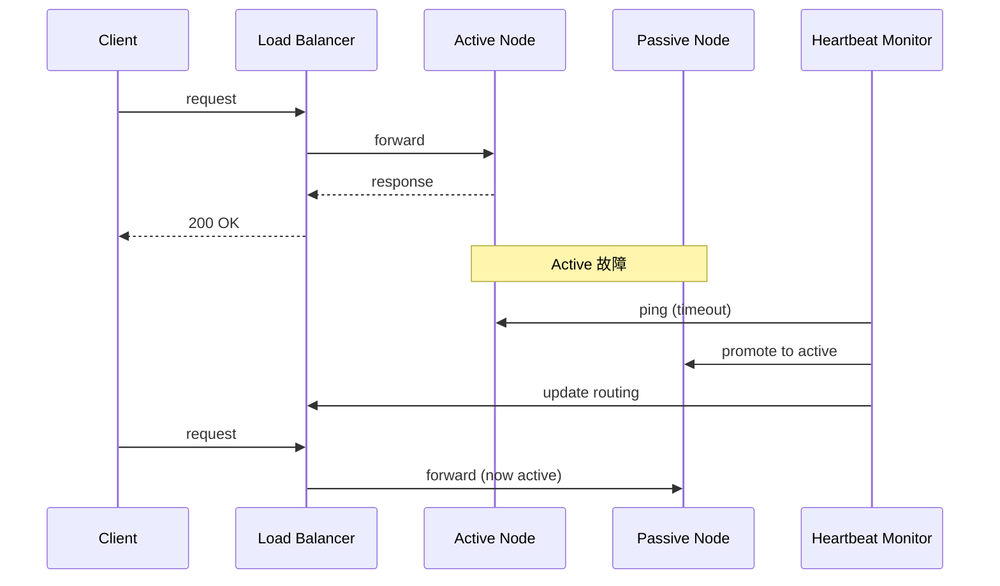
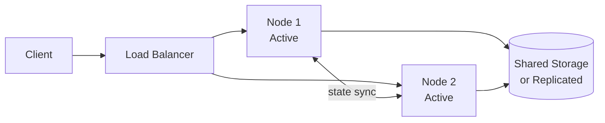
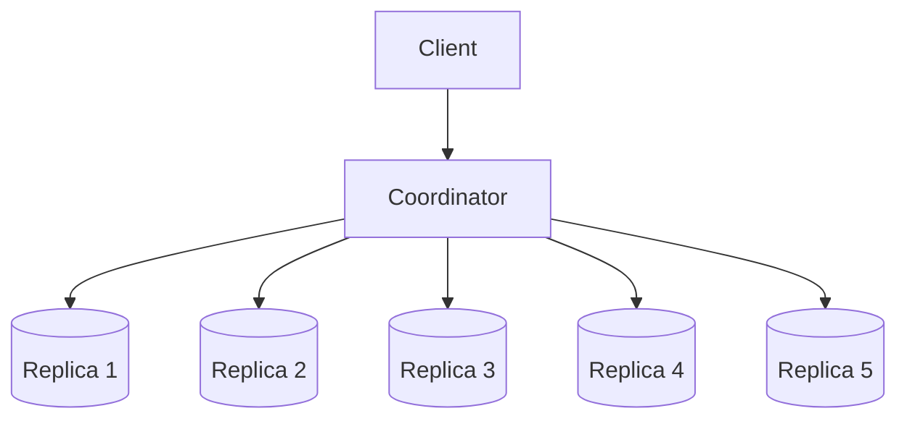
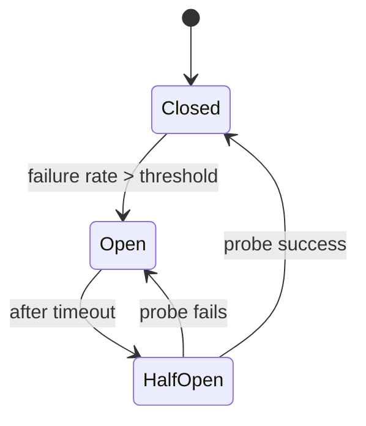
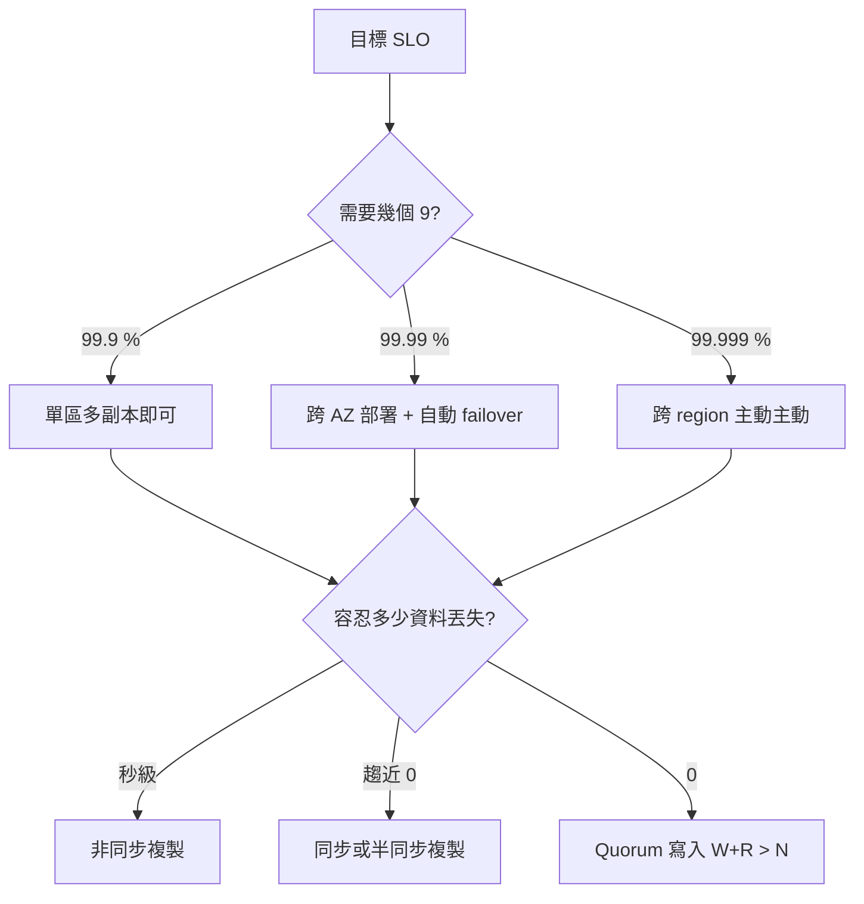

# 可用性模式

可用性（Availability）描述系統在預期時間內可被使用的比率。系統設計面試中，當你說「這個服務 99.99% 可用」時，面試官的下一句通常是：「那 leader 掛了你怎麼辦？怎麼算出這個數字？」

本章補齊 [CAP 定理](/learn/chapters/cap-theorem) 與 [資料庫](/learn/chapters/databases) 之間的縫——當網路分區或節點故障真的發生時，**具體用哪些模式活下來**。

## 可用性度量：9 的個數

可用性以「停機時間佔比」衡量。常見等級：

| SLA | 每年最多停機 | 每月最多停機 | 適用場景 |
|-----|--------------|--------------|----------|
| 99% (兩個 9) | 3.65 天 | 7.2 小時 | 內部工具、非關鍵服務 |
| 99.9% (三個 9) | 8.76 小時 | 43.2 分鐘 | 一般商業服務 |
| 99.95% | 4.38 小時 | 21.6 分鐘 | 中型 SaaS |
| 99.99% (四個 9) | 52.6 分鐘 | 4.32 分鐘 | 主流雲服務承諾值 |
| 99.999% (五個 9) | 5.26 分鐘 | 26 秒 | 電信、支付核心 |

> **SLA / SLO / SLI 區分：** SLI 是實際量到的指標（例如成功率）；SLO 是內部目標（例如 99.95%）；SLA 是對外承諾，違反會賠錢，通常設得比 SLO 寬鬆。

## 可用性數學：串聯與並聯

決定整體可用性的不是單機 SLA，而是**架構拓撲**。

### 串聯（依賴鏈）

當請求必須依序通過多個元件，整體可用性是各元件可用性的乘積：

$$A_{total} = A_1 \times A_2 \times A_3 \times \dots$$

| 元件 | 可用性 | 鏈式結果 |
|------|--------|----------|
| LB → App → DB | 99.99% × 99.99% × 99.99% | **99.97%**（一年多停 26 分鐘） |
| 5 個微服務串聯 | 99.99%⁵ | **99.95%**（一年多停 4 小時） |

> **教訓：** 微服務拆得越細、依賴鏈越長，整體可用性越低。

### 並聯（冗餘）

當有多個替代節點可用，整體不可用機率是各節點不可用機率的乘積：

$$A_{total} = 1 - (1 - A_1)(1 - A_2)\dots$$

| 配置 | 計算 | 結果 |
|------|------|------|
| 單台 99% | — | 99% |
| 雙台並聯 99% | 1 − 0.01 × 0.01 | **99.99%** |
| 三台並聯 99% | 1 − 0.01³ | **99.9999%** |

> **教訓：** 冗餘是用來換可用性的最直接手段，但要確保節點**故障獨立**（不同機架、不同 AZ、不同電源）。

## 故障轉移（Failover）

故障轉移是當主節點失效時，將流量切到備援節點的機制。

### Active-Passive（主備援）



| 變體 | 備援狀態 | 切換時間 | 成本 |
|------|----------|----------|------|
| 冷備援（Cold Standby） | 關機 / 不執行服務 | 數分鐘 ~ 數小時 | 最低 |
| 暖備援（Warm Standby） | 執行中但不接流量、資料持續同步 | 數十秒 ~ 數分鐘 | 中等 |
| 熱備援（Hot Standby） | 與主節點同步運作，隨時可接管 | 秒級 | 最高 |

### Active-Active（雙主）



- 兩台同時服務流量，平日做負載分擔，故障時無縫接管
- 需要解決：寫入衝突、會話親和（session affinity）、跨節點狀態同步
- 通常配合無狀態應用（見 [擴展性章節](/learn/chapters/scalability)）使用

### 腦裂（Split-Brain）

網路分區時，雙方各自認為對方掛了，都升格為主節點 → 出現兩個 leader 同時寫入。

**防範手段：**

| 手段 | 機制 |
|------|------|
| **Quorum 仲裁** | 升格為 leader 需要過半節點同意（N/2 + 1）；少數方無法形成 quorum |
| **Fencing Token** | 每次 leader 變更發放遞增 token；舊 leader 的寫入因 token 過期被儲存層拒絕 |
| **STONITH** | "Shoot The Other Node In The Head" — 強制電源關閉舊節點 |
| **第三方仲裁者** | 引入 odd 數量的見證節點（例如 etcd、ZooKeeper） |

## 複製的可用性視角

[資料庫章節](/learn/chapters/databases) 介紹了複製的拓撲（leader-follower、leader-leader）。這裡從**可用性**角度補充三個關鍵維度。

### 同步度：RPO 與 RTO 的權衡

| 模式 | 寫入確認時機 | RPO（資料丟失） | RTO（恢復時間） | 寫入延遲 |
|------|--------------|------------------|------------------|----------|
| **同步複製** | 所有副本確認後 | 0（不丟資料） | 秒級 | 高（受最慢副本影響） |
| **半同步** | 至少一個副本確認 | 趨近 0 | 秒級 | 中 |
| **非同步** | leader 寫入即確認 | 數秒 ~ 數分鐘 | 秒級 ~ 分鐘級 | 低 |

> **RPO（Recovery Point Objective）：** 容忍的資料丟失量。RPO = 0 表示「一筆都不能丟」。
> **RTO（Recovery Time Objective）：** 容忍的恢復時間。RTO = 5 分鐘表示「故障後 5 分鐘內必須恢復」。

### Quorum：W + R > N

在 N 個副本中，每次寫入要求 W 個副本確認、每次讀取要求 R 個副本回應，當 **W + R > N** 時可保證強一致讀取。



| 配置 (N=5) | 一致性 | 寫入可用性 | 讀取可用性 | 說明 |
|------------|--------|------------|------------|------|
| W=5, R=1 | 強 | 任一副本掛即不可寫 | 高 | 讀多寫少場景 |
| W=1, R=5 | 強 | 高 | 任一副本掛即不可讀 | 寫多讀少場景 |
| W=3, R=3 | 強 | 容忍 2 個副本失效 | 容忍 2 個副本失效 | **常見平衡點** |
| W=1, R=1 | 最終一致 | 最高 | 最高 | DynamoDB 預設、犧牲一致性 |

> **典型實踐：** Cassandra、DynamoDB、Riak 都允許每次操作指定 W、R，依業務場景動態調整。

## 韌性模式（Resilience Patterns）

故障轉移處理「節點層級」失效；韌性模式處理「請求層級」的緩慢、超時、依賴失效。

### 健康檢查：Liveness vs Readiness

| 檢查 | 失敗時行為 | 用途 |
|------|-----------|------|
| **Liveness** | 重啟容器 / 進程 | 偵測死鎖、記憶體洩漏導致無法回應 |
| **Readiness** | 從負載均衡器移除（不重啟） | 偵測暫時性無法服務（例如初始化中、依賴失效） |

> **常見錯誤：** 把 readiness probe 直接連到資料庫，DB 抖動時整批 pod 一起被踢出 LB → 雪崩。

### 斷路器（Circuit Breaker）

當下游服務持續失敗時，**主動快速失敗**，避免拖垮上游。



| 狀態 | 行為 |
|------|------|
| **Closed** | 正常放行請求；統計失敗率 |
| **Open** | 直接拒絕請求（不打下游），快速回應錯誤或降級結果 |
| **Half-Open** | 試探性放行少量請求；成功則關閉斷路器，失敗則重新打開 |

> **實作：** Netflix Hystrix（已停更）、resilience4j、Sentinel、Istio 內建。

### 艙壁（Bulkhead）

源自船舶設計：將船艙分隔，一個艙進水不會沉船。

| 隔離維度 | 做法 |
|----------|------|
| 連線池 | 每個下游服務獨立連線池，避免單一服務拖慢佔光所有連線 |
| 執行緒池 | 不同 API 用不同執行緒池，慢 API 不會阻塞快 API |
| 部署 | 將不同租戶 / 不同重要程度的流量部署在不同叢集 |

### 重試 + 指數退避 + Jitter

```text
delay(n) = min(base * 2^n + random(0, jitter), max_delay)
```

| 策略 | 用途 |
|------|------|
| 立即重試 | 永遠不要這樣做（除非確定是瞬時錯誤） |
| 固定間隔 | 簡單，但可能造成同步重試風暴 |
| 指數退避 | 避免持續打爆下游 |
| 指數退避 + Jitter | **推薦**，加入隨機抖動避免群體同步重試 |

### 優雅降級（Graceful Degradation）

當依賴失效時，**降級而非整體失敗**：

| 場景 | 完整行為 | 降級行為 |
|------|----------|----------|
| 推薦系統 | 個人化推薦 | 改用熱門排行榜（cached） |
| 商品頁 | 即時庫存 | 顯示「最後更新於 X 分鐘前」 |
| 動態消息 | 即時排序 | 顯示時間倒序 |

## 反面教材：常見可用性陷阱

| 陷阱 | 表現 | 教訓 |
|------|------|------|
| **重試風暴** | 下游剛恢復就被重試流量再次打爆 | 必須加 jitter；上游限流 |
| **故障轉移雪崩** | 切到備援後備援也撐不住而連環垮 | 備援必須與主節點同等容量；定期演練 |
| **同步依賴鏈過長** | 單一下游慢 → 整條鏈逾時 | 加超時、斷路器；改非同步通訊 |
| **健康檢查太敏感** | 暫時性抖動觸發大規模 pod 重啟 | Readiness 與 liveness 分開；加 failure threshold |
| **單一可用區部署** | AZ 故障 → 全服務下線 | 至少跨 AZ；關鍵服務跨 region |
| **把監控部署在被監控的系統內** | 故障時連告警都發不出來 | 監控基礎設施獨立部署 |

## 面試決策流：從可用性目標反推架構



## 面試中如何使用

1. **先說可用性目標** — 「我估計這系統需要 99.99%，因此 ...」直接引出後續設計
2. **算依賴鏈** — 主動指出哪段是串聯瓶頸（例如「LB → App → 第三方支付，整體被支付的 SLA 拉低」）
3. **指明冗餘策略** — Active-Active vs Active-Passive、跨 AZ vs 跨 Region
4. **提到 Failover 的代價** — 切換時間（RTO）、可能的資料丟失（RPO）、腦裂風險與防範
5. **點到韌性模式** — Circuit Breaker / Bulkhead / Jitter 是區分資深工程師的細節
6. **不要忽略監控** — 「我會監控 P99 延遲與錯誤率，超過 5% 觸發告警」展示營運思維

> **常見追問：** 「leader 掛了會怎樣？」→ 描述 quorum 仲裁 + fencing；「99.99% 怎麼算？」→ 列出依賴鏈，計算串聯結果；「如果整個 region 掛了？」→ 跨 region 主動主動 + DNS failover。

---

> 內容改寫自 [system-design-primer-zh-tw](https://github.com/kevingo/system-design-primer-zh-tw)（CC-BY-SA 4.0）
