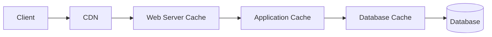
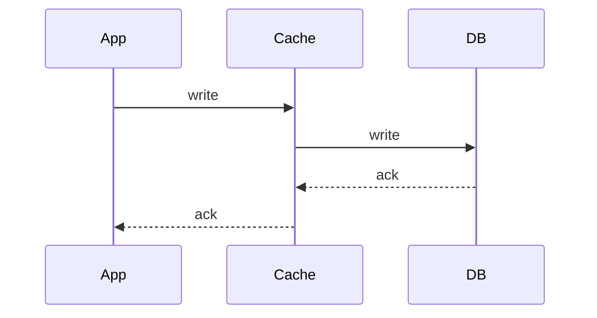

# 快取

快取（Cache）是將經常存取或計算昂貴的結果儲存在較快的介質中，以減少延遲和資料庫負載。

## 快取層級

| 層級 | 位置 | 範例 |
|------|------|------|
| 客戶端快取 | 瀏覽器、App | HTTP cache headers（ETag、Cache-Control） |
| CDN | 邊緣節點 | CloudFront、Cloudflare |
| Web Server | 反向代理 | Nginx、Varnish |
| 應用層快取 | App 內建 | Redis、Memcached |
| 資料庫快取 | DB 內建 | MySQL query cache、PostgreSQL buffer |

> **原則：** 越靠近使用者的快取，命中時延遲越低。

## 寫入策略

### Write-Through（寫穿）

- **行為：** 每次寫入同時更新 Cache 和 DB
- **優點：** Cache 永遠是最新的
- **缺點：** 寫入延遲增加（兩次寫入）

### Write-Around（寫繞）

- **行為：** 寫入只更新 DB，不更新 Cache
- **優點：** 避免寫入不常讀取的資料污染 Cache
- **缺點：** 首次讀取一定 Cache miss

### Write-Back（寫回）

- **行為：** 寫入只更新 Cache，非同步批次寫入 DB
- **優點：** 極低寫入延遲
- **缺點：** Cache 故障時可能丟失資料

## 失效策略

| 策略 | 說明 | 適用場景 |
|------|------|----------|
| TTL（Time to Live） | 設定過期時間，到期自動失效 | 通用 |
| LRU（Least Recently Used） | 空間不足時移除最久未存取的 | 通用 |
| 主動失效 | 寫入 DB 時同時刪除/更新 Cache | 需要強一致的場景 |

## 常見快取問題

### 快取雪崩（Cache Avalanche）

**問題：** 大量 key 同時過期，請求全部打到 DB。

**解法：**
- 隨機化 TTL（base TTL + random jitter）
- 多層快取（local cache + Redis）
- 限流保護 DB

### 快取穿透（Cache Penetration）

**問題：** 查詢不存在的 key，Cache 永遠 miss，每次都打 DB。

**解法：**
- 快取空值（null key with short TTL）
- Bloom Filter 前置過濾

### 快取擊穿（Cache Breakdown / Hotspot）

**問題：** 熱門 key 到期瞬間，大量併發請求同時打 DB。

**解法：**
- Mutex lock（只讓一個請求去 DB，其餘等待）
- 永不過期 + 非同步更新

## 面試中如何使用

1. **預設答案：** 幾乎所有系統設計題都應該加快取
2. **說明快取位置：** 在架構圖的哪一層
3. **選擇寫入策略：** 根據一致性需求
4. **討論失效策略：** TTL + LRU 是最常見的組合
5. **提到風險：** 快取與 DB 的不一致、雪崩/穿透/擊穿

---

> 內容改寫自 [system-design-primer-zh-tw](https://github.com/kevingo/system-design-primer-zh-tw)（CC-BY-SA 4.0）
