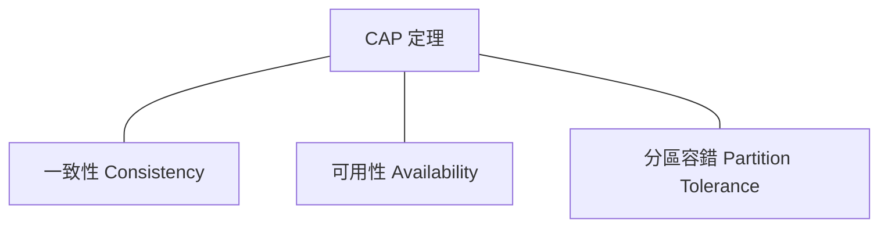

# CAP 定理

CAP 定理（Brewer's theorem）指出，在分散式系統中，以下三個保證最多只能同時滿足兩個：

## 三個保證

### 一致性（Consistency）

每次讀取都能取得最新的寫入結果，或收到錯誤。所有節點在同一時間看到相同的資料。

### 可用性（Availability）

每個請求都能收到（非錯誤的）回應，但不保證回應包含最新的寫入結果。

### 分區容錯（Partition Tolerance）

即使網路發生分區（節點之間無法通訊），系統仍能繼續運作。

## 為什麼是「三選二」？

在分散式系統中，**網路分區是不可避免的**。因此 P 是必選項，實際的選擇是：

| 選擇 | 犧牲 | 行為 | 範例 |
|------|------|------|------|
| CP | 可用性 | 分區時拒絕請求，直到資料一致 | HBase、MongoDB（強一致模式）、Redis Cluster |
| AP | 一致性 | 分區時仍回應請求，但資料可能過時 | Cassandra、DynamoDB、CouchDB |

> **注意：** CA 系統（放棄分區容錯）在分散式環境中不存在。單機資料庫是 CA，但那不是分散式系統。

## CP 系統：一致性優先

適用場景：

- 金融交易（帳戶餘額必須正確）
- 庫存管理（不能超賣）
- 分散式鎖（只能有一個持有者）

代價：在網路分區期間，部分請求會被拒絕或逾時。

## AP 系統：可用性優先

適用場景：

- 社交媒體動態（晚幾秒看到新貼文是可以接受的）
- DNS（最終一致即可）
- 購物車（合併衝突比拒絕服務好）

代價：讀取到的資料可能不是最新的。需要衝突解決策略（last-write-wins、向量時鐘等）。

## PACELC：CAP 的延伸

CAP 只描述了分區發生時的取捨。**PACELC** 補充了分區不存在時的取捨：

> **P**artition 發生時選 **A** 或 **C**；**E**lse（正常運作時）選 **L**atency 或 **C**onsistency。

| 系統 | P 時 | E 時 | 說明 |
|------|------|------|------|
| DynamoDB | A | L | 高可用 + 低延遲，犧牲強一致 |
| MongoDB | C | C | 強一致優先 |
| Cassandra | A | L | 預設最終一致，可調為強一致 |
| PostgreSQL (single) | N/A | C | 單機，不涉及分區 |

## 面試中如何使用 CAP

1. **辨識系統的一致性需求** — 金融、庫存 → CP；社交、快取 → AP
2. **說明你的選擇與理由** — 不是背誦定理，而是用它來論證設計決策
3. **提到 PACELC** — 展示你理解「不只是分區時的取捨」

---

> 內容改寫自 [system-design-primer-zh-tw](https://github.com/kevingo/system-design-primer-zh-tw)（CC-BY-SA 4.0）
