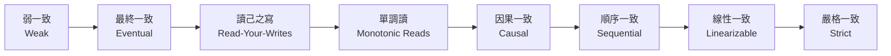
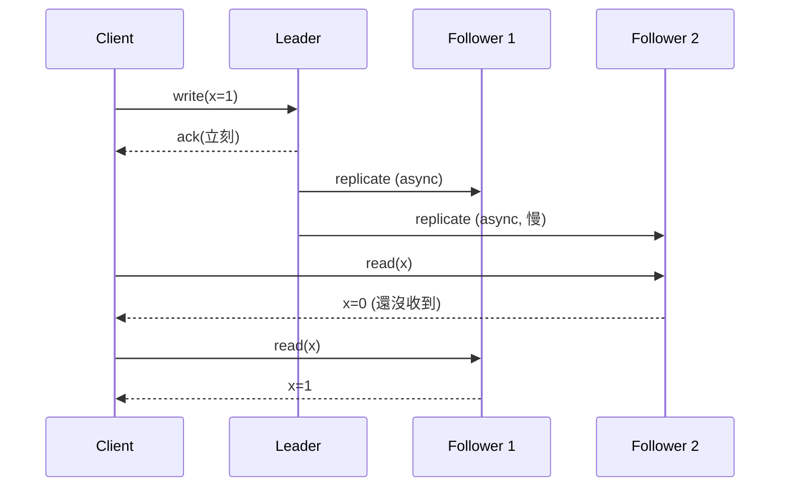
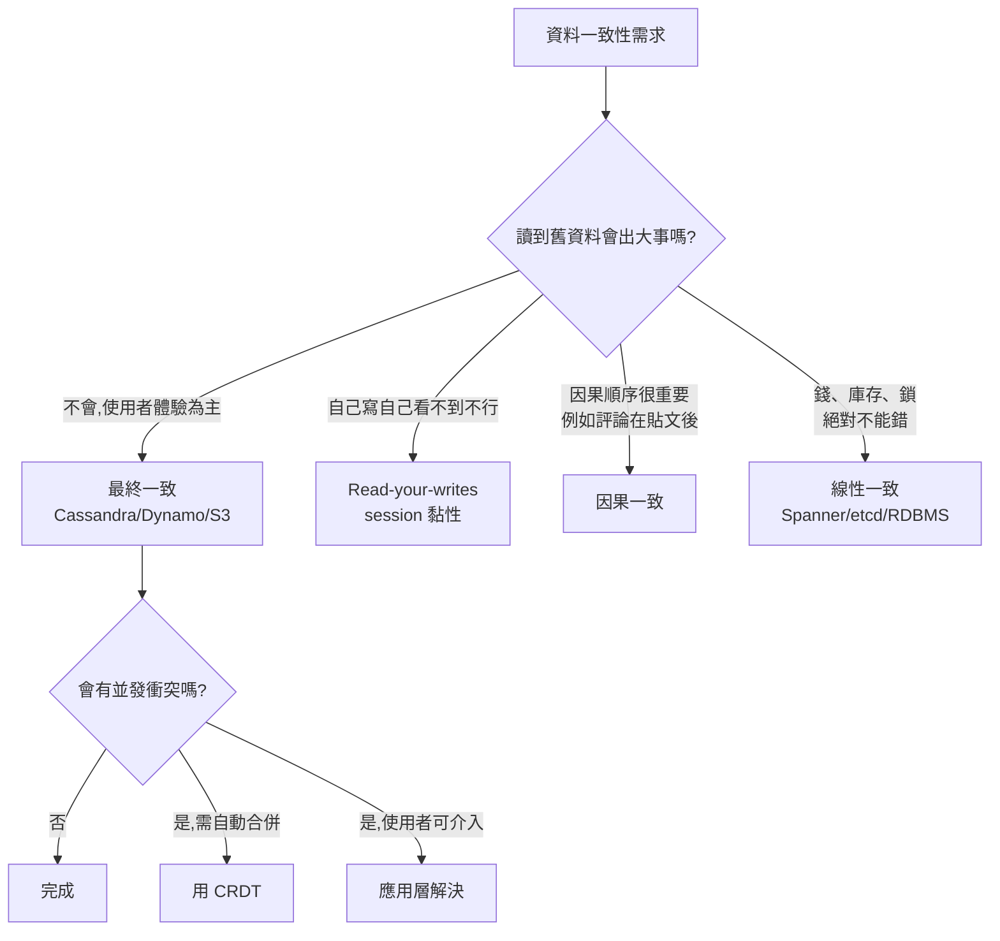

# 一致性模式

[CAP 定理](/learn/chapters/cap-theorem) 告訴我們在分區存在時,一致性與可用性必須二選一。但「一致性」本身**不是非黑即白**,而是一個光譜。本章把這個光譜攤開來,並對應到實務系統。

## 一致性光譜

從左到右:**保證越強、可用性與性能越差、實作越貴**。

| 等級 | 一句話定義 | 典型系統 |
|------|------------|----------|
| Weak | 寫入後讀不一定看得到,best-effort | memcached、VoIP |
| Eventual | 停止寫入後最終會收斂 | DNS、S3、Cassandra(預設) |
| Read-your-writes | 自己寫的自己讀得到 | session cookie 黏性 |
| Monotonic reads | 讀過新版就不會再讀到舊版 | 同一 follower 持續路由 |
| Causal | 有因果關係的寫入順序保留 | COPS、CockroachDB |
| Sequential | 全域有一個操作順序(可不同於實時) | — |
| **Linearizable** | 像存在於單一節點上;讀總是看到最新已完成的寫 | Spanner、etcd、ZooKeeper |
| Strict | 線性一致 + 物理時間零誤差 | 理論上不可達 |

## 弱一致(Weak Consistency)

寫入後,讀取「**可能看得到、可能看不到**」,沒有保證。系統做 best effort。

**適用場景:**
- 即時通訊(VoIP / 視訊)— 短暫斷線後不需要補回中斷期間的內容
- 即時遊戲 — 老的位置就老了,只關心最新
- 即時 metrics — 丟一兩個取樣可接受

**反例:** 千萬不要拿來做帳戶餘額、訂單狀態。

## 最終一致(Eventual Consistency)

> 「停止寫入,給足夠時間,最終所有副本會收斂到同一個值。」

**特性:**
- 寫入延遲低、可用性高(AP 系統的核心)
- 短窗口內可能讀到舊資料(stale read)
- 需要**衝突解決**機制處理並發寫入

**典型系統:** DNS、S3、DynamoDB(預設)、Cassandra、Riak。

### 衝突解決策略

並發寫入兩個副本後,合併時要決定誰贏。

| 策略 | 機制 | 適用 |
|------|------|------|
| **Last-Write-Wins(LWW)** | 用時間戳,大者勝 | 簡單,但會丟資料(時鐘不可靠) |
| **向量時鐘(Vector Clock)** | 每個節點維護版本向量,偵測並發 | DynamoDB 早期、Riak |
| **CRDT** | 資料型別本身設計成可合併 | 計數器、集合、共享文件(Yjs / Automerge) |
| **應用層解決** | 把衝突丟回給應用 / 使用者 | 購物車合併、Git merge |
| **讀取時修復(Read Repair)** | 讀到不一致時觸發同步 | Cassandra |

> **CRDT 是面試亮點:** 例如 G-Counter(只增計數器)用每個節點的本地計數加總,合併時取每維度最大值,**證明可收斂**。共享文件(Notion / Figma)就靠這個。

## 介於兩者之間的「會話保證」

純 eventual 太弱、純 strong 太貴,實務上常用以下「弱一致 + 一點保證」:

| 保證 | 含義 | 實作手段 |
|------|------|----------|
| **Read-your-writes** | 自己剛寫的自己一定讀得到 | 寫後路由到 leader、或記住 LSN 等到 follower 追上 |
| **Monotonic reads** | 一個 client 不會讀到「比之前更舊」的版本 | 黏性路由到同一 follower |
| **Monotonic writes** | 同一 client 的寫入順序保留 | 序列化單一 client 的寫 |
| **Writes-follow-reads** | 寫入時看到的世界至少包含先前讀到的 | 因果順序追蹤 |

> **使用者感受:** 你發完一篇貼文後重新整理應該看得到 → read-your-writes;你看到「100 讚」之後不應該再看到「99 讚」 → monotonic reads。

## 因果一致(Causal Consistency)

> 「有因果關係的操作,所有節點看到的順序一致;沒因果關係的可以不同。」

例子:A 發貼文 → B 留言。任何節點都應先看到貼文再看到留言;但 C 同時發的另一篇貼文順序不重要。

**實作:** 每個寫入帶因果向量(類似向量時鐘),讀取時檢查依賴是否到位。代表系統:COPS、Eiger、CockroachDB(部分模式)。

## 線性一致(Linearizability)

> 「就像系統只有一台節點,每個操作在某個瞬間生效,讀到的一定是最新已完成的寫。」

這是分散式系統能達到的**最強實際一致性**。也是 CAP 中的「C」。

### 線性一致的三個關鍵

1. **實時順序保留** — 操作 A 完成後,B 開始 → 全世界都看到 A 在 B 之前
2. **每個操作有一個原子生效點** — 不存在「半完成」狀態
3. **讀總是返回最近的成功寫** — 不會回滾、不會看到舊值

### 達到線性一致的代價

| 手段 | 機制 | 代價 |
|------|------|------|
| **單一 Leader + 同步複製** | 所有寫經 leader,讀也走 leader | leader 是瓶頸,故障時不可用 |
| **共識協定(Paxos/Raft)** | 過半節點達成一致 | 寫入需要至少一個 RTT,效能受限 |
| **Quorum 讀寫(W+R>N)** | 寫多數、讀多數 | 延遲取決於最慢副本 |
| **TrueTime + Spanner** | 全球原子鐘 + GPS 提供時間區間 | 需要硬體基礎設施 |

> **典型系統:** etcd、ZooKeeper、Consul(KV)、Google Spanner、CockroachDB(嚴格模式)。

## 一致性 vs 共識

兩個常被混淆的概念:

| | 一致性(Consistency) | 共識(Consensus) |
|---|------------------------|---------------------|
| 描述 | **資料**在不同節點的同步程度 | **節點**對某個值達成一致的過程 |
| 例子 | 「所有副本都有 x=5」 | 「一群節點同意誰是 leader」 |
| 工具 | 複製策略、quorum | Paxos、Raft、ZAB |
| 關係 | 強一致系統**通常**靠共識實作 | 共識協定是強一致的基礎 |

## 怎麼選

## 實務組合:同一系統不同等級

真實系統很少全部一個等級,而是依資料類型分層:

| 資料類型 | 一致性等級 | 範例 |
|----------|------------|------|
| 帳戶餘額、訂單狀態 | 線性一致 | 走主庫、用事務 |
| 個人資料、設定 | Read-your-writes | session 黏 + cache |
| 動態消息、追蹤者 | 最終一致 | follower 讀、CDN |
| 統計、計數器 | 最終一致(或近似) | Redis、CRDT counter |
| 推薦結果 | 弱一致 | 預先計算、隨意取 |

> **面試講法:** 「下單、付款走線性一致,訂單狀態走 read-your-writes,商品瀏覽紀錄走最終一致。」 一句話展示分層思維。

## 反面教材

| 陷阱 | 表現 | 教訓 |
|------|------|------|
| **整個系統都用最強一致** | 性能差、容易不可用 | 依資料類型分層 |
| **用時間戳做 LWW 但時鐘不同步** | 「較新」的寫入被丟掉 | 用 NTP + 邏輯時鐘 / 或改 CRDT |
| **以為非同步複製是強一致** | 主庫掛了,follower 提升,**剛寫的資料消失** | 同步複製或半同步,並接受延遲 |
| **以為 quorum 寫就一定強一致讀** | W=2 / R=2 / N=3 → 看似 W+R>N,但讀取時若沒 read-repair 仍讀到舊值 | 強一致讀需要 sloppy quorum + read repair 或單 leader |
| **CRDT 解所有問題** | 業務邏輯不能單純 merge(扣庫存、轉帳) | CRDT 適合 commutative 操作,複雜事務還是要強一致 |

## 面試中如何使用

1. **先問需求** — 「讀到 5 秒前的資料 OK 嗎?」 → 直接決定 AP / CP
2. **分層談** — 不要說「整個系統強一致」,要說「金流線性、動態最終一致」
3. **點出衝突解決** — 提到 LWW / 向量時鐘 / CRDT 是分散式深度的訊號
4. **連到 CAP / 複製** — 「我選 AP,衝突用 LWW,RPO 接受 5 秒」串起整套設計
5. **承認 trade-off** — 「強一致代價是寫入延遲增加 + 分區時不可用,值得是因為...」

> **常見追問:**
> 「最終一致多久收斂?」→ 取決於複製延遲,通常毫秒~秒級,但網路分區後可能更久
> 「為什麼不全用線性一致?」→ 寫入要過半節點 ack,延遲與可用性都打折
> 「線性一致跟 ACID 的 I 有什麼差?」→ 線性一致是**單一物件**保證,可序列化(serializability)是**多物件事務**保證,Spanner 提供 strict serializability = 兩者皆有

---

> 內容改寫自 [system-design-primer-zh-tw](https://github.com/kevingo/system-design-primer-zh-tw)(CC-BY-SA 4.0)
