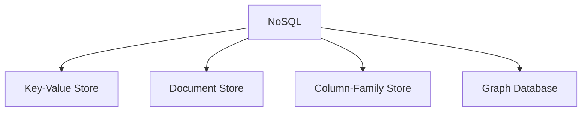
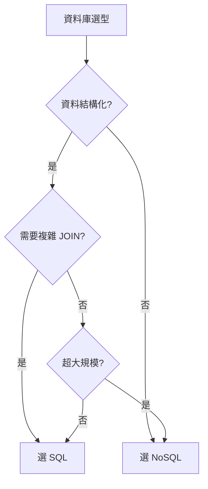

# 資料庫

資料庫選型是系統設計面試的高頻考點。核心問題：**什麼時候用 SQL？什麼時候用 NoSQL？**

## SQL（關聯式資料庫）

### 核心特性：ACID

| 屬性 | 說明 |
|------|------|
| **A**tomicity（原子性） | 交易中的操作要麼全部成功，要麼全部回滾 |
| **C**onsistency（一致性） | 交易前後資料庫都處於合法狀態 |
| **I**solation（隔離性） | 並發交易互不影響 |
| **D**urability（持久性） | 交易提交後，資料永久保存 |

### 正規化

正規化減少資料冗餘，但需要 JOIN 操作。

| 正規化程度 | 權衡 |
|------------|------|
| 高度正規化 | 資料一致、省空間；JOIN 多、讀取慢 |
| 反正規化 | 讀取快、無 JOIN；資料冗餘、寫入需同步多處 |

> **面試技巧：** 初始設計用正規化；遇到讀取效能瓶頸時，針對性地反正規化特定表。

### 常見 SQL 資料庫

| 資料庫 | 特色 |
|--------|------|
| PostgreSQL | 功能豐富、JSON 支援、擴充性強 |
| MySQL | 成熟穩定、社群大 |
| Amazon Aurora | MySQL/PostgreSQL 相容、雲端託管、自動擴展 |

## NoSQL

NoSQL 犧牲部分 SQL 特性（通常是 JOIN 和 ACID），換取彈性綱要和水平擴展能力。

### 四種 NoSQL 類型

| 類型 | 資料模型 | 範例 | 適用場景 |
|------|----------|------|----------|
| Key-Value | key → value（blob） | Redis、DynamoDB | 快取、會話、排行榜 |
| Document | key → JSON/BSON 文件 | MongoDB、CouchDB | CMS、使用者資料、產品目錄 |
| Column-Family | row key → column families | Cassandra、HBase | 時序資料、分析、日誌 |
| Graph | 節點 + 邊 + 屬性 | Neo4j、Amazon Neptune | 社交網絡、推薦引擎 |

## SQL vs NoSQL 選型

| 考量 | 選 SQL | 選 NoSQL |
|------|--------|----------|
| 資料結構 | 結構化、關聯多 | 非結構化、巢狀 |
| 一致性需求 | 強一致（金融） | 最終一致可接受 |
| 查詢模式 | 複雜 JOIN、聚合 | 主要按 key 查詢 |
| 擴展需求 | 中等規模 | 超大規模、需水平擴展 |
| 綱要變更 | 穩定、少變 | 頻繁變更 |

> **面試中的安全答案：** 多數系統設計題用 SQL 作為主資料庫是合理的。需要水平擴展或特殊資料模型時，再引入 NoSQL。

## 複製（Replication）

### 主從複製（Leader-Follower）

- 一個 Primary 接受寫入
- 多個 Replica 處理讀取
- 非同步複製 → 可能讀到舊資料（replication lag）

### 多主複製（Leader-Leader）

- 多個節點同時接受寫入
- 需要衝突解決機制
- 適用於多資料中心部署

## 分片（Sharding）

當單一資料庫無法容納所有資料時：

| 策略 | 做法 | 適用 |
|------|------|------|
| Hash-based | `hash(key) % N` | 均勻分布、隨機存取 |
| Range-based | 按範圍分片（如日期） | 範圍查詢、時序資料 |
| Directory-based | 查找表決定分片 | 彈性高；查找表是瓶頸 |

### 分片的代價

- **JOIN 困難** — 跨分片 JOIN 非常昂貴
- **重新平衡** — 增減節點需要遷移資料
- **跨分片查詢** — 需要 scatter-gather
- **熱點** — 某些分片負載遠高於其他

> **經驗法則：** 能用讀取複製和快取解決的問題，不要用分片。

## 面試決策流

---

> 內容改寫自 [system-design-primer-zh-tw](https://github.com/kevingo/system-design-primer-zh-tw)（CC-BY-SA 4.0）
