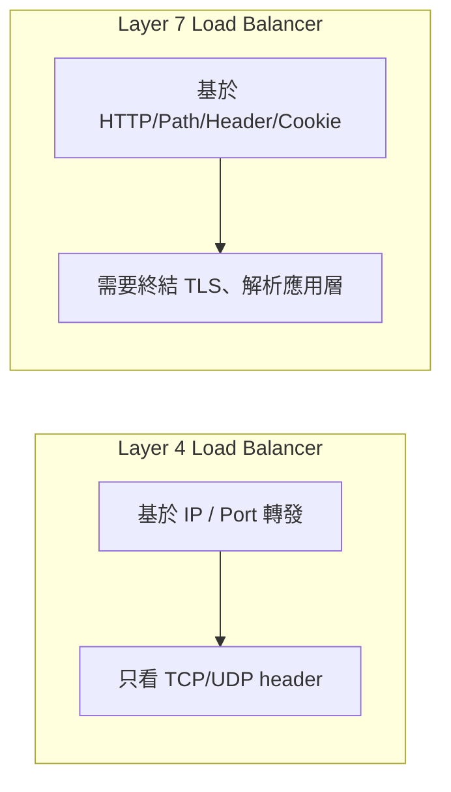
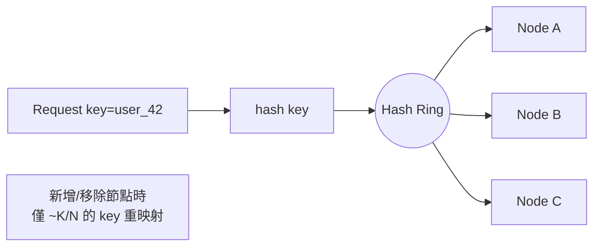
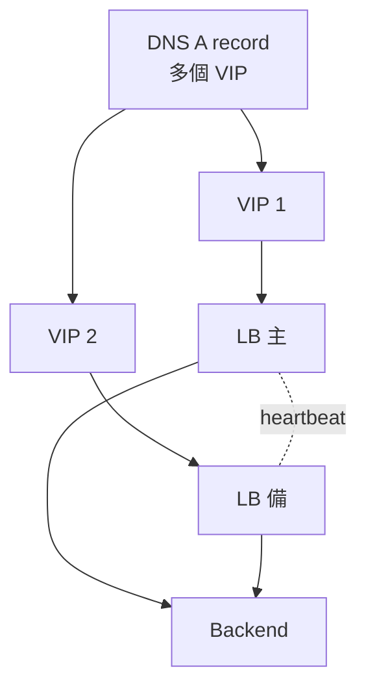
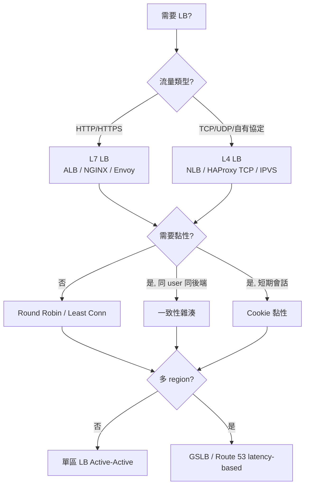

# 負載均衡

負載均衡器（Load Balancer，LB）將進來的請求分發到一組後端資源，是水平擴展與高可用的入口。系統設計面試中，幾乎所有題目的高層架構圖都會出現一個 LB；面試官真正在乎的是：**你選擇哪一層做 LB？演算法是什麼？故障時誰來救它？**

本章補齊 [擴展性章節](/learn/chapters/scalability) 提到的「無狀態應用 + LB」之間的細節，並與 [可用性模式](/learn/chapters/availability-patterns) 的 failover 相互呼應。

## LB 解決的三個問題

| 問題 | LB 的角色 |
|------|-----------|
| **流量分配** | 把請求分到多個後端，避免單機過載 |
| **健康路由** | 主動探測，剔除不健康節點，不把流量送進黑洞 |
| **故障隔離** | 後端崩潰、滾動更新、AZ 故障時自動切換 |

附帶能力（不一定每個 LB 都做）：SSL 終結、壓縮、快取、限流、WAF、observability。

## 部署形態：硬體 / 軟體 / 雲端

| 形態 | 代表 | 特性 |
|------|------|------|
| 硬體 LB | F5 BIG-IP、Citrix ADC | 高吞吐、價格昂貴、傳統企業 |
| 軟體 LB | HAProxy、NGINX、Envoy | 跑在通用伺服器上，靈活、生態完整 |
| 雲端 LB | AWS ELB/ALB/NLB、GCP LB、Azure LB | 託管、跨 AZ、自動擴展 |
| 客戶端 LB | gRPC client-side LB、Ribbon | 沒有中間 hop，需要服務發現 |

## L4 vs L7：在哪一層做決策

| 維度 | L4（傳輸層） | L7（應用層） |
|------|---------------|---------------|
| 觀察資訊 | 來源/目的 IP、Port、TCP 旗標 | HTTP Method、URL、Header、Cookie、Body |
| 決策粒度 | 連線級（per-connection） | 請求級（per-request） |
| TLS | 透傳（passthrough）或終結 | 通常終結後再轉發 |
| CPU 成本 | 低（不解析應用協定） | 較高（要解析 HTTP、可能解壓） |
| 路由能力 | 只能依 IP/Port 分流 | 可依路徑分服務、A/B 分版本、灰度 |
| 觀察性 | 有限（連線統計） | 豐富（HTTP 狀態碼、慢請求、URL 維度） |
| 典型實作 | AWS NLB、HAProxy TCP mode、IPVS | AWS ALB、NGINX、Envoy、Istio Gateway |
| 適用 | 遊戲、TCP 長連線、自有協定 | Web、API Gateway、微服務 |

> **混合模式：** 雲上常見 NLB（L4）→ Envoy/Ingress（L7）→ 後端。L4 處理高吞吐 TCP，L7 做路由與可觀察性。

## 負載均衡演算法

### 不感知後端狀態

| 演算法 | 機制 | 適用 / 陷阱 |
|--------|------|-------------|
| **Round Robin** | 依序輪流 | 後端同質時最簡單；異質硬體會把弱機打爆 |
| **Weighted Round Robin** | 各後端依權重比例分配 | 後端硬體不同時用；權重要手動或自動調整 |
| **Random** | 隨機選一台 | 無狀態、實作簡單；流量大時近似均勻 |
| **Source IP Hash** | 對來源 IP 取 hash | 同一客戶端固定打同一台；NAT 後一群人打同一台是常見問題 |

### 感知後端狀態

| 演算法 | 機制 | 適用 / 陷阱 |
|--------|------|-------------|
| **Least Connections** | 選當下連線數最少的 | 適合長連線、處理時間差異大；要求 LB 維持精準連線計數 |
| **Least Response Time** | 選最近回應最快的 | 反映真實負載；新加入節點可能被「冷打爆」 |
| **EWMA / Peak EWMA** | 對延遲做指數加權平均 | Envoy / Linkerd 用；對抖動更穩 |
| **P2C（Power of Two Choices）** | 隨機選兩台選負載較低的 | 接近 least-connections 效果，但不需全域狀態 |

### 一致性雜湊（Consistent Hashing）

- **目的：** 同一個 key（user_id、session_id、cache_key）穩定打到同一台後端
- **應用：** 黏性會話、分片快取（memcached client）、有狀態服務（如 chat room）
- **實務：** 用 virtual node（每個實體節點對應 100~200 個虛擬節點）以避免熱點不均
- **延伸閱讀：** Google Maglev、Envoy `ring_hash` / `maglev`

> **一致性雜湊 vs Source IP Hash：** 前者「key → 節點」對應穩定且可分布均勻；後者僅對 IP 取 hash，NAT/代理後容易傾斜。

## 會話與黏性（Session Affinity / Stickiness）

理想是無狀態、任何後端都能服務任何請求。但實務上仍會用到黏性：

| 黏性手段 | 原理 | 風險 |
|----------|------|------|
| **Cookie-based**（LB 注入） | LB 種一個 cookie 記錄目標後端 | 後端死掉時 cookie 失效，要 fallback |
| **Cookie-based**（應用注入） | 應用發 session cookie，LB 依此路由 | 改 cookie 格式時要協調 LB |
| **Source IP** | 同 IP 黏到同一台 | NAT、行動網路換 IP 即破功 |
| **一致性雜湊** | 對 user_id / session_id 雜湊 | 需要 key 在請求中可見 |

> **建議：** 把 session 移到外部存儲（Redis、資料庫），讓應用真正無狀態，LB 用 round-robin 或 least-connections 即可。黏性只在升級會話、長連線（WebSocket）、或本機快取命中率特別重要時才用。

## 健康檢查

LB 的價值一半來自「不要把流量送到死掉的後端」。

| 檢查類型 | 機制 | 用途 |
|----------|------|------|
| **被動健康檢查** | 觀察實際請求的失敗率/延遲，自動剔除 | 反映真實流量，但首次失敗才能偵測 |
| **主動健康檢查** | 定期送 probe（HTTP `/healthz`、TCP connect） | 提前剔除，但 probe 本身可能誤判 |

設計要點：

- **Endpoint 區分** — `/livez`（活著嗎？）vs `/readyz`（可以接流量嗎？）
- **依賴隔離** — `/readyz` 不要直接打資料庫，否則 DB 抖動會讓整批 pod 同時被剔除（雪崩）
- **Hysteresis** — 連續 N 次失敗才剔除、連續 M 次成功才回來，避免抖動
- **Outlier detection** — 自動隔離延遲明顯偏高的節點（Envoy 內建）

## LB 自身的高可用

LB 本身就是一個單點，必須做冗餘。

| 模式 | 機制 |
|------|------|
| **Active-Passive + VRRP/Keepalived** | 兩台 LB 共用一個 VIP，主掛備接管（秒級） |
| **Active-Active + ECMP** | 多台 LB 同時對外，透過 ECMP/Anycast 做封包級分流 |
| **DNS 多 A 紀錄 + 健康檢查** | DNS 同時回傳多個 LB IP；某 LB 掛由健康檢查移除 |
| **GSLB（全域 LB）** | DNS 依 client 地理/延遲返回最近 LB（見下節） |

> **腦裂風險：** Active-Passive 配 VRRP 時也會出現雙主。配合 fencing 或第三方仲裁（見 [可用性模式](/learn/chapters/availability-patterns#腦裂split-brain)）。

## 全域負載均衡（GSLB）

跨 region / 跨資料中心的流量分配，通常透過 DNS 完成。

| 路由策略 | 用途 |
|----------|------|
| **Geo-based** | 把使用者導向最近的 region |
| **Latency-based** | 量測 client → region 延遲，挑最快的 |
| **Weighted** | 依比例分配（例如灰度 5% 到新 region） |
| **Failover** | 主 region 健康檢查失敗時切到備援 region |
| **Anycast** | 同一 IP 在多地宣告，BGP 路由到最近的（CDN/DNS 服務常用） |

代表服務：AWS Route 53、Cloudflare、NS1、Google Cloud DNS。

## 與相關元件的邊界

| 元件 | 與 LB 的關係 |
|------|---------------|
| **反向代理（Reverse Proxy）** | LB 是反向代理的一種職責；NGINX/Envoy 同時做兩者 |
| **API Gateway** | L7 LB + 認證、限流、聚合、協定轉換 |
| **Service Mesh（Istio/Linkerd）** | sidecar proxy 做服務間 LB（client-side、east-west） |
| **CDN** | 全球邊緣的 LB，先看快取再回源 |
| **Ingress Controller（K8s）** | 集群入口的 L7 LB |

## 反面教材

| 陷阱 | 表現 | 教訓 |
|------|------|------|
| **LB 後面還是同一台 DB** | 應用層水平擴展但 DB 不擴展 | LB 不會神奇地解決瓶頸；下游也要規劃 |
| **健康檢查打 DB** | DB 抖動 → readiness 全失敗 → pod 全踢出 | 健康檢查只查自身狀態，依賴用熔斷器 |
| **長連線分配不均** | WebSocket / gRPC 連線一旦建立就不會換 LB | 用 connection draining + max connection age 強制重連 |
| **LB 流量超過頻寬** | LB 自己被打爆 | 監控 LB CPU/網卡；用 ECMP 或 GSLB 分散 |
| **TLS 全做在 LB 但沒做後端加密** | 內網被嗅探 | 視合規需求做 mTLS / 後端再加密 |
| **滾動部署沒有 connection draining** | 後端被殺時請求失敗 | LB 先標記下線、等待現有連線完成、再撤掉節點 |

## 容量速算

> 「你這個 LB 撐得住嗎？」

關鍵指標：

| 指標 | 典型量級（單台軟體 LB，現代硬體） |
|------|-----------------------------------|
| L4 連線/秒 | 數十萬 ~ 百萬 |
| L7 HTTP RPS | 數萬 ~ 數十萬 |
| 並發長連線 | 數十萬 ~ 數百萬（看記憶體） |
| TLS 握手/秒 | 數千 ~ 數萬（看是否有硬體加速） |
| 頻寬 | 受網卡限制，10/25/100 Gbps |

> **面試講法：** 「我估計尖峰 50K RPS，用 2 台 L7 LB（active-active）配 50K 連線各承擔 25K，留 50% headroom；TLS 終結在 LB，後端走純 HTTP。」

## 面試決策流

## 面試中如何使用

1. **先說選 L4 還是 L7** — 「這是 HTTP API，我用 L7 LB，因為要做路徑路由與灰度」
2. **點出演算法選擇** — 「後端處理時間差異大，用 least-connections 而非 round-robin」
3. **明確 LB 自身的冗餘** — 「兩台 LB Active-Active，前面用 DNS 多 A 紀錄」
4. **講會話策略** — 「Session 放 Redis，應用無狀態；長連線用一致性雜湊」
5. **連到健康檢查** — 「`/readyz` 只檢自己，DB 失效用熔斷器」（連到 [可用性模式](/learn/chapters/availability-patterns#健康檢查liveness-vs-readiness)）
6. **算容量** — 「估 50K RPS、2 台 LB，每台 25K，CPU 餘 50%」

> **常見追問：** 「LB 掛了怎麼辦？」→ active-active + DNS 健康檢查；「同一個使用者打到不同後端讀到舊資料？」→ 一致性雜湊 + 後端共享存儲；「TLS 在哪做？」→ 終結在 LB，後端走 HTTP 或 mTLS；「灰度怎麼做？」→ L7 LB 依 header/cookie 分流到 canary。

---

> 內容改寫自 [system-design-primer-zh-tw](https://github.com/kevingo/system-design-primer-zh-tw)（CC-BY-SA 4.0）
