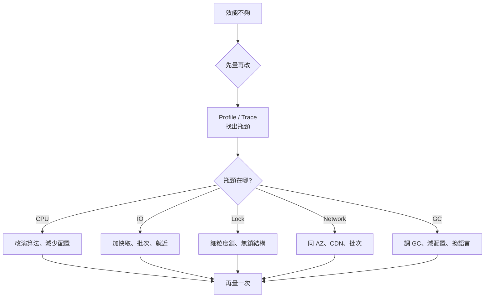

# 性能、延遲與吞吐

系統設計面試裡,「快不快」、「撐不撐得住」、「P99 是多少」這幾個問題常常被混為一談。本章釐清三組常被搞混的詞,並提供面試中可以直接套用的速算工具。

## 性能 vs 擴展性

兩者描述的是不同層級的問題。

| 問題 | 性能(Performance) | 擴展性(Scalability) |
|------|---------------------|------------------------|
| 一個使用者時 | 系統慢 → **性能問題** | 系統快 → 沒問題 |
| 高負載時 | 已經慢的依然慢 | 變慢 → **擴展性問題** |
| 解法 | 演算法、索引、快取、profiling | 加機器、分片、非同步化、水平擴展 |
| 衡量 | 單一請求延遲 | 加資源後吞吐量是否「比例」上升 |

> **定義(Werner Vogels):** 「服務是可擴展的,如果增加資源能讓性能成比例提升。」 增加 2 倍資源若只換到 1.2 倍吞吐 → 擴展性差。

## 延遲 vs 吞吐量

| | 延遲(Latency) | 吞吐量(Throughput) |
|---|----------------|----------------------|
| 定義 | 完成單一動作所需時間 | 單位時間完成的動作數 |
| 單位 | ms / μs | RPS / QPS / MB/s |
| 比喻 | 一個包裹從寄出到收到的時間 | 物流公司每天能送的包裹數 |
| 改善方向 | 減少每個請求的工作量(快取、就近) | 增加並行(更多 worker、批次處理) |

**目標:** 在可接受的延遲下追求最大吞吐 — 不要為了拉高吞吐犧牲使用者體驗,也不要為了極致延遲而資源浪費。

### 兩者並非同向

| 場景 | 延遲 | 吞吐 |
|------|------|------|
| 增加 worker 數 | 不變或略增(排隊) | ↑ |
| 加 batch size | ↑(等待湊批) | ↑(攤銷固定成本) |
| 加快取 | ↓ | ↑ |
| 同步呼叫改非同步 | 表面 ↓(回 202) | ↑(下游可平滑處理) |
| CPU 飆到 95% | ↑↑ | 接近上限 |

## Little's Law:吞吐 / 延遲 / 並發的關係

$$L = \lambda \times W$$

- $L$:系統內平均並發數(in-flight requests)
- $\lambda$:平均到達率(吞吐,RPS)
- $W$:平均停留時間(延遲,秒)

**用途:**

| 已知 | 求 | 例子 |
|------|----|----|
| 吞吐 5K RPS、延遲 50ms | 並發 = 5000 × 0.05 = **250** | 連線池 / worker 至少要 250 |
| 並發 1000、延遲 200ms | 吞吐 = 1000 / 0.2 = **5000 RPS** | 估算單機上限 |
| 吞吐 10K RPS、並發 100 | 延遲 = 100 / 10000 = **10ms** | 反推延遲是否合理 |

> **面試講法:** 「P99 延遲 100ms、目標 10K RPS → 並發至少 1000 → 我需要 worker pool 1000 或拆 4 台 250 connections each。」

## 百分位數:不要用平均值

延遲分布通常**重尾**(long tail),平均值會被少數極端值拉走、又被大量快值蓋住,導致**沒人感受到「平均」的體驗**。

| 指標 | 含義 | 用途 |
|------|------|------|
| P50(median) | 一半請求快於這個值 | 「典型」體驗 |
| P95 | 95% 快於這個值 | SLA 起點 |
| **P99** | 99% 快於這個值 | 系統設計面試最常見的 SLO |
| P99.9 / P99.99 | 0.1% / 0.01% 慢尾 | 大流量服務、廣告、金融 |
| max | 最慢一筆 | 通常受 GC / network spike 影響,不可作 SLO |

> **重要事實(Tail at Scale, Dean & Barroso):** 一個請求 fan-out 到 100 台後端,只要每台 P99 慢 = 1%,**整體請求碰到至少一台慢的機率 ≈ 63%**。微服務拆得細 + 不處理尾延遲 = 整體體驗崩潰。

### 百分位數不能取平均

```text
✗ 錯:LB 後 5 台機器,各 P99=100ms → 整體 P99 = 100ms
✓ 對:LB 後 5 台機器各 P99=100ms → 整體 P99 ≥ 100ms,通常更高
```

百分位數要在**原始 sample 集合上重新計算**,不能對「每台的 P99」取平均或中位數。實務上用 t-digest、HDR Histogram 之類資料結構合併。

## 尾延遲的成因與解法

| 成因 | 解法 |
|------|------|
| GC 暫停 | 改用低暫停 GC(ZGC、Shenandoah)、減少配置、語言層面換 Rust/Go |
| Noisy neighbor | CPU/IO quota、隔離 workload |
| 鎖競爭 | 細粒度鎖、無鎖結構、sharding |
| 網路抖動 | 同 AZ、TCP keepalive、QUIC |
| 慢盤 / 重試風暴 | 換 SSD、分層儲存、加 jitter |
| Cold cache | 預熱、warming pool |
| Long-tail query | 設逾時、降級、**hedged requests** |

### Hedged Requests(對沖請求)

> Google 的經典手法:第一個請求發出後,若 P95 內沒回應,**對另一台後端再發一次**,任一回應就採用。

效果:用 5% 額外請求換 P99 接近 P50。代價:後端容量要預留、要支援冪等。

## 每位工程師都該背的延遲數字

> Jeff Dean 經典清單(2020 校正,**面試常考**)。

| 操作 | 延遲 | 對照 |
|------|------|------|
| L1 cache reference | 0.5 ns | — |
| Branch mispredict | 5 ns | — |
| L2 cache reference | 7 ns | 14× L1 |
| Mutex lock/unlock | 25 ns | — |
| Main memory reference | 100 ns | 200× L1 / 20× L2 |
| Compress 1 KB(Snappy) | 2 μs | 2,000 ns |
| Send 1 KB over 1 Gbps | 10 μs | — |
| **SSD random read** | 100 μs | 1,000× memory |
| Read 1 MB sequentially from memory | 250 μs | — |
| Round trip within same datacenter | 500 μs | — |
| Read 1 MB sequentially from SSD | 1 ms | 4× memory |
| **HDD seek** | 10 ms | 100× SSD |
| Read 1 MB sequentially from HDD | 30 ms | 30× SSD |
| **Round trip CA → Netherlands → CA** | 150 ms | 跨洲必算 |

### 速記轉換(數量級)

| 規模 | 等價 |
|------|------|
| ns(奈秒) | 1 個時鐘週期 |
| μs(微秒) | 1000 ns,本機操作 |
| ms(毫秒) | 1000 μs,**跨網路 / 磁碟**的世界 |

> **面試應用:**
> - 「快取命中 vs miss 差幾個量級?」→ memory 100 ns vs SSD 100 μs → **1000 倍**
> - 「跨洲呼叫合理嗎?」→ 150 ms,做不到 P99 < 100 ms,需 CDN / 邊緣
> - 「為什麼要批次?」→ 100 個 1 KB 寫各自 RTT 50 ms = 5 秒;批次 1 次 = 50 ms

## USE / RED / 四黃金訊號

監控指標的三套主流框架(面試聊「怎麼觀察系統」時可以拿出來)。

| 框架 | 維度 | 適用 |
|------|------|------|
| **USE**(Brendan Gregg) | Utilization / Saturation / Errors | 資源(CPU、記憶體、磁碟、網路) |
| **RED**(Tom Wilkie) | Rate / Errors / Duration | 服務(每個 endpoint 的 RPS、錯誤率、延遲) |
| **四黃金訊號**(Google SRE) | Latency / Traffic / Errors / Saturation | 通用,SRE 必備 |

> **面試套路:** 「我會用 RED 監控每個 API 的 P99、錯誤率、QPS,搭配 USE 看單機 CPU/記憶體飽和度,超過閾值告警。」

## 性能優化的優先順序



> **三條鐵則:**
> 1. **沒量過就不要改** — 直覺常常錯,Profile 之後再下手
> 2. **先 algorithmic,再 micro-optimize** — O(n²) → O(n log n) 的改善遠大於 cache line 對齊
> 3. **延遲與吞吐並非互斥但要明說選哪個** — 不要含糊地「優化」

## 反面教材

| 陷阱 | 表現 | 教訓 |
|------|------|------|
| **只看平均延遲** | dashboard 綠,使用者抱怨慢 | 看 P99 / P99.9 |
| **拿單機 benchmark 推估線上** | 上線後完全打不到那個吞吐 | 線上有 GC、網路、隔壁租戶,benchmark 不算數 |
| **加機器解延遲問題** | 機器越多 P99 反而上升 | 延遲問題加機器治標不治本,可能放大尾延遲 |
| **過早優化** | 程式碼複雜、可讀性差 | 先寫對,profile 後再優化熱點 |
| **沒有 timeout / 重試風暴** | 一個慢下游拖垮整條鏈 | 每跳都要超時,重試加 jitter(見可用性模式) |
| **吞吐設計 SLO 但測試只跑 1 個並發** | 上線即崩 | 壓測必須在目標並發下測延遲 |

## 面試中如何使用

1. **先講量化目標** — 「P99 < 100ms、5 K RPS、跨 region」直接框出設計空間
2. **用延遲表估可行性** — 「跨洲 RTT 150 ms,P99 < 100 ms 不可能,需要邊緣節點」
3. **算 Little's Law** — 連線池、worker 數、佇列深度都從這推
4. **點出尾延遲** — 「P99 而不是平均」、「fan-out 多會放大慢尾」
5. **指出觀察手段** — RED + 四黃金訊號,告訴面試官你會怎麼驗收

> **常見追問:**
> 「為什麼用 P99 不用平均?」→ 重尾分布,平均蓋掉問題,使用者感受是長尾
> 「fan-out 100 台會怎樣?」→ Tail at Scale,需要 hedged request / 限制 fan-out 寬度
> 「怎麼壓測?」→ 在目標並發下量 P99,別只看 RPS

---

> 內容改寫自 [system-design-primer-zh-tw](https://github.com/kevingo/system-design-primer-zh-tw)(CC-BY-SA 4.0)
