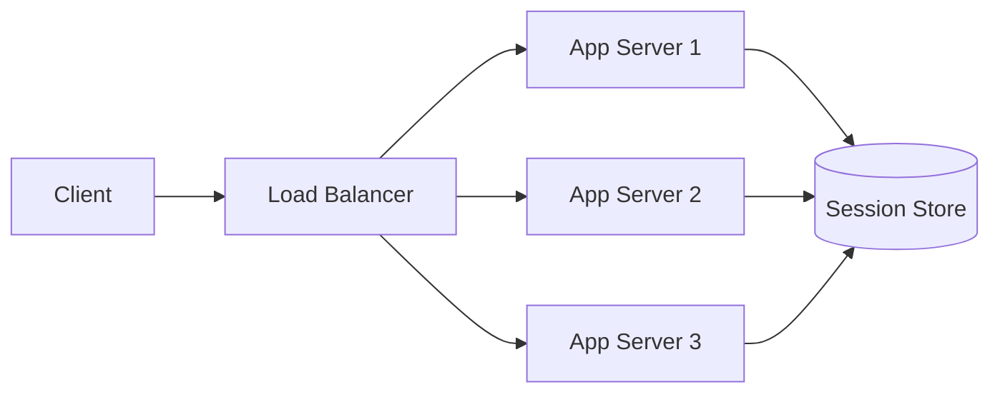
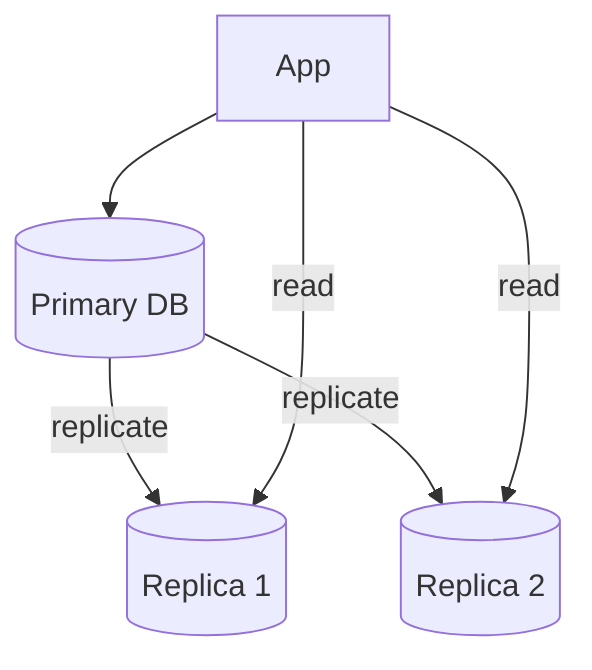

# 擴展性

擴展性（Scalability）是指系統在負載增加時，仍能維持效能與可用性的能力。

## 垂直擴展 vs 水平擴展

| | 垂直擴展（Scale Up） | 水平擴展（Scale Out） |
|---|---|---|
| 做法 | 升級單機（更多 CPU、RAM、SSD） | 增加更多機器 |
| 優點 | 簡單、無分散式問題 | 理論上可無限擴展 |
| 缺點 | 有硬體上限、單點故障 | 複雜度高（分散式協調） |
| 適用 | 初期、小規模 | 大規模、高可用 |

> **經驗法則：** 先垂直擴展到合理上限，再轉向水平擴展。過早引入分散式架構會增加不必要的複雜度。

## 無狀態網頁層

水平擴展的前提是 **無狀態（Stateless）** 的應用層。每台 App Server 不保存使用者會話狀態，任何一台都能處理任何請求。

### 會話管理策略

| 策略 | 說明 | 優缺點 |
|------|------|--------|
| Sticky sessions | LB 將同一使用者導向同一台 server | 簡單；但 server 掛了會丟失會話 |
| 集中式 Session Store | Redis / Memcached 存放會話 | 無狀態 app；額外依賴 |
| Client-side token | JWT 存放在 cookie 或 header | 完全無狀態；token 大小有限 |

**推薦做法：** 使用集中式 Session Store 或 JWT。避免 sticky sessions — 它讓擴展和故障轉移變困難。

## 資料庫擴展

應用層無狀態後，瓶頸轉移到資料層。

### 讀取複製（Read Replica）

- 所有寫入走 Primary
- 讀取分散到 Replica
- 適用於讀多寫少場景（讀寫比 > 5:1）

### 分片（Sharding）

當單一資料庫無法容納所有資料時，將資料分散到多台 DB。

| 分片策略 | 說明 | 風險 |
|----------|------|------|
| Hash-based | `hash(key) % N` 決定分片 | 增減節點需 rehash（可用一致性雜湊） |
| Range-based | 按範圍分（如 A–M、N–Z） | 可能分布不均（熱點） |

> **注意：** 分片引入 join 困難、跨分片查詢、重新平衡等問題。在快取和讀取複製用盡之前，不要急著分片。

## 擴展決策樹

面對效能瓶頸時，優先順序：

1. **加快取** — 最低成本的改善（見快取章節）
2. **讀取複製** — 解決讀取瓶頸
3. **水平擴展應用層** — 解決 QPS 瓶頸
4. **分片** — 解決單機容量瓶頸（最後手段）

---

> 內容改寫自 [system-design-primer-zh-tw](https://github.com/kevingo/system-design-primer-zh-tw)（CC-BY-SA 4.0）
