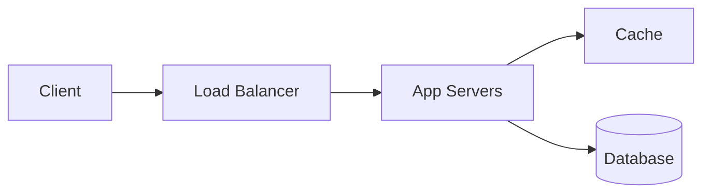

# 解題框架：四步驟法

系統設計面試題目通常開放且模糊。以下四步驟法幫助你結構化地展開設計。

## 步驟一：概述使用案例、限制與假設（3–5 分鐘）

收集需求、釐清範圍。你需要問面試官：

- **使用者是誰？** 他們會如何使用？
- **規模有多大？** 每日活躍使用者（DAU）、每秒請求數（QPS）？
- **系統的輸入與輸出？** 核心功能有哪些？
- **預期的讀寫比？** 讀多寫少、還是反過來？
- **資料量？** 單筆大小 × 總量 → 儲存需求？
- **可用性與延遲要求？** 99.9%？p99 < 200ms？

> **重點：** 不要急著畫圖。先把需求釘死，再開始設計。

## 步驟二：建立高階設計（5–10 分鐘）

用主要元件建立高階設計大綱。畫出核心元件與連線，用一兩句解釋你的設計。

這個階段的目標：

- **列出 API 端點**（例如 `POST /api/shorten`、`GET /:short_code`）
- **畫出資料流方向**（寫入路徑、讀取路徑）
- **確認元件職責分工**（每個方塊做什麼）

## 步驟三：設計核心元件（10–15 分鐘）

深入每個核心元件的細節。以 URL 縮短服務為例，你需要討論：

1. **雜湊產生短網址的演算法** — Base62 編碼 vs MD5 截斷 vs 預先產生的 Key Generation Service (KGS)
2. **跳轉機制** — 301（永久）vs 302（臨時）對快取與分析的影響
3. **資料庫綱要** — 表結構、索引設計
4. **讀寫路徑** — 寫入時如何確保唯一性？讀取時如何快速查詢？

> **技巧：** 先深入最有挑戰性的元件。面試官通常會引導你往哪裡鑽，跟著他的方向走。

## 步驟四：擴展設計（5–10 分鐘）

辨識並解決瓶頸，給定限制條件。典型考量：

| 瓶頸 | 解法 |
|------|------|
| 單機無法撐住 QPS | 水平擴展 App Servers + Load Balancer |
| 資料庫讀取過慢 | 加入讀取快取（Redis/Memcached） |
| 資料庫寫入瓶頸 | 分片（Sharding）或非同步寫入（Message Queue） |
| 單點故障 | 主從複製、多區域部署 |
| 熱點資料 | 快取 + CDN |

簡短討論替代方案與權衡（tradeoffs）。面試官想看你的思考過程，不只是答案。

## 時間分配建議

| 步驟 | 時間 | 常見失誤 |
|------|------|----------|
| 步驟一：釐清需求 | 3–5 分鐘 | 跳過直接畫圖，導致方向錯誤 |
| 步驟二：高階設計 | 5–10 分鐘 | 方塊太多，缺乏重點 |
| 步驟三：核心元件 | 10–15 分鐘 | 每個元件都淺嚐，沒有深入 |
| 步驟四：擴展設計 | 5–10 分鐘 | 只說「加快取」，缺乏具體方案 |

## 面試官評量重點

| 能力 | 觀察指標 |
|------|----------|
| 需求釐清 | 是否主動提問？是否量化規模？ |
| 架構思維 | 元件分工是否合理？資料流是否清楚？ |
| 技術深度 | 能否深入解釋演算法、資料結構、權衡？ |
| 溝通能力 | 是否有條理地引導討論？是否接受回饋並調整？ |
| 權衡判斷 | 是否能比較方案的 pros/cons 並做出合理選擇？ |

---

> 內容改寫自 [system-design-primer-zh-tw](https://github.com/kevingo/system-design-primer-zh-tw)（CC-BY-SA 4.0）
