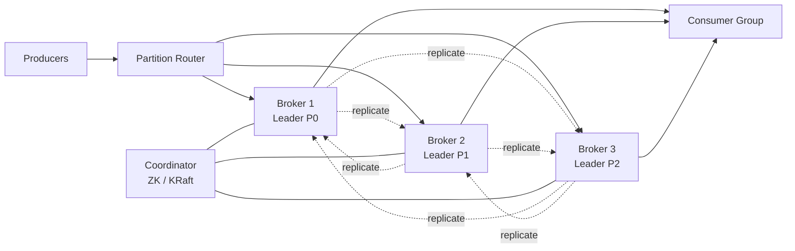

# Design a Distributed Message Queue (Kafka)

## Problem Statement

Design a high-throughput, durable, distributed publish-subscribe message queue similar to Apache Kafka. The system must support millions of messages per second across many topics, retain messages for replay, and tolerate broker failures without data loss.

## Requirements

### Functional
- Producers publish messages to named topics
- Consumers subscribe to topics and read messages in order per partition
- Messages are persisted on disk and replayable for a configurable retention window
- Consumer groups share work via partition assignment
- Topic partitions can be added to scale throughput

### Non-Functional
- Sustain 1M+ messages/second per cluster
- p99 publish latency < 50ms
- Durability: no data loss with replication factor 3 and one broker failure
- Horizontal scalability: add brokers without downtime

## Expected Answer

### High-Level Design

Topics are split into ordered, append-only partitions. Each partition is a log file replicated across N brokers via a leader-follower protocol. Producers write to the partition leader; followers replicate. Consumers track their own offset per partition. A coordination service (ZooKeeper or KRaft) manages cluster membership, leader election, and partition assignment.

### Architecture Diagram

### Key Components

- **Producer**: hashes message key to choose a partition, batches writes for throughput
- **Broker**: stores partition log segments on disk, serves reads via zero-copy sendfile
- **Partition Leader**: accepts all writes for a partition; followers replicate
- **Consumer Group Coordinator**: assigns partitions to consumers, tracks committed offsets
- **Coordination Service**: ZooKeeper or KRaft quorum for metadata and leader election

### Tradeoffs

- Per-partition ordering only (not global) — simpler scaling at cost of cross-partition guarantees
- Pull-based consumers vs push: pull lets consumers control rate but adds polling overhead
- Disk-backed log gives durability and replay but consumes capacity proportional to retention

### Scaling Considerations

- Shard high-traffic topics with more partitions; rebalance consumer groups
- Tier old segments to object storage (Tiered Storage) to extend retention cheaply
- Use compression (LZ4 / Snappy) on producer side to lower network and disk cost
- Place replicas across racks/zones for fault tolerance
