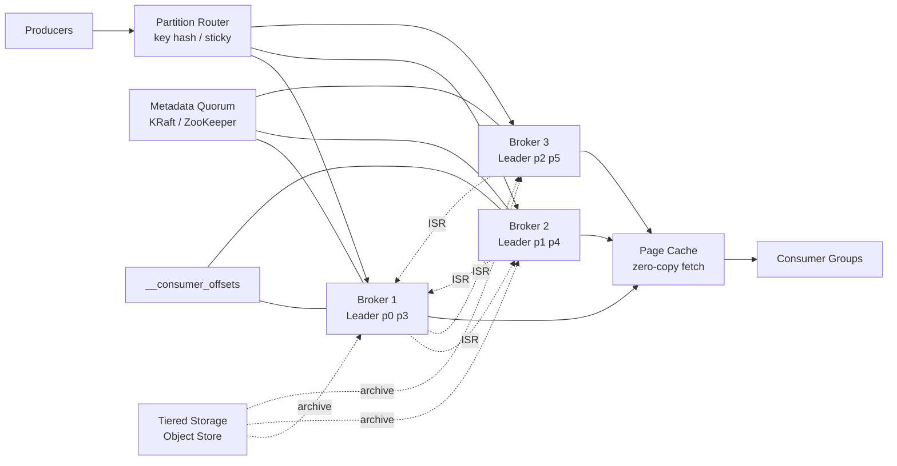
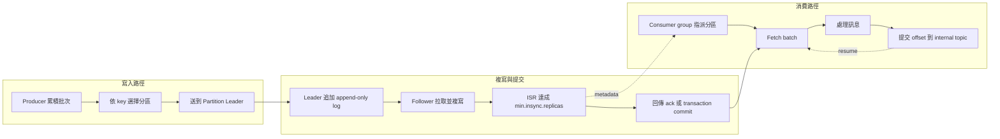
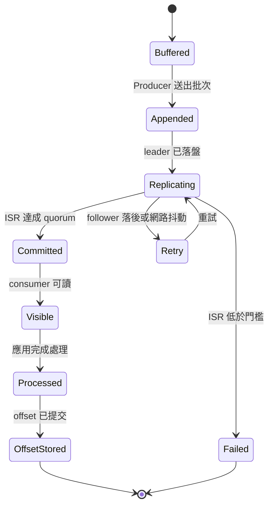

# 設計分散式訊息佇列（Kafka）

## 題目敘述

設計一個類似 Apache Kafka 的高吞吐、可重播、分散式 publish-subscribe 訊息佇列，作為整個公司的事件骨幹。上游可能是訂單、付款、庫存、風控、行為追蹤、IoT telemetry 等數千個 Producer；下游則有即時服務、串流分析、資料倉儲、搜尋索引與機器學習特徵管線等多種 Consumer。系統必須支援以 Topic / Partition 為核心的 append-only log 模型，在單一 broker 或單一可用區故障下仍不遺失已 ack 的訊息，允許 Consumer 從任意 offset 重播，並在熱資料上維持低延遲讀取。除了吞吐量與持久性之外，還要處理多租戶配額、Leader-Follower 複寫、ISR 收斂、Producer batching、Consumer group rebalance、offset 管理、Tiered Storage 成本控制，以及對關鍵工作流提供 exactly-once semantics。

## 需求

### 功能性需求

- **Topic 與 Partition**：Producer 可將訊息寫入指定 Topic；系統依 key hash 或 partitioner 規則將資料路由到對應 Partition，並保證同一 Partition 內的順序。
- **持久化與重播**：訊息以 append-only log 形式落盤，保留固定 retention window；Consumer 可依 offset 從舊資料重播，或從最新位置開始追新資料。
- **Consumer Groups**：多個 Consumer 可組成 consumer group，共享同一 Topic 的不同 partitions；rebalance 後每個 partition 同一時間只由 group 內一個 consumer 處理。
- **複寫與故障切換**：每個 partition 具備 leader 與 follower replicas；只有 leader 接受寫入，followers 持續複寫；leader 故障時從 ISR 中選出新 leader。
- **Offset 與交易語意**：系統需支援 offset commit、`__consumer_offsets` 內部主題、idempotent producer，以及需要時的 transactional write / read_committed 流程。

### 非功能性需求

- **吞吐量**：叢集穩態約 500 K 訊息/s，尖峰約 2 M 訊息/s；多 Topic 同時熱寫入時仍需維持線性擴充能力。
- **延遲**：`acks=all` 的 produce p99 < 30 ms；熱資料 fetch p99 < 50 ms；consumer rebalance 不可讓整個 group 停頓超過數秒。
- **持久性**：RF=3、`min.insync.replicas=2` 下，單一 broker 或單一 AZ 故障不得造成已 ack 訊息遺失；禁止 unclean leader election。
- **可用性**：資料平面目標 99.99%；控制平面短暫抖動時，健康 leader 仍應盡量持續服務既有 partitions。
- **多租戶隔離**：單一 noisy tenant 不能吃掉所有磁碟、網路或 fetch 資源；需要 quota、throttle 與 topic 級 retention guardrail。
- **成本上限**：熱資料保留 7 天在 broker SSD，歷史資料額外保留 23 天到 object storage；冷資料成本應顯著低於全 SSD 保留。

## 期望解答

### 業務需求

- **把同步耦合改成事件解耦**：當訂單服務、付款服務、庫存服務不必同步互等，整體系統才能承受流量尖峰與下游局部故障；Kafka 的價值首先是吸收 burst，而不是只做佇列。
- **重播能力就是事故恢復能力**：當下游 consumer 有 bug、schema 改版、或新分析需求出現時，能從舊 offset 重播資料比「即時但不可回放」更重要，這直接降低營運風險。
- **可信的 ack 才能承載關鍵事件**：對付款、帳務、風控事件來說，一次靜默遺失就足以摧毀團隊信任，因此 ISR、quorum 與嚴格 leader election 不是可選功能，而是產品核心承諾。
- **讓多個下游獨立演進**：同一份事件流要能同時餵給 OLTP 服務、即時監控、資料倉儲、搜尋索引與 ML 特徵工程，consumer groups 與 offset 獨立管理讓各團隊可自行演進而不互卡。
- **把 retention 成本控制在可預期範圍**：不是所有資料都值得放在最貴的 SSD；熱資料快讀、冷資料廉價保存，才符合長期的單位經濟。

### 容量估算

#### 假設

- 平均寫入量 500 K 訊息/s，尖峰 4 倍約 2 M 訊息/s。
- 平均訊息 payload 1 KB；Producer 以 batch + LZ4 壓縮後，實際網路 / 磁碟平均約 0.6 KB / 訊息。
- RF=3，`acks=all`，`min.insync.replicas=2`；至少容忍 1 個 broker 或 1 個 AZ 故障。
- 熱資料保留 7 天在 broker SSD；額外 23 天以 Tiered Storage 存到 object storage。
- 共有 20 個核心 topics；總計先配置 384 個 leader partitions；活躍 consumer 約 20 K 個，每 5 秒提交一次 offset。
- 熱讀集中在最近 24 小時，約 80% fetch 可由 page cache 直接服務；冷讀再回溯本地 segment 或 tiered storage。

#### 推導

- 穩態 ingress：500 K × 0.6 KB ≈ 300 MB/s；尖峰 ingress：2 M × 0.6 KB ≈ 1.2 GB/s。
- Broker 總寫入量：300 MB/s × RF=3 ≈ 900 MB/s 穩態磁碟寫入；尖峰約 3.6 GB/s——若規劃 36 台 brokers，平均每台約 25 MB/s 穩態、100 MB/s 尖峰，仍在 NVMe 順序寫舒適區間。
- 熱資料容量：300 MB/s × 86 400 × 7 ≈ 181 TB 邏輯資料；乘上 RF=3 後約 544 TB 原始 SSD 容量——36 台 brokers 約每台 15 TB，有 20 TB NVMe 時仍可保留操作空間。
- 冷資料容量：300 MB/s × 86 400 × 23 ≈ 595 TB 邏輯資料，移到 object storage，不再佔用 broker 熱層磁碟。
- Partition 需求：尖峰 1.2 GB/s 若以單 partition 安全吞吐 10 MB/s 估算，最低需要約 120 個 hot leader partitions；配置 384 個 leaders 代表約 3.2× headroom，也提供 consumer 並行度。
- Offset 負載：20 K consumers / 5 秒 ≈ 4 K commits/s；`__consumer_offsets` 做成 compacted internal topic，配 48 partitions 足以分散負載。

### 整體設計

Kafka 的核心是把每個 Topic 切成多個 ordered partitions，partition 本質上是一串滾動的 append-only log segments；每個 partition 在某一台 broker 上有唯一 leader，其他 replicas 以 follower 身分從 leader 拉取資料並維持 ISR。Producer 依 key 或 sticky partitioner 決定目標 partition，先在 client 端累積 RecordBatch、壓縮，再送到 leader；leader 先順序追加到本地 log，再等待足夠 ISR followers 複寫後，於 `acks=all` 模式回應成功。Metadata 由 ZooKeeper 或較新的 KRaft quorum 管理，負責 broker membership、controller election、partition metadata 與 leader 變更。Consumer 以 pull 模式運作並組成 consumer groups；同一 group 內每個 partition 只分配給一個 consumer，處理完成後將 offset 寫入 `__consumer_offsets` 或與交易一起提交。讀取熱資料時 broker 主要利用 OS page cache 與 zero-copy sendfile 路徑把 segment 直接送出，避免額外 memory copy；較舊 segments 可依 retention policy 刪除、compact，或搬到 Tiered Storage 以拉長保留時間。對關鍵管線，使用 idempotent producer、transaction coordinator 與 `read_committed` consumer，可把重試造成的重複寫入壓到最低並提供 exactly-once semantics。

### 架構圖

### 關鍵元件

- **Producer SDK**：負責 batching、compression、sticky partitioner / key hash、重試、`acks=all`、idempotent sequence numbers，以及 transactional producer 的 begin / commit / abort。
- **Partition Leader**：唯一接受該 partition 寫入的 broker replica；把資料依序追加到本地 append-only log，並決定何時可視為 committed。
- **Followers 與 ISR**：followers 持續從 leader 拉取新資料；落後過多的 replica 會被踢出 ISR，只有 ISR 內成員才可參與安全 leader election。
- **Broker Log Segments**：把 partition 拆成多個 segment 檔案，便於 roll、retention delete、compaction、索引查找與 tiered offload。
- **Metadata Quorum**：ZooKeeper 或 KRaft controller quorum，管理 cluster membership、broker registration、leader election、partition metadata 與 reassignment。
- **Group Coordinator**：協調 consumer group membership、心跳、rebalance 與 partition assignment，避免同一 group 內重複消費同一 partition。
- **`__consumer_offsets`**：compact internal topic，持久保存 group 的 committed offsets 與 group metadata，讓 consumer 能從正確位置恢復。
- **Page Cache / Zero-copy 路徑**：熱讀取直接走 OS page cache，並用 sendfile 類型的 zero-copy 路徑把資料送出，降低 CPU 與記憶體複製成本。
- **Tiered Storage Manager**：把舊 segments 從 broker 本地磁碟卸載到 object storage，保留長期 replay 能力又不塞爆 SSD。
- **Transaction Coordinator**：為 exactly-once semantics 管理 transaction state、producer epoch、commit markers 與 abort markers，搭配 `read_committed` 讓下游避開未提交資料。

### 準入控制

1. **租戶 Produce / Fetch Quota**：依 tenant、client-id、IP 或 service account 對 bytes/s、requests/s、連線數做限制；超限時回 throttle time，而不是讓單一 producer 把 broker NIC 吃滿。
2. **Topic 與 Partition Guardrail**：建立 topic 時檢查最大 partitions、replication factor、retention 上限與 compaction 類型；避免團隊用「多開 partitions」掩蓋壞 key 分布，最後拖垮 metadata plane。
3. **ISR 感知寫入保護**：若某 partition 的 ISR 低於 `min.insync.replicas`，關鍵 topic 寫入直接失敗而非降級成功；分析或低優先 topic 可選擇暫時排隊或導向次級叢集。
4. **磁碟水位與 Tiered Offload 觸發**：當 broker 磁碟超過 80% 水位，先加速 segment roll 與 tiered offload，再對低優先 producer 啟動 throttle；超過 90% 時凍結新 topic / partition 建立。
5. **Catch-up Consumer 隔離**：超高 lag 的 consumer groups 會被限制 fetch max bytes 或導向專用 catch-up 視窗，避免它們的大量掃描把熱讀取 page cache 擠掉。

### Workflow 階段

1. **Producer 批次累積**（type: 記憶體 / 網路，latency: 2-10 ms，interruptible: 是）：Producer 先在 client 端依 partition 累積 RecordBatch、壓縮並附上 sequence number；若 linger 到期或 batch 滿了才送出，重試可由 idempotence 保護。
2. **Leader 追加寫入**（type: 磁碟順序寫，latency: 3-10 ms，interruptible: 否）：Partition leader 驗證 epoch、ACL、配額與序號後，把 batch 追加到本地 append-only log；尚未 committed 前不能對外宣稱成功。
3. **Follower 複寫與 ISR 提交**（type: 網路 + 磁碟，latency: 5-20 ms，interruptible: 否）：followers 拉取 leader 新資料並落盤；當 ISR 內足夠 replicas 追上 high watermark 後，leader 才在 `acks=all` 下回 ACK。
4. **Consumer 拉取與處理**（type: 網路 + CPU，latency: 10-100 ms，interruptible: 是）：consumer group 取得 partition 指派後以 pull 模式 fetch；熱段通常走 page cache，應用可依自身 SLA 做批次處理與 backpressure。
5. **Offset / Transaction 提交**（type: 控制平面 + internal topic，latency: 5-20 ms，interruptible: 是）：consumer 處理完成後提交 offset，或在 transaction 中同時提交 output topic 與 consumed offsets；失敗時需冪等重試。

### Workflow 圖

### 故障處理與服務降級

1. **單一 broker 故障**：controller 從 ISR 中挑選新 leader；producer 重新拿 metadata 後重試；因禁止 unclean leader election，已 ack 資料不會遺失，只是少數 partitions 會有數秒切換延遲。
2. **Follower 落後過多**：該 replica 被移出 ISR，叢集先保住正確性而非硬撐 RF 名義；如果 ISR 低於 `min.insync.replicas`，關鍵 topic 寫入直接失敗，避免不安全 ack。
3. **Metadata quorum 抖動**：新 topic、reassignment、leader 變更等控制操作暫停；既有健康 leaders 盡量繼續服務既有 partitions，但一旦再有 broker 故障，受影響 partitions 可能無法立即重新選主。
4. **磁碟逼近滿載**：先縮短低優先 topic 的 retention、加速 tiered offload、限制 catch-up consumers，再對非關鍵 producers 啟動 throttle；最後才拒絕新寫入。
5. **Consumer lag 爆增**：先把慢 group 與即時 group 隔離，必要時允許分析型 consumer `seek to latest` 跳過陳舊資料；即時服務優先維持新資料低延遲。
6. **整個 AZ 故障**：透過 rack-aware replica placement 保證 ISR 橫跨多 AZ；如果還剩至少兩份同步副本，叢集繼續服務；若只剩單副本，關鍵 producer 寧可暫停也不返回不安全成功。

### 優化

- **Producer batching + compression**（bottleneck: 小訊息封包 / NIC）：把大量 1 KB 級別小訊息合成大 batch，再用 LZ4 或 Zstd 壓縮，可顯著降低 syscall、網路封包數與磁碟寫入量。
- **Sticky partitioner**（bottleneck: 批次被多 partitions 打散）：對無 key 流量暫時黏在同一 partition，讓 batch 更大、更容易壓縮，通常能提升寫入吞吐而不犧牲太多平衡性。
- **Page cache + zero-copy fetch**（bottleneck: 讀取 CPU / memory copy）：熱門 segments 留在 OS page cache，broker 直接以 zero-copy 路徑送資料給 consumer，避免多次 user-space copy。
- **Tiered Storage**（bottleneck: SSD retention 成本）：把舊 segments 卸載到 object storage，讓 broker SSD 專注在熱資料；冷讀稍慢，但 retention 可以從幾天擴到數週甚至數月。
- **Cooperative rebalance**（bottleneck: consumer group 停頓）：增量式 rebalance 減少「全部 revoke 再全部 assign」造成的停機窗，對大型 groups 特別重要。
- **Log compaction**（bottleneck: state topic 重建時間）：對 changelog / config / latest-state 類 topic 啟用 compaction，可在保留最新值的同時縮小重播成本。

### 權衡

- **每個 partition 有序 vs 全域有序**：Kafka 選擇 per-partition ordering，換取水平擴充；若追求全域嚴格順序，吞吐與可用性都會明顯下降。
- **`acks=all` + `min.insync.replicas` vs 寫入延遲**：更安全的 ack 會增加尾延遲，但能把「成功卻遺失」的風險壓到最低；對關鍵事件這個交換通常值得。
- **更多 partitions vs 控制平面複雜度**：partitions 提供吞吐與並行度，但也帶來更多 metadata、file handles、rebalance 成本與 segment 管理負擔。
- **Exactly-once semantics vs 吞吐與操作成本**：idempotence + transactions 能減少重複處理，但也增加 coordinator 壓力、client 複雜度與故障排查成本。
- **Tiered Storage vs 冷讀延遲**：把舊資料放到 object storage 很省錢，但第一次冷讀會比本地 SSD 慢；是否接受取決於 replay SLO。

### 擴展性考量

- **Broker 水平擴充**：新增 brokers 後逐步做 partition reassignment，把 leader 與 replica 平均攤開；吞吐通常接近線性成長，但要預留搬遷期間的額外網路與磁碟 I/O。
- **Metadata plane 與 data plane 分離**：大型叢集應把 KRaft controller quorum 與資料 brokers 分開部署，避免 metadata 抖動直接放大到資料平面。
- **Rack-aware 與跨 AZ 複寫**：replicas 應分散在不同 racks / AZ，避免單機房事件同時打掉整個 ISR；這是高可用的基本盤。
- **跨區域複寫**：用 MirrorMaker 2 或 Cluster Linking 把關鍵 topics 複製到另一區域，做災難復原、合規隔離或就近消費，但要接受跨區最終一致與額外成本。
- **依 topic class 調整 retention / compaction**：交易事件、clickstream、audit log、changelog 應有不同策略；不要用單一預設值處理所有資料型態。
- **規劃 partition budget**：partition 不是免費的；每增加一個 partition 都會增加 metadata、segment 索引、consumer group assignment 與故障恢復成本，因此需要長期容量預算與命名治理。
