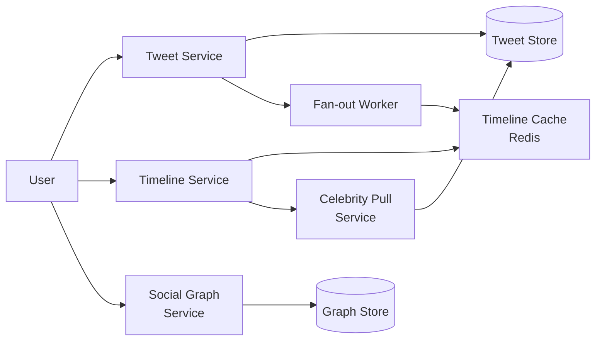

# Design Twitter

## Problem Statement

Design a microblogging service like Twitter. Users post short text updates ("tweets"), follow other users, and see a home timeline of tweets from accounts they follow. The system must serve timelines at very low latency and scale to hundreds of millions of users.

## Requirements

### Functional
- Post a tweet (text up to 280 chars, optional media)
- Follow / unfollow users
- View user profile timeline (own tweets)
- View home timeline (tweets from followed users, reverse chronological)
- Like and reply (basic)

### Non-Functional
- 300M+ DAU, billions of tweets/day
- p99 home-timeline read latency < 200ms
- Read-heavy workload (~100:1 reads:writes)
- 99.95% availability

## Expected Answer

### High-Level Design

Use a hybrid fan-out approach. For most users, fan-out-on-write: when a user tweets, push the tweet ID into the precomputed timeline cache of each follower. For celebrities with millions of followers, fan-out-on-read: pull their tweets at read time and merge with the precomputed timeline. Tweets and user data live in sharded storage; timelines live in Redis.

### Architecture Diagram

### Key Components

- **Tweet Service**: writes tweet to durable store, emits event for fan-out
- **Tweet Store**: sharded by user_id or tweet_id snowflake
- **Fan-out Worker**: queue-driven; for non-celebrity authors pushes tweet_id to follower timelines
- **Timeline Cache**: Redis sorted-set per user keyed by timestamp
- **Celebrity Pull Service**: at read time pulls latest tweets from celebrities the user follows
- **Social Graph Service**: stores follow relationships in adjacency list

### Tradeoffs

- Fan-out-on-write is fast at read but expensive for users with many followers
- Hybrid model adds complexity but handles both common and celebrity cases
- Redis cache loss requires rebuild from durable store; trade memory for speed
- Reverse-chronological is simple; ranked timeline would require an ML scorer at read or write time

### Scaling Considerations

- Snowflake-style tweet IDs encode timestamp + shard, enabling sharded sorting
- Cap fan-out workers per author or queue depth to prevent storms
- Multi-region Redis with local read replicas for low-latency reads
- Async media pipeline; tweet write does not block on media processing
