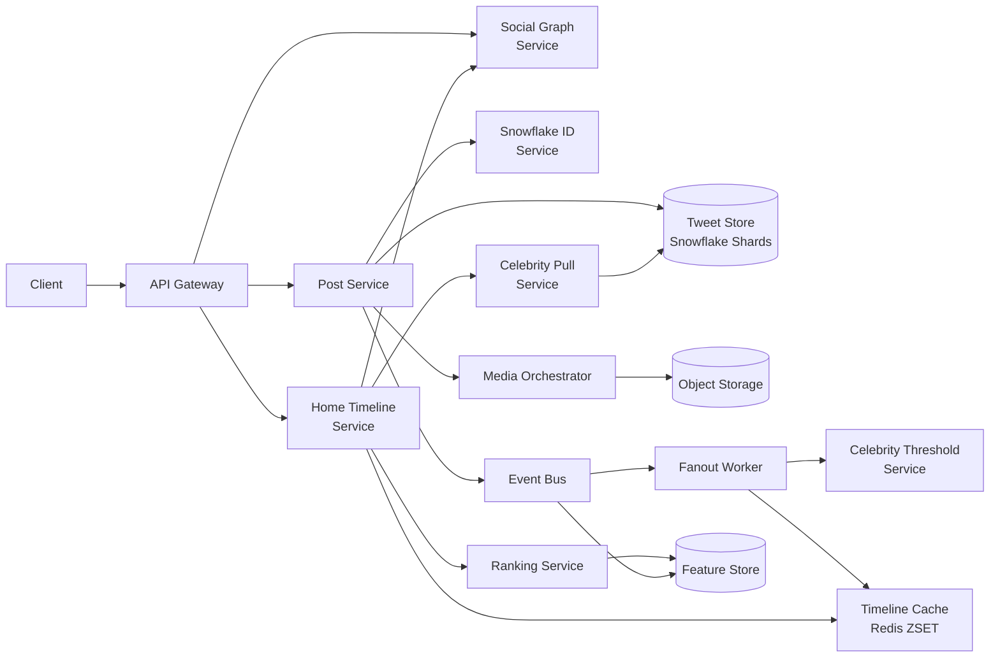
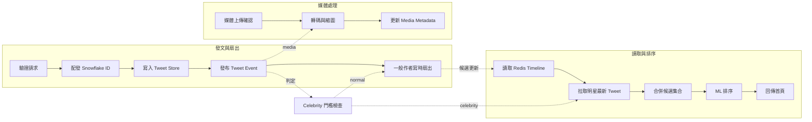
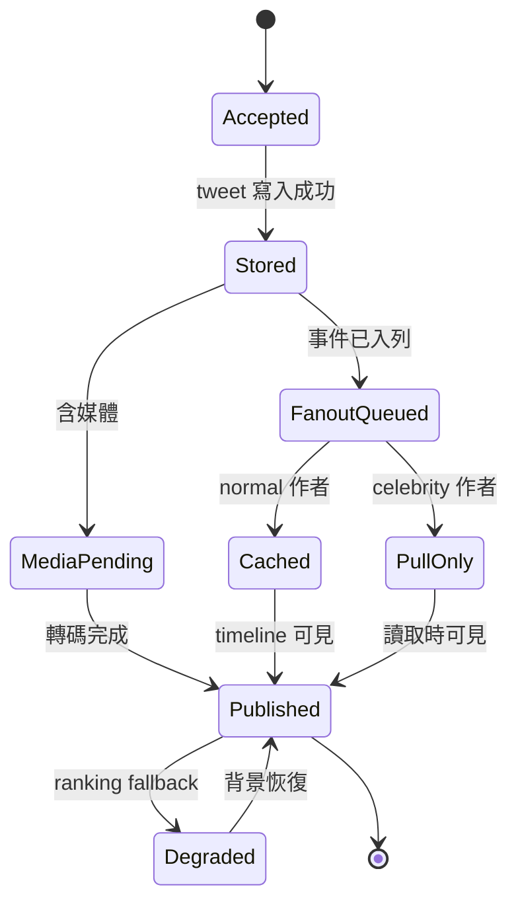

# 設計 Twitter

## 題目敘述
設計一個類似 Twitter 的微網誌服務。使用者可以發布最長 280 字的 tweet、附帶圖片或短影片、追蹤其他帳號、瀏覽個人 Profile timeline，並在 Home timeline 中看到自己追蹤對象的最新內容。系統必須在數億日活使用者、每日數億則新 tweet、以及明星帳號造成的極端流量偏斜下，仍能維持首頁讀取的低延遲與高可用；同時也要支援媒體非同步處理、社交關係查詢、以及以 ML 為基礎的 ranked timeline，而不能讓任何單一熱門作者把整個 fan-out 寫路徑拖垮。

## 需求

### 功能性需求

- **發佈 tweet**：支援文字 tweet、@mention、hashtag，以及選用的圖片 / 短影片附件。
- **追蹤關係**：支援 follow / unfollow，並能快速查詢某使用者的 following 與 follower。
- **個人時間軸**：可瀏覽任一使用者的 Profile timeline，按時間倒序顯示其已發布內容。
- **首頁時間軸**：可讀取 Home timeline，混合顯示追蹤對象的 tweet，支援分頁與下拉刷新。
- **互動行為**：支援 like、reply、retweet；計數可以最終一致，但讀取時要能看見近即時結果。
- **媒體處理**：圖片縮圖、影片轉碼、內容審查必須由非同步 pipeline 完成，tweet 發佈不等待整個媒體流程結束。

### 非功能性需求

- **吞吐量**：假設 3 億 DAU、每日 5 億則 tweet（平均約 5.8 K 寫/s，尖峰約 60 K 寫/s），每日 60 億次 Home timeline 讀取（平均約 69 K 讀/s，尖峰約 700 K 讀/s）。
- **延遲**：發佈 tweet API p99 < 300 ms；Home timeline p99 < 200 ms；Profile timeline p99 < 150 ms。
- **可用性**：首頁與個人時間軸 99.95%；發文路徑 99.9%；follow graph 查詢 99.99%。
- **持久性**：成功發布的 tweet 必須多副本持久化；即使單機房故障也不能遺失已 ack 的 tweet。
- **一致性**：tweet 內容本身需讀寫一致；timeline 候選集合、like 計數、ranking 分數允許秒級最終一致。
- **成本與資源**：首頁讀取必須盡量命中 Redis / memory cache；昂貴的 ML ranking 與媒體轉碼只能處理有限的 top-K 候選與非同步工作。

## 期望解答
### 業務需求

- **資訊新鮮度直接驅動留存**：使用者打開 Twitter 的首要期望是立刻看到剛發生的事，因此「新 tweet 幾秒內出現在首頁」比很多後台統計都更直接影響日活與留存。
- **明星流量不能拖垮整體體驗**：大多數作者粉絲數普通，但少數明星帳號會產生極端 fan-out 成本；若不把這些作者分流，單一爆紅事件就會讓所有人的首頁延遲一起惡化。
- **時間軸讀取必須像滑動一樣順**：首頁是最常被呼叫的核心路徑，低延遲與高 cache hit rate 直接決定使用者是否持續捲動、點讚、回覆與停留。
- **媒體內容提升互動但不應阻塞發文**：圖片與影片能明顯拉高互動率，但若每次發文都要等待轉碼與審核完成，使用者會感覺產品卡頓，因此媒體流程必須與 tweet 發佈解耦。
- **排名品質影響商業價值**：純倒序時間軸最簡單，但長期 engagement、廣告效率、與內容發現能力都更依賴 ranked timeline，因此系統要能在不拉高 p99 的前提下接入 ML scoring。

### 容量估算

#### 假設

- 註冊使用者約 10 億，DAU 約 3 億；平均每位 DAU 每天打開 Home timeline 20 次。
- 每日 5 億則 tweet ⇒ 5 億 / 86 400 ≈ 5.8 K 寫/s 平均；尖峰按 10× 估算約 58 K ~ 60 K 寫/s。
- 每日 60 億次 Home timeline 讀取 ⇒ 60 億 / 86 400 ≈ 69.4 K 讀/s 平均；尖峰按 10× 估算約 694 K ~ 700 K 讀/s。
- 每則 tweet 主資料平均約 700 B：tweet_id (8B) + author_id (8B) + text / metadata (約 300B) + counters / flags / index overhead (約 384B)；RF=3。
- 10% tweet 帶媒體，平均原始上傳 3 MB；轉碼後多版本與縮圖額外增加約 2× 儲存。
- 一般作者平均有 200 個活躍 follower；超過 100 K follower 的作者視為 celebrity，改走 fan-out-on-read。

#### 推導

- Tweet 主儲存：5 億 / 日 × 700 B ≈ 350 GB / 日；一年約 128 TB；5 年約 640 TB；RF=3 後熱資料約 1.9 PB。
- Home timeline 請求量：平均約 69 K rps、尖峰約 700 K rps，因此首頁一定要以快取與預先計算候選為主，不能每次現場掃完整 follow graph。
- 一般作者 fan-out 寫入：若 95% tweet 來自非 celebrity，則 4.75 億 / 日 × 200 follower ≈ 950 億筆 timeline entry / 日，平均約 1.1 M ZSET insert/s；若沒有 celebrity 分流，熱門作者會把這個數字推高數個數量級。
- Timeline cache 容量：每個熱使用者保留最近 500 個 candidate tweet_id 與 score，單 entry 估 32 B；若每區保留 1 500 萬熱使用者，約 1 500 萬 × 500 × 32 B ≈ 240 GB，含 replica 可抓 500 GB / 區。
- 媒體儲存：5 000 萬筆媒體 / 日 × 3 MB ≈ 150 TB / 日原始上傳；轉碼與縮圖後約 450 TB / 日總增量，因此媒體必須進 object storage 並做熱冷分層。
- Ranking 成本：若每次首頁只對 top 1 000 candidates 做特徵聚合，再讓 ML 模型輸出 top 50，則可把原本「全量追蹤對象 merge + 排序」的成本壓縮到可控範圍。

### 整體設計

整體採用混合式 fan-out。寫路徑中，Post Service 先配發 Snowflake tweet_id，將 tweet 主資料同步寫入以 tweet_id 分片的 Tweet Store，接著把 `tweet_created` 事件送進 Event Bus；Fanout Worker 透過 Social Graph Service 取得 follower 集合，並由 Celebrity Threshold Service 根據 follower 數、近十分鐘實際 fan-out 成本、與 queue backlog 判斷作者是否應走 fan-out-on-write。一般作者的 tweet_id 會批次推入 follower 的 Redis timeline sorted set；celebrity 則只更新自己的 Profile timeline 與 read-time index，讓 Home Timeline Service 在讀取時額外拉取其最新 tweet。讀路徑中，Home Timeline Service 先從 Redis 取預先計算的 candidates，再補抓追蹤中的 celebrity 最近內容、去重、hydrate tweet metadata，最後交給 Ranking Service 以特徵與 ML 模型算分，若 ranking 故障則退回 reverse chronological。媒體內容完全走非同步 pipeline：客戶端先上傳到 object storage，Media Orchestrator 觸發轉碼、縮圖與內容審查，完成後再更新 tweet 的 media metadata；因此發文延遲不被影片處理拖慢。

### 架構圖

### 關鍵元件

- **API Gateway**：做 TLS termination、auth、租戶 / 使用者層級限流，以及把發文、首頁、社交關係查詢路徑拆開處理。
- **Post Service**：驗證 tweet 內容、組裝 metadata、配發 Snowflake ID、同步寫入主儲存，並發布 `tweet_created` 事件。
- **Tweet Store**：以 tweet_id 分片的持久化儲存層，保存 tweet 本文、作者、media references、reply / retweet 關係與狀態旗標。
- **Social Graph Service**：維護 follow graph，通常需要雙向索引：`following_by_user` 與 `followers_by_user`，以支援 fan-out 與 follower count 查詢。
- **Fanout Worker**：訂閱 tweet 事件，對一般作者批次把 tweet_id 推到 follower 的 timeline cache；整個流程必須冪等，避免重複插入。
- **Celebrity Threshold Service**：根據 follower 數、活躍 follower 數、近期 queue 壓力與實際成本動態判定某作者是否改走 fan-out-on-read。
- **Timeline Cache**：Redis sorted set，key 為 user_id，member 為 tweet_id，score 可用 tweet 時間或預計算 rank hint；首頁主要從這裡讀 candidate 集合。
- **Home Timeline Service**：讀取 cache、拉取 celebrity 最新 tweet、做去重與 hydration，並把 top-K 候選交給 ranking。
- **Ranking Service**：讀取 user features、tweet features、social signals 與 freshness，產生 ranked timeline；失效時可直接退回時間倒序。
- **Media Orchestrator / Pipeline**：處理圖片縮圖、影片轉碼、內容安全審查與 metadata 更新，與發文主路徑解耦。

### 準入控制

1. **發文速率限制**：API Gateway 依使用者、IP、裝置風險分級做 token bucket；匿名或高風險流量先被限流，保護 tweet 寫入與 media upload 容量。
2. **fan-out 預算保護**：若某作者的 follower 數、近十分鐘 fan-out 成本、或 queue backlog 超過門檻，系統立即把該作者切到 celebrity 模式，避免單則 tweet 觸發巨量 Redis 寫入。
3. **首頁候選上限**：Home Timeline Service 對每次請求最多只取固定數量的 candidates（例如 1 000 筆），超過則截斷；深分頁走降級路徑，不讓單一使用者造成過度 merge / rank 成本。
4. **媒體佇列閘門**：Media Pipeline 依轉碼槽位與 GPU / CPU 使用率控制同時在途工作數；容量緊張時優先處理圖片、縮減高解析轉碼、或延後低優先影片。
5. **Ranking 計算保護**：當線上模型延遲飆高時，只對 top-N 候選做完整特徵查詢；其餘直接按時間倒序輸出，確保首頁核心 SLA 優先。

### Workflow 階段

1. **發文驗證與 Snowflake 配號**（API + CPU，約 5 ~ 10 ms，可中斷）：驗證 auth、文字長度、media reference、reply 對象與基本風險規則，接著產生 tweet_id；失敗直接回 4xx，重試只由 client 發起。
2. **Tweet 持久化**（分片 DB quorum 寫入，p99 約 20 ~ 40 ms，**寫入 ack 進行中不可中斷**）：將 tweet 主資料寫入 Tweet Store 與必要索引；若部分 replica 超時，協調者改投健康副本並以冪等 key 重試。
3. **媒體非同步處理**（Object storage + CPU / GPU，秒級到十秒級，可中斷）：若含媒體，背景完成上傳確認、縮圖、轉碼與審查；tweet 可先以 media pending 狀態對外可見。
4. **作者分類與 fan-out 決策**（CPU + graph lookup，約 5 ~ 15 ms，可中斷）：根據 follower count、活躍粉絲數與 queue 壓力判定 normal 或 celebrity；判定結果可快取數分鐘並持續校正。
5. **一般作者寫時扇出**（Queue + Redis 批次寫入，約 100 ms 到數秒，可中斷）：對 normal 作者批次列舉 follower，將 tweet_id 插入每位 follower 的 Redis ZSET；worker 以至少一次投遞 + 冪等插入實作。
6. **首頁候選合併與 hydrate**（Cache + DB read，p99 約 40 ~ 80 ms，可中斷）：Home Timeline Service 讀取預先計算 timeline，補抓追蹤中的 celebrity 最新 tweet，去重後再批次 hydrate tweet metadata。
7. **ML 排序與回傳**（Feature lookup + inference，p99 約 20 ~ 60 ms，可中斷）：對 top-K candidates 查線上特徵並計算分數，輸出 top 50；若模型逾時則降級成 reverse chronological。

### Workflow 圖

### 故障處理與服務降級

1. **Fanout Worker / queue backlog 堆積**：一般作者的 tweet 可能延後數秒出現在 follower 首頁，但 Tweet Store 與 Profile timeline 仍先成功；系統可暫時提高 celebrity 門檻敏感度，讓更多高成本作者改走 read-time merge。
2. **Redis timeline shard 故障**：Home Timeline Service 退回到「最近 cache snapshot + Tweet Store + celebrity pull」的混合查詢，延遲上升但首頁仍可用；背景程序從事件流重建遺失的 timeline cache。
3. **Social Graph Service 不可用或延遲飆高**：follow / unfollow 寫入先進 queue，首頁讀取使用近即時 graph cache 或上一版 follower snapshot；新追蹤關係可能延後數秒生效。
4. **Ranking Service 故障**：直接降級為 reverse chronological，仍從 Redis 取 candidates，只是略過特徵查詢與模型推論；可保住首頁主要可用性與大多數快取命中。
5. **Media Pipeline 積壓**：tweet 本文先發布，媒體以 placeholder 或低解析版本顯示；影片高階轉碼延後，避免發文路徑因 GPU 不足被拖慢。
6. **明星事件造成流量暴衝**：Celebrity Pull Service 與 Home Timeline Service 會啟用更積極的結果快取、縮小 candidate set、並限制深分頁；必要時暫時關閉部分非核心社交特徵。

### 優化

- **Hybrid fan-out**（bottleneck: celebrity 寫入放大）：一般作者走 fan-out-on-write，明星作者走 fan-out-on-read，把最昂貴的寫入擴散移出主路徑。
- **Redis sorted set 首頁快取**（bottleneck: Home timeline 讀取放大）：預先保存候選 tweet_id，避免每次讀取都重新掃 follow graph 與 Tweet Store。
- **Tweet Store 依 Snowflake ID 分片**（bottleneck: 熱點寫入與時間排序）：時間有序 ID 方便 profile scan、分區路由與跨 shard merge。
- **批次 follower 掃描與 pipeline 寫入 Redis**（bottleneck: fan-out worker QPS）：worker 一次抓 follower page 並批次送 ZADD，可比單筆插入顯著降低網路往返。
- **只對 top-K 做 ML ranking**（bottleneck: 線上推論延遲）：先用便宜規則粗排，再對較少的 candidates 查特徵與推論，控制 p99 與成本。
- **celebrity threshold 動態調整**（bottleneck: queue backlog / 熱點作者）：門檻不只看 follower 數，也看活躍粉絲與實際 fan-out 成本，避免靜態門檻失準。

### 權衡

- **fan-out-on-write vs fan-out-on-read**：前者讀取快但寫入放大嚴重；後者讀取貴但能處理明星帳號。我們選混合式，讓多數普通使用者享受低延遲讀取，同時隔離極端作者成本。
- **reverse chronological vs ranked timeline**：倒序簡單且可解釋，但 engagement 往往較差；ranked timeline 更符合商業目標，但引入特徵基礎設施、模型延遲與 debug 複雜度。
- **全量首頁快取 vs 僅快取熱使用者**：全量快取讀取最省，但 Redis 成本過高；只快取熱使用者需要冷啟重建與 fallback 路徑，但成本更合理。
- **單一社交圖資料庫 vs 多索引雙寫**：單一模型簡單但查詢模式受限；為了同時支援 following scan、followers count、與 fan-out，我們接受雙向索引與最終一致維護成本。

### 擴展性考量

- **Tweet Store 以 Snowflake bits 導向分片**，天然支援橫向擴容；新 shard 上線後可透過時間區段與 worker bits 漸進導流。
- **Social Graph 需要 source 與 target 兩種視角分片**：`following_by_user` 有利於首頁讀取，`followers_by_user` 有利於 fan-out 與 celebrity 判定；兩者都應支援高壓縮儲存。
- **Timeline cache 採多區部署與區域本地讀取**，首頁盡量在本區完成；跨區只同步 tweet 事件與必要 metadata，而不是同步整份 timeline。
- **Celebrity 判定應動態化**：單看 follower count 不足以反映真實成本；系統應根據活躍粉絲、近期互動率、與 queue backlog 做即時切換。
- **Ranking 基礎設施需分離 online 與 offline**：offline pipeline 訓練模型與產生 embedding，online path 只做低延遲特徵查詢與推論，避免首頁依賴批次計算。
- **事件匯流排依 author_id / user_id 分區**：可保證單作者事件有序、便於 fan-out worker 水平擴張，也能在局部熱點時精準擴容單一 partition 消費者。
