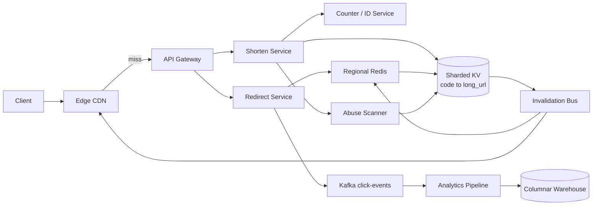
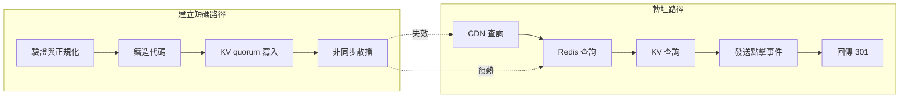
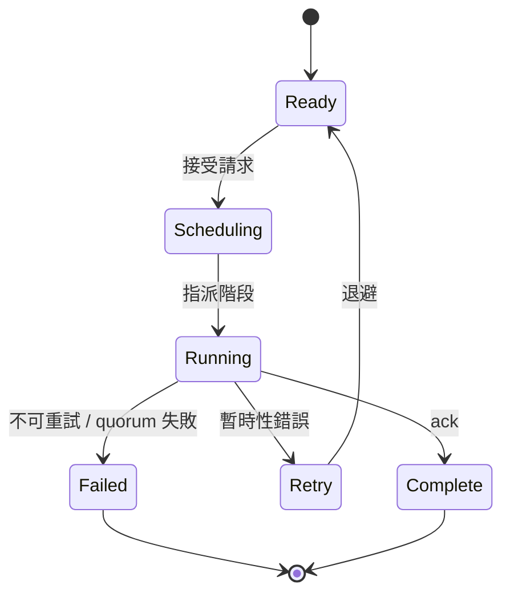

# 設計短網址服務

## 題目敘述

設計一個類似 bit.ly 的短網址服務。給定任意長網址，系統需要鑄造出一個全域唯一的短代碼（例如 `https://sho.rt/aZ9bK2`）；當該短代碼被造訪時，伺服器以 HTTP 301/302 將使用者導向原始目的地。系統必須在高寫入併發下保證代碼唯一、在熱門連結（病毒式擴散）的流量尖峰下仍維持 p99 < 100 ms 的轉址延遲、並在單一資料中心故障時零代碼遺失。點擊數據統計是必要功能，但絕對不能擋在轉址的關鍵路徑上。

## 需求

### 功能性需求

- **建立短碼**：接收長網址（與選用的自訂別名 / TTL），回傳一個全域唯一的短代碼。
- **轉址**：將短代碼解析回長網址，回傳 HTTP 301/302。
- **自訂別名**：登入用戶可保留虛榮 slug（如 `sho.rt/launch2026`）；衝突時回 409。
- **過期機制**：可選 TTL，過期後該代碼停止解析。
- **點擊分析**：統計每個代碼的點擊數、Referrer、國家、UA 分類，提供擁有者查詢。

### 非功能性需求

- **吞吐量**：每月 1 億筆新短網址（平均約 40 寫/s，尖峰約 400 寫/s），每月約 100 億次轉址（平均約 4 K 讀/s，尖峰約 40 K 讀/s；讀寫比 ≈ 100:1）。
- **延遲**：轉址 p99 < 100 ms（從邊緣節點計）；建立短碼 p99 < 300 ms。
- **可用性**：轉址路徑 99.99%（每年 ≤ 約 52 分鐘停機）；建立路徑 99.9% 可接受。
- **持久性**：成功回 200/201 即代表已多副本複寫；零鑄造代碼遺失。
- **成本上限**：穩態下每百萬次轉址成本 < $0.05（CDN + 快取 + DB 合計）。
- **法規遵循**：惡意 / 釣魚連結需在 1 小時內全球下架；個資（Referrer、IP）保留 ≤ 90 天。

## 期望解答

### 業務需求

- **可信賴的永久性**：發出的短連結必須持續可用——一個壞掉的連結比一個慢的連結更傷使用者信任，因此持久性與「絕不靜默重用舊代碼」優先於任何取巧的空間最佳化。
- **轉址路徑零摩擦**：在全球行動網路下都要感覺瞬間打開，這樣短網址才能繼續嵌進推文、簡訊、QR code、印刷品中而使用者察覺不到多了一跳。
- **預設安全的連結生態**：保護生態系不讓服務變成釣魚／惡意導流——濫用偵測、下架、租戶層級限流是核心產品功能，不是後加的。
- **可預期的免費工具成本**：轉址路徑必須便宜到（CDN + 邊緣快取）讓免費用戶不會把單位經濟拖垮；付費方案的分析功能補足其餘成本。
- **足以說服連結擁有者付費的分析品質**：擁有者需要可信的點擊數據以選擇我們而非自行架設，但分析絕不能拖慢轉址。

### 容量估算

#### 假設

- 每月 1 億筆寫入 ⇒ 1 億 / (30 × 86 400) ≈ 38.6 寫/s 平均；尖峰 10× ≈ 400 寫/s。
- 讀寫比 100:1 ⇒ 每月 100 億次轉址 ⇒ ≈ 3 858 讀/s 平均；尖峰 10× ≈ 38.6 K 讀/s。
- 每筆紀錄：short_code (8B) + long_url (平均 200B) + owner_id (8B) + created_at (8B) + ttl (8B) + flags (4B) ≈ 240B；含索引／複寫負載預估 500B。
- 保留期：5 年內的連結保持可解析 ⇒ 1 億 × 12 × 5 = 60 億筆。
- 點擊事件：每筆 1 KB（去正規化），批次寫入分析儲存，保留 90 天。

#### 推導

- 對映表儲存：60 億 × 500B ≈ 3 TB；RF=3 ⇒ 約 9 TB 原始容量——分片 KV 叢集綽綽有餘。
- 點擊事件量：4 K 平均事件/s × 1 KB = 4 MB/s ⇒ 每天約 340 GB ⇒ 90 天約 30 TB；冷層歸檔到欄式儲存。
- 快取占用：Top 1% 短碼承擔約 90% 流量（Zipf 分布）⇒ 快取 6 千萬筆熱門條目 × 約 300B ≈ 18 GB → 單一 Redis shard 即可裝下，再以區域複本擴展。
- 轉址路徑頻寬：40 K rps × 約 500B 回應 ≈ 20 MB/s 區域出口流量；CDN 吸收 95% 以上。
- 代碼空間安全度：base62^7 ≈ 3.5 兆組 ⇒ 以 1 億/月速度需 2 900 年才耗盡；隨機產生的碰撞機率在累積 100 億筆前都低於 10⁻⁹。

### 整體設計

寫入與讀取兩條路徑分離設計，因為它們在延遲、吞吐、一致性的需求差了兩個數量級。寫入路徑：無狀態的「Shorten Service」取得唯一代碼有兩條途徑——(a) 由 Counter Service 從 ZooKeeper/etcd 預先批次配發整段 ID 範圍，每個 Shorten replica 取一段 10 K ID 後在本地遞增；(b) 自訂別名走 KV 的條件式 insert（PUT IF NOT EXISTS）。確認後的對映以 RF=3 quorum 同步複寫，並透過 pub/sub 匯流排把 mint 事件非同步散發到每個區域快取與 CDN 邊緣。讀取路徑：CDN 命中 → 區域 Redis → 分片 KV 三層回退；回應帶 `Cache-Control: public, max-age=86400`，95% 以上流量在 CDN 結束。點擊事件由轉址 handler 以 fire-and-forget 方式寫入 Kafka，下游串流處理器更新近似計數器（HLL 算唯一訪客、精確計數每分鐘批次）寫進分析倉儲；轉址本身永遠不等分析。另有「Abuse Service」訂閱 mint 事件，比對安全瀏覽（Safe Browsing）饋源，必要時翻轉 `revoked` 旗標並透過同一條失效匯流排傳播。

### 架構圖

### 關鍵元件

- **API Gateway**：TLS 終止、租戶層級限流、Shorten 路徑驗證；轉址依路徑成本路由（CDN > Redis > KV）。
- **Shorten Service**：無狀態；隨機代碼從本地 counter range 取號後 base62 編碼；自訂別名以條件式 PUT 寫入 KV；發出 mint 事件。
- **Counter / ID Service**：以 etcd 配發不重疊的整數區段給 Shorten 各 replica（如每次抓 10 K 個 ID），消除全域熱列。
- **分片 KV**：唯一真實來源，依 code hash 分片，RF=3 quorum 寫入；支援條件式 insert 處理別名唯一性。
- **Redirect Service**：唯讀；快取 → KV 兩段查找後回 301/302，順手丟點擊事件。
- **區域 Redis**：區域內 LRU 熱碼快取（約 18 GB），由失效匯流排預熱。
- **CDN 邊緣**：對 301 回應快取 24 小時；吸收熱門連結爆量。
- **Kafka 點擊事件匯流排**：在轉址路徑與分析之間做持久緩衝，分析慢不會回壓到轉址。
- **分析管線**：串流處理器維護每代碼 HLL + 計數，落地到分析倉儲做 rollup。
- **Abuse Scanner**：訂閱 mint 事件、比對安全瀏覽饋源，可觸發吊銷與失效廣播。
- **Invalidation Bus**：將吊銷／覆寫事件 pub/sub 散發到所有快取與 CDN purge 端點。

### 準入控制

1. **租戶層級限流／配額**（API Gateway）：匿名 shorten 限 10 rpm/IP；免費登入 100 rpm；付費 10 K rpm；企業協商。觸發回 429 + upsell header。
2. **資源檢查**（shorten 寫入）：Counter Service 無法配發新 range（如 etcd 分區）時，gateway 開始丟掉非優先流量、回 `Retry-After`；同 slug 的別名 insert 競爭被序列化以保護 KV。
3. **熱碼流量整形**（轉址）：偵測到單一短碼超過 N krps 時提升其 CDN TTL 並 pin 到專屬 Redis hot-key replica；擁塞時把免費租戶的代碼降權，付費／企業 SLO 優先。
4. **跨區溢流**：區域轉址層飽和時，全球負載平衡把流量切到最近的健康區域；KV 多區同步，故障接手區頂多多一次跨區 cache miss。

### Workflow 階段

1. **驗證與正規化**（CPU，約 5 ms，可中斷）：解析長網址、拒絕非 http(s)、視使用者選項移除追蹤參數、輕量網域黑名單檢查；失敗短路 400。重試：僅由 client 端發起。
2. **鑄造代碼**（CPU，約 10 ms，可中斷）：隨機代碼取本地 range 下一個 ID；若 range 用完向 Counter Service 補；別名走條件式 insert。重試：別名衝突回 409；range 抓取失敗指數退避 3 次後 503。
3. **持久化對映**（KV quorum 寫入，p99 約 30 ms，**quorum ack 進行中時不可中斷**）：將 `(code, long_url, owner, ttl, created_at)` 寫入分片 KV；確認後才視為鑄造成功。重試：若部分 quorum 失敗，協調節點換另一 replica 重試。
4. **非同步散播**（CPU，最終一致，可中斷）：mint 事件丟到失效匯流排讓快取／CDN 預熱或失效；丟到 Abuse Scanner 佇列做安全瀏覽檢查。重試：消費者用至少一次 + 冪等 handler。
5. **轉址服務**（唯讀，區域內 p99 約 20 ms，可中斷）：CDN miss → Redis → KV；點擊事件丟 Kafka；回 301。重試：KV 讀失敗時退而求其次返回過期但有界的快取。

### Workflow 圖

### 故障處理與服務降級

1. **單一轉址 Pod 故障** → 健康檢查失敗，LB 把它從 pool 摘除；區域 Redis 仍服務；使用者幾乎無感。
2. **區域 Redis 故障** → 轉址層退到 KV 直查；p99 從 5 ms 升到約 30 ms 但可用性保住；背景重建並從 KV 預熱新的 Redis 副本。
3. **單一區域 KV shard 不可用** → 讀取由跨區複本接手（多約 60 ms RTT）；該 shard 寫入暫時 hinted-handoff 到鄰區；SLO 暫降到 99.9%。
4. **流量超過容量／病毒式熱碼** → CDN TTL 拉長、熱碼 Redis hot replica 拉起、免費租戶限流收緊以保護付費代碼。
5. **整區離線** → 全球 DNS / anycast LB 抽乾該區；讀寫故障接手最近區域；mint 路徑因每區都有 counter range 與可寫 KV 故能繼續。
6. **最後手段：靜態 fallback** → 若轉址層自身失能，CDN 在 max-age 內仍能提供前次快取的 301，現有連結不中斷。

### 優化

- **CDN 優先轉址**（瓶頸：讀 QPS / 延遲）：把 301 推到邊緣 24 小時 TTL，95% 以上流量不到原站；原站負載降 20×。
- **Counter Range 預配發**（瓶頸：寫入競爭）：每個 Shorten replica 擁有不重疊區段，消除全域熱列，鑄造變純本地操作。
- **熱碼提升**（瓶頸：單代碼爆量）：偵測超過 N krps 的代碼後 pin 到專屬 Redis 副本 + 拉長 CDN TTL，一條病毒連結不會餓死其他流量。
- **非同步點擊管線（Kafka）**（瓶頸：轉址延遲 vs 分析持久性）：fire-and-forget 讓熱路徑保持約 20 ms，分析慢也不影響。
- **別名 Bloom Filter**（瓶頸：KV 條件式 insert 負載）：在 KV 前放記憶體 Bloom Filter，常見的「slug 已被佔用」O(1) 命中且不擾動 KV。
- **長網址壓縮去重**（瓶頸：儲存與快取占用）：以 hash 對長網址去重，多個短碼指向同一筆正規化目的地，實測可省 30% 儲存。

### 權衡

- **Counter range 取號 vs 純隨機 hash**：counter range 代碼較短且零碰撞但耦合協調者；純隨機分散但需衝突重試且代碼較長。我們選 counter range，因協調者已分片且每次配發 10 K 已攤銷成本。
- **強一致 vs 最終一致 讀取**：對映建立後不可變，最終一致即可；轉址用 CDN 服務，吊銷以 ≤ TTL 的延遲收斂。
- **同步複寫 vs 寫入吞吐**：quorum 寫入加約 30 ms，但「連結永遠有效」的承諾不容妥協；高峰時也不降為非同步。
- **伺服器端記點擊 vs 延遲**：完全同步 logging 會多 5-10 ms；改採 Kafka best-effort + client-side beacon + 取樣補完整。
- **別名功能 vs 濫用風險**：別名是濫用磁鐵；以登入 + 更嚴格限流為閘門，犧牲一點免費 UX 換得安全。

### 擴展性考量

- **KV 依 code hash 分片**，配合一致性雜湊使新增 shard 漸進再平衡；代碼天生均勻（counter+base62），無熱點。
- **多區 active-active**：每區持有一段 counter range 與完整唯讀複本；跨區複寫非同步，代碼一寫即定，自然無衝突。
- **冷碼分層**：N 年以上代碼下放到物件儲存，熱 KV 只留索引；削減熱層大小與成本，僅輕微抬升解析延遲。
- **CDN + Redis 自動擴張熱碼**：sidecar 追蹤每代碼 QPS，即時提升 TTL 與促升熱碼複本。
- **Kafka 分析 fan-out**：依 code hash 分區，單一爆紅代碼的事件流序在同一 partition；偏斜時可重新平衡。
- **容量規劃保留**：Redis 記憶體保留 3× 尖峰、KV 寫入保留 2× 尖峰，避免單日爆紅活動或新企業客戶觸發即時 reshard。
