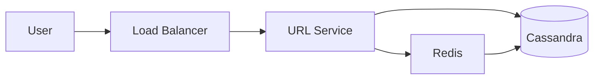

# Design a URL Shortener

## Problem Statement

Design a URL shortening service like bit.ly. Given a long URL, generate a short alias and redirect users.

## Requirements

### Functional
- Generate a short URL from a long URL
- Redirect short URL to original
- Custom aliases (optional)
- Analytics on click counts

### Non-Functional
- 100M URLs/month throughput
- p99 redirect latency < 100ms
- 99.9% availability

## Expected Answer

### High-Level Design

Use a write-heavy KV store keyed by short hash. Bloom filter to avoid collisions. CDN for hot redirects.

### Architecture Diagram

### Key Components

- **URL Service**: stateless, generates short codes via base62 encoding of counter or hash
- **Cache**: Redis LRU for hot URLs
- **Database**: Cassandra (write-heavy, eventually consistent)

### Tradeoffs

- Hash-based vs counter-based: hash avoids coordination but risks collision; counter needs distributed sequence
- Eventually-consistent reads acceptable since URLs are immutable

### Scaling Considerations

- Shard DB by short_code prefix
- CDN-cache 301 redirects
- Async analytics via Kafka
