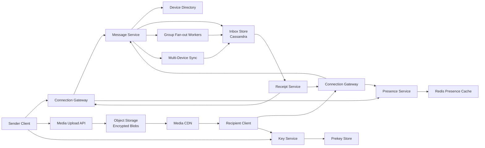
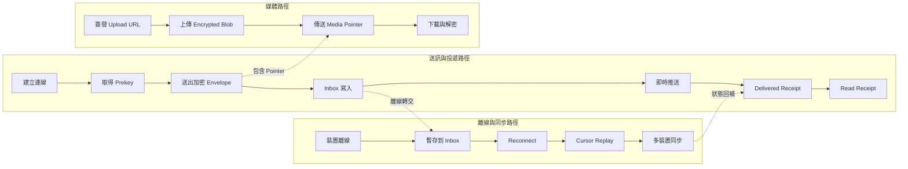
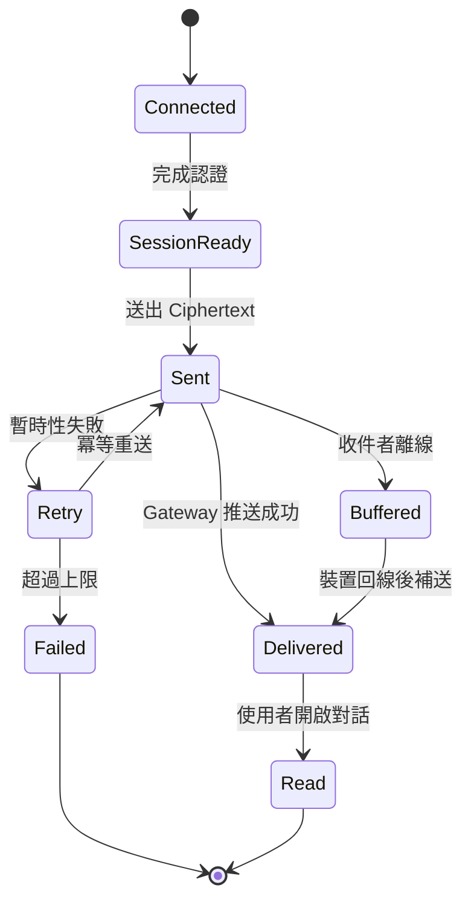

# 設計 WhatsApp
## 題目敘述
設計一個類似 WhatsApp 的全球即時通訊系統。使用者可在手機與桌面裝置上進行 1:1 與群組聊天，傳送文字、圖片、語音訊息與文件，看到 sent / delivered / read receipts，並在多裝置之間保持對話同步。系統必須在不穩定的行動網路、跨國高 RTT、裝置頻繁休眠與重新連線的環境下仍維持低延遲投遞；訊息內容預設採 end-to-end encryption，伺服器只能看到加密後的 envelope、metadata 與 routing 資訊，不能讀取明文。當接收者離線時，系統需要把訊息暫存到 per-user inbox，待其回線後補送；群組訊息要能支援大規模 fan-out；媒體檔案要以 encrypted blob 方式上傳到 object storage；presence 與 online status 需要靠 heartbeat 更新，但即使該功能降級，也不能影響核心送達能力。
## 需求
### 功能性需求
- **1:1 即時聊天**：雙方在線時可在數百毫秒內完成訊息投遞，支援 sent / delivered / read receipts。
- **群組聊天**：支援最多約 1 000 名成員的群組，包含加人、退群、群組 metadata 更新與群組訊息 fan-out。
- **多媒體傳輸**：支援照片、影片、語音訊息與文件；大檔案走 object storage，聊天訊息只傳遞 pointer、checksum 與 decryption metadata。
- **離線緩衝**：接收者離線時，訊息保留在 server-side inbox；回線後需按順序補送並去重。
- **多裝置同步**：同一帳號的手機、平板、桌面端都應收到各自 device queue 的訊息與狀態更新。
- **端對端加密**：使用 Signal protocol 類型的 session setup、prekey bundles 與 sender keys；伺服器不持有解密明文所需的私鑰。
- **在線狀態**：提供 best-effort 的 online / last-seen / typing indicator；由 connection server heartbeat 匯報。
- **媒體下載控制**：接收端拿到 encrypted blob URL 後再自行下載與解密，訊息本身只攜帶 metadata。
### 非功能性需求
- **規模**：20 億註冊用戶，日活約 12 億；每日約 1 500 億則訊息，尖峰每秒可達數百萬訊息寫入。
- **延遲**：雙方在線的文字訊息投遞 p99 < 500 ms；receipt 回傳 p99 < 800 ms；presence 更新對使用者感知延遲 < 5 s。
- **可用性**：核心送訊與收訊路徑 99.99%；presence、typing indicator、last-seen 可接受較低等級可用性。
- **持久性**：成功回 sent 給 sender 之後，代表加密 envelope 已寫入多副本 inbox store；不可靜默遺失訊息。
- **弱網友善**：客戶端可容忍短暫斷線、行動網路切換、NAT timeout 與 reconnect storm。
- **隱私**：伺服器只處理 ciphertext、sender / recipient / device metadata、delivery state 與 encrypted media pointer；不看明文內容。
- **成本控制**：大流量媒體必須從 object storage + CDN 提供，避免所有 byte 經過訊息伺服器。
## 期望解答
### 業務需求
- **送達可靠性優先於花俏功能**：使用者可以容忍 last-seen 不準，但不能接受訊息消失；因此 inbox durability、重試、去重與多副本寫入是產品信任的核心。
- **全球低摩擦溝通**：WhatsApp 的價值在於「打開就能送」，因此需要長連線、區域化接入點與離線補送，讓跨國聊天仍接近即時。
- **隱私即產品本身**：end-to-end encryption 不是附加功能，而是競爭護城河；設計必須預設 server 無法讀取訊息內容。
- **多裝置一致體驗**：使用者預期手機、桌面與平板都能看到相同對話與 receipt，因此架構必須從一開始就支援 per-device fan-out 與 sync。
- **媒體成本可預測**：文字訊息很小，但圖片與影片成本巨大；媒體必須從聊天主路徑解耦，讓 object storage 與 CDN 吸收大部分頻寬。
### 容量估算
#### 假設
- 20 億註冊用戶，日活約 12 億；同時在線裝置約 2 億台。
- 每日 1 500 億則訊息，平均約 1.74 M 訊息/s；尖峰以 5 倍估算約 8.7 M 訊息/s。
- 平均每則 envelope 大小約 350 B，包含 message_id、chat_id、sender、recipient / group、device metadata、ciphertext、receipt flags。
- 群組訊息佔 20%；平均每個群組實際投遞 fan-out 成員數 12，熱門群組另以分層 fan-out 吸收尖峰。
- 每個用戶平均綁定 2.2 台裝置；多裝置同步使實際 device-level delivery 約為 user-level delivery 的 1.8 倍。
- presence heartbeat 每台在線裝置每 45 秒一次，payload 約 150 B。
- 媒體附件佔 8% 訊息；平均媒體大小 600 KB；95% 流量由 object storage + CDN 提供。
- 離線訊息平均保留 7 天；Cassandra RF=3；索引與 compaction overhead 估 2 倍。
#### 推導
- 純 user-level 訊息寫入：1.74 M/s 平均，8.7 M/s 尖峰；若乘上多裝置同步 1.8 倍，device-level delivery event 約 3.1 M/s 平均、15.7 M/s 尖峰。
- 群組 fan-out 額外放大：20% 訊息 × 平均 12 名收件者，等效於整體投遞量再上升約 2.2 倍；因此 inbox write path 需按約 7 M/s 穩態、30 M/s 尖峰級別設計。
- Inbox 儲存：若保留 7 天離線與未確認訊息，7 M delivery/s × 350 B × 86 400 × 7 ≈ 148 TB 原始資料；乘上 RF=3 與 2 倍 overhead，約需 900 TB 熱儲存容量。
- Presence 負載：2 億台在線裝置 / 45 s ≈ 4.4 M heartbeat/s；每秒入口資料量約 660 MB，必須走極輕量寫入與 TTL key。
- 媒體頻寬：1 500 億/天 × 8% × 600 KB ≈ 720 PB/天 原始媒體下載需求；若 95% 經 CDN 命中，原站仍需承受約 36 PB/天 級別出口，因此媒體服務一定要與訊息服務切開。
- 長連線規模：2 億併發裝置，若單台 connection server 可穩定維持 100 K WebSocket，至少需約 2 000 台前線連線節點，再預留 2 倍冗餘與區域分散。
### 整體設計
整體上把系統拆成「連線層、訊息路由層、持久化 inbox、金鑰與裝置目錄、presence、媒體平面、同步與 receipts」七個子系統。Client 優先與最近區域的 Connection Gateway 建立長連線（WebSocket 為主，必要時 long-polling fallback），Gateway 維護 session 與 device-to-connection 映射，並把上行訊息交給 Message Service。Message Service 只處理 envelope：驗證 sender device、檢查 chat membership、決定目標 user / device、把 ciphertext 寫入 per-user / per-device inbox Cassandra，然後根據收件人是否在線將通知推給對應的 Connection Gateway；離線裝置則留在 inbox 等待 pull / replay。端對端加密採 Signal protocol：伺服器保存 public identity key、signed prekey 與 one-time prekey bundle，協助 session setup，但不見明文；群組採 sender keys 降低 N 倍加密成本。媒體檔案先由 sender client 直接上傳 encrypted blob 到 object storage，聊天訊息只包含 media pointer、size、hash 與 key metadata。Presence Service 由 connection servers 以 heartbeat 更新 Redis / CRDT-like TTL store，供 best-effort 查詢。多裝置同步則透過 Device Directory 與 Sync Service，把同帳號的各裝置視為獨立投遞目標，但以共同的 account timeline 與去重邏輯維持一致體驗。
### 架構圖

### 關鍵元件
- **Connection Gateway**：終止 WebSocket / long-polling，維護 device session、心跳、背壓、重連與 region pinning；只做輕量 routing，不負責重邏輯。
- **Message Service**：驗證 envelope、檢查 chat membership、分辨單聊或群聊、寫入 inbox store、產生 delivery task 與 receipt 狀態。
- **Inbox Store**：以 Cassandra 儲存 per-user / per-device inbox；按 recipient_user_id 或 recipient_device_id 分區，支援高寫入與有序 replay。
- **Device Directory**：維護帳號綁定的裝置清單、active sessions、device capabilities 與 key version，供多裝置 fan-out 與去重使用。
- **Key Service**：保存 public identity key、signed prekey 與 one-time prekey bundles；只協助 session bootstrap，不持有私鑰。
- **Presence Service**：接收 heartbeat、更新 online / last-seen / typing 狀態，以 TTL key 近似表示在線資訊。
- **Group Fan-out Workers**：把群組 envelope 轉成 member-level delivery task；大群組可分 shard / batch fan-out，避免單一 hot partition。
- **Receipt Service**：處理 sent、delivered、read receipts，對 sender 與其他裝置回放狀態更新。
- **Media Upload API**：簽發上傳 URL 與內容限制；真正 byte stream 由 client 直接進 object storage。
- **Multi-Device Sync**：把同帳號不同裝置視為不同 delivery target，並在 reconnect 時按 cursor 補送缺失事件。
### 準入控制
1. **連線層限流**：每個帳號、IP、裝置型別都有 connection quota；大量 reconnect 時先限制匿名或低優先級流量，保護既有 session。
2. **送訊配額**：對單一 sender、單一群組與可疑帳號設定 message rate limit；異常爆量時回 `429` 或延後進入 fan-out queue。
3. **群組 fan-out 節流**：大群組訊息進入分批 fan-out pipeline，限制每秒展開的 member 數，避免單一熱門群組壓垮整個 inbox 集群。
4. **媒體準入檢查**：上傳前先驗證檔案大小、content type、惡意內容掃描結果與租戶配額；超限時拒絕簽發 upload URL。
5. **Presence 降級保護**：當 heartbeat 壓力過高時，停用 typing indicator、拉長 last-seen 更新頻率，優先保住 message delivery。
6. **多裝置同步保護**：reconnect 後的 sync replay 以 cursor 與批次窗口控制，一次只回補有限數量，避免單一重連裝置造成 read storm。
### Workflow 階段
1. **建立連線與註冊裝置**（network，約 50 至 200 ms，可中斷）：Client 與最近區域 Gateway 建立 WebSocket，帶上 auth token、device_id 與 sync cursor；失敗時退到 long-polling。重試：指數退避加 jitter。
2. **取得 prekey 與建立 session**（CPU + network，約 20 至 80 ms，可中斷）：Sender 向 Key Service 取 recipient 的 prekey bundle，建立 Signal session；若 bundle 不足則使用舊 session 或暫時排隊。重試：短暫失敗可重試，bundle 缺貨需背景 replenishment。
3. **送出加密 envelope**（network + CPU，約 10 至 30 ms，可中斷）：Sender 把 ciphertext、message_id、chat metadata 傳給 Gateway，再交由 Message Service 驗證與路由。重試：client 以 message_id 冪等重送。
4. **寫入 inbox 與 fan-out**（storage，p99 約 40 至 120 ms，寫入 quorum 期間不可中斷）：單聊直接寫 recipient inbox；群組先展開 member list，再批次寫多個 recipient inbox 與 device queue。重試：部分失敗以去重 key 重做 batch。
5. **即時推送與 receipt 更新**（network，p99 約 50 至 200 ms，可中斷）：若裝置在線，Gateway 立即推送；裝置 ack 後更新 delivered，使用者打開對話後再更新 read。重試：未 ack 保留在 inbox 等待 reconnect。
6. **多裝置補送與同步**（storage + network，秒級，可中斷）：同帳號其他裝置收到同步事件；離線裝置回線後按 cursor replay 未收事件。重試：以 cursor 與 message_id 去重，保證至少一次投遞。
7. **媒體上傳與下載**（network + object storage，秒級，可中斷）：大檔媒體由 client 直接上傳 encrypted blob；接收者收到 pointer 後再從 CDN 下載並本地解密。重試：斷點續傳與多段下載。
### Workflow 圖

### 故障處理與服務降級
1. **單一 Connection Gateway 故障**：LB 把節點摘除，client 重新連到同區其他節點；若 session mapping 遺失，使用 sync cursor 從 inbox 補送未完成事件。
2. **Presence Service 故障**：online / last-seen / typing indicator 暫停更新，但訊息寫入 inbox 與 delivery path 不受影響；UI 可退回「未知狀態」。
3. **單一 Cassandra shard 壓力過高**：對熱群組改用 batch fan-out 與暫時 queue buffering，必要時把超大群組切到專屬 fan-out worker pool。
4. **Key Service 暫時不可用**：既有 session 可繼續傳訊；只有首次建立 session 或 prekey 用盡的對象會延遲。系統優先保留舊 session，而不是全面阻塞。
5. **Object Storage 或 CDN 異常**：文字訊息與 receipts 繼續運作；媒體訊息顯示下載失敗與稍後重試，不讓主聊天路徑被拖垮。
6. **跨區網路分割**：使用者先被 pin 到本區接入點；跨區投遞若受阻，訊息先落本地 inbox 與跨區 replication queue，待連線恢復後補送，犧牲即時性保住 durability。
7. **Reconnect Storm**：大規模斷線後，大量裝置同時重連；系統以 admission control、cursor 分頁回補與低優先級功能關閉來保住核心投遞。
8. **Receipt 管線落後**：可延後 read receipts 與多裝置狀態同步，只要 delivered path 仍健康，就維持基本聊天可用。
### 優化
- **區域化長連線接入**（bottleneck: 連線數與 RTT）：讓 client 連最近區域，降低 keepalive 成本與跨洋往返延遲。
- **per-user inbox + per-device queue 分離**（bottleneck: 多裝置同步）：帳號級 timeline 與裝置級投遞分開，兼顧一致體驗與高寫入吞吐。
- **Sender Keys 用於群組加密**（bottleneck: 群組加密 CPU）：避免 sender 對每個群組成員各自重新做昂貴 session setup。
- **Batch fan-out workers**（bottleneck: 熱群組寫放大）：把大群組拆 shard 批次寫入，降低單次 fan-out 峰值。
- **Heartbeat 壓縮與 TTL key**（bottleneck: presence 寫入量）：presence 只存最後活躍時間與短 TTL，避免重型資料模型。
- **Client 直傳媒體**（bottleneck: 頻寬與訊息伺服器 CPU）：媒體 byte 不經 Message Service，讓聊天主路徑只處理小 envelope。
- **冪等 message_id 與 cursor replay**（bottleneck: 重試與去重）：至少一次投遞下仍可保證使用者不會看到重複訊息。
- **區分核心與次要功能 SLO**（bottleneck: 整體容量壓力）：優先保住送訊、收訊、離線補送，把 presence、typing、last-seen 視為可降級能力。
### 權衡
- **WebSocket 長連線 vs 純輪詢**：長連線延遲更低、體驗更好，但需要更多 connection state 與 failover 機制；我們選長連線，並保留 long-polling fallback。
- **per-recipient inbox vs 單一聊天日誌**：per-recipient inbox 寫放大較高，但離線補送、裝置去重與刪除已送資料更簡單；WhatsApp 類系統通常更偏前者。
- **強一致 receipts vs 最終一致 receipts**：強一致會拖慢主路徑；我們選 delivered / read 最終一致，讓訊息本體先安全送達。
- **server-side fan-out vs client-side fan-out**：client-side 可減少後端狀態，但對大群組與弱網不友善；我們選 server-side fan-out 配合 sender keys。
- **完整 presence 準確度 vs 系統成本**：秒級精準 online status 很昂貴；我們接受 best-effort online / last-seen，而不讓它侵蝕訊息系統資源。
- **端對端加密 vs 伺服器能力**：E2E encryption 強化隱私，但讓 server-side search、內容審查與部分除錯變困難；這是產品定位上的主動取捨。
### 擴展性考量
- **Connection Gateway 水平擴張**：session state 盡量外部化或可重建，讓新增 gateway 只需接管更多裝置連線即可擴容。
- **Inbox Store 依 recipient 分片**：以 user_id / device_id 做一致性雜湊，天然支援橫向擴張與離線補送。
- **Group fan-out 與 receipt 分流**：把群組展開、receipt 更新、sync replay 拆成不同工作池，避免互相干擾。
- **Key Service 與 Device Directory 分區化**：裝置目錄與 prekey bundle 可按 account shard 切分，降低熱帳號影響範圍。
- **媒體平面獨立演進**：object storage、CDN、transcoding 與內容掃描可獨立擴容，不受聊天 envelope TPS 牽制。
- **多區 active-active 接入**：使用者接入點可依地理位置與健康度切換；跨區 replication 採非同步，但訊息一旦 ack sent 就已落多副本。
- **冷熱資料分層**：近期未送達與未同步事件留在熱層 Cassandra；歷史已確認訊息可移到較便宜的 archive 或備份層。
- **可控降級面**：在超大流量或區域故障時，可依序停用 typing、presence、last-seen、read receipts，而不碰核心收發流程。
