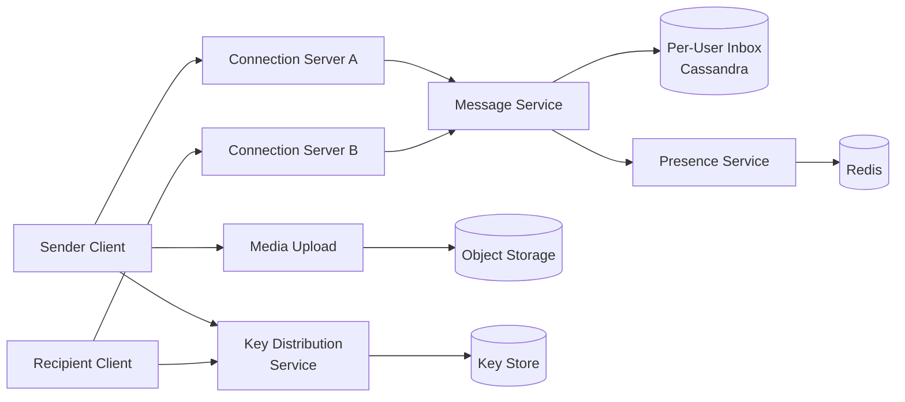

# Design WhatsApp

## Problem Statement

Design a real-time mobile messaging service like WhatsApp. Users exchange text and media messages 1:1 and in groups, see delivery and read receipts, and have messages end-to-end encrypted. The system must work over flaky mobile networks and scale to billions of users.

## Requirements

### Functional
- 1:1 chat and group chat (up to ~1000 members)
- Real-time delivery with sent / delivered / read receipts
- Media (photos, voice notes) attachments
- Online presence indicator
- End-to-end encryption (Signal protocol)
- Offline message buffering

### Non-Functional
- 2B+ users, hundreds of billions of messages/day
- p99 message delivery latency < 500ms when both parties online
- Tolerate intermittent connectivity gracefully
- 99.99% availability

## Expected Answer

### High-Level Design

Clients connect over a long-lived WebSocket / XMPP-like connection to a regional Connection Server. Connection Servers track which users are online and route messages to a central Message Service that persists messages to per-recipient inboxes. A Presence Service tracks online/offline state. Media is uploaded to object storage; messages carry only the URL and decryption key. End-to-end encryption keys are exchanged via a Key Distribution Service; the server never sees plaintext.

### Architecture Diagram

### Key Components

- **Connection Server**: terminates client WebSocket, tracks online sessions in Redis
- **Message Service**: validates, persists, and routes messages to recipient's Connection Server
- **Per-User Inbox**: Cassandra row per user, ordered by message timestamp; cleared after delivery confirmation
- **Presence Service**: heartbeats from Connection Servers update online state
- **Media Pipeline**: client uploads encrypted blobs to object storage; recipient downloads + decrypts
- **Key Distribution Service**: stores public prekey bundles for Signal-protocol session setup

### Tradeoffs

- Long-lived connections give low-latency push but require sticky load balancing and graceful failover
- Storing only undelivered messages keeps storage cost bounded but complicates multi-device sync
- Group fan-out at sender (n-1 encrypted copies) keeps server stateless but increases sender bandwidth
- E2E encryption prevents server-side search and content moderation by design

### Scaling Considerations

- Region-pinned Connection Servers with cross-region routing for cross-region pairs
- Shard inbox store by user_id; archive delivered messages to cold storage
- Backpressure on clients with offline buffers to handle reconnect storms
- Multi-device support requires per-device message fan-out and sync server
