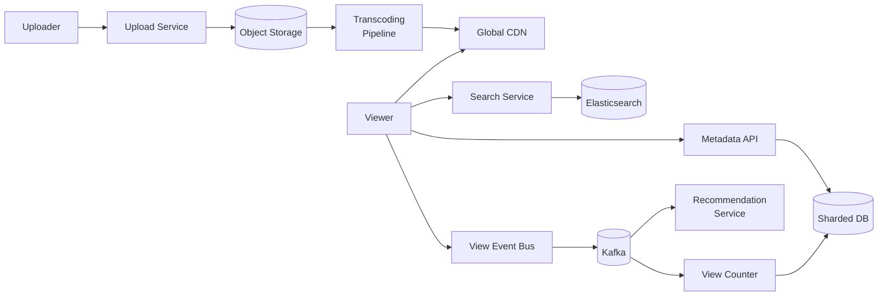

# Design YouTube

## Problem Statement

Design a video-sharing platform like YouTube. Users upload videos, the system transcodes them to multiple resolutions, and other users stream them globally with low buffering. Include search, recommendations, and view counts.

## Requirements

### Functional
- Upload videos up to several GB
- Transcode to multiple resolutions (240p–4K) and bitrates
- Stream adaptive bitrate (HLS/DASH) globally
- Search videos by title and metadata
- Track view counts and basic recommendations

### Non-Functional
- 1B+ daily active users, billions of views/day
- p99 start-of-playback latency < 2s globally
- 99.95% availability for playback
- Storage in exabytes; video assets are immutable once published

## Expected Answer

### High-Level Design

Uploads land in object storage and trigger an async transcoding pipeline that produces multi-bitrate HLS segments. CDN edge nodes cache segments globally. Metadata (title, owner, view count) lives in a sharded SQL/NoSQL store. Search runs on an inverted index (Elasticsearch). View counts use an approximate counter with periodic flush. A separate recommendation service consumes view events from Kafka.

### Architecture Diagram

### Key Components

- **Upload Service**: chunked resumable uploads to object storage
- **Transcoding Pipeline**: serverless or queue-driven workers producing HLS/DASH segments
- **CDN**: edge cache for video segments and thumbnails
- **Metadata DB**: sharded by video_id
- **Search**: inverted index over title, description, tags
- **Recommendation Service**: offline + online ML pipeline consuming view events
- **View Counter**: approximate counter (HyperLogLog / batched updates)

### Tradeoffs

- Pre-transcode all resolutions (fast playback, costly) vs on-demand (cheap, slow first view) — pick pre-transcode for popular content
- Strong consistency on view counts is unnecessary; eventual consistency keeps the hot path fast
- Push-based vs pull-based recommendations: push refines per-user feed but increases write amplification

### Scaling Considerations

- CDN tiered caching: edge → regional → origin
- Shard metadata DB by video_id; replicate read traffic
- Use Kafka to decouple ingestion from analytics, recommendations, and counters
- Separate cold storage tier for old, rarely-watched videos
