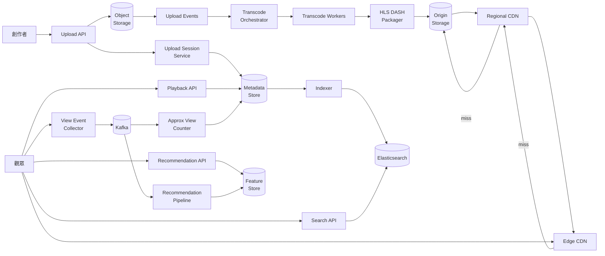
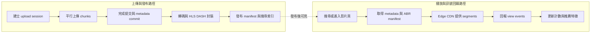
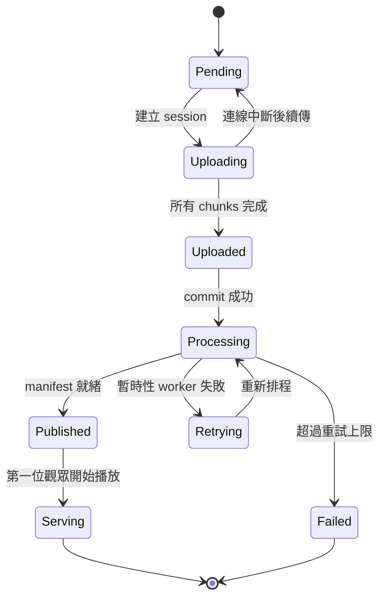

# 設計 YouTube

## 題目敘述

設計一個類似 YouTube 的全球影片分享平台。創作者可以上傳數百 MB 到數 GB 的影片，系統必須支援 chunked resumable upload，並在背景非同步完成轉碼、縮圖、字幕抽取與 HLS/DASH 封裝，讓觀眾在世界各地以 Adaptive Bitrate Streaming 低緩衝播放。平台同時要支援影片 metadata 管理、全文搜尋、觀看數統計、推薦首頁與內容審核；播放是絕對核心路徑，任何搜尋、計數、推薦或 ML 任務都不能拖慢首幀時間或造成全球熱門影片的 origin 壅塞。

## 需求

### 功能性需求

- **影片上傳**：支援大檔案 chunked resumable upload，網路中斷後可依 upload session 從已完成的 chunk 繼續。
- **非同步處理**：影片完成上傳後，背景轉碼產生 240p 至 4K 多種 resolutions / bitrates，切成 HLS/DASH segments，並生成 manifests、thumbnails、captions。
- **全球播放**：觀眾可在全球以 Adaptive Bitrate Streaming 播放影片，播放器會依當前頻寬與裝置能力切換 rendition。
- **搜尋與發現**：依標題、描述、標籤、創作者、語言等 metadata 搜尋影片；結果需要支援排序與基本 typo tolerance。
- **觀看數與推薦**：追蹤 view count、近似 unique viewers、watch time 等訊號，並將觀看事件送進推薦與 ML pipeline。

### 非功能性需求

- **規模**：每日約 200 萬支新影片上傳、每日約 50 億次播放、全球數億活躍用戶。
- **延遲**：影片頁 metadata / manifest API p99 < 200 ms；start-of-playback p99 < 2 秒；CDN 命中 segment 延遲維持在數十毫秒等級。
- **可用性**：播放路徑 99.95% 以上；上傳與後處理可接受較低 SLA，但不能遺失已 ack 的影片資料。
- **持久性**：成功完成 upload commit 即代表原始影片已落到多副本 / erasure-coded object storage；發布後的影片資產視為 immutable。
- **一致性**：播放可接受最終一致（例如觀看數延遲數分鐘），但影片發布、刪除、權限與版權封鎖必須快速收斂到全球邊緣。
- **成本上限**：segment 流量必須主要由 tiered CDN 吸收；昂貴的 GPU / CPU transcoding 與 cold storage 需要按熱門度分層配置。

## 期望解答

### 業務需求
- **創作者可相信平台不會吞片**：只要 upload commit 成功，就必須保證原檔可恢復與後續可重試；否則創作者會流失到其他平台。
- **觀眾幾乎感受不到距離**：點開影片後應快速開始播放，哪怕在跨洲、行動網路或熱門影片爆量下也不能頻繁 buffering。
- **觀看越多，推薦越準，但播放不能被 ML 拖累**：推薦對商業價值極高，但推薦、分析、特徵抽取都必須從播放熱路徑解耦。
- **熱門內容單位經濟要成立**：全球 segment 流量遠大於控制面 API，必須依賴 edge → regional → origin 的快取層次，不然 egress 成本會失控。
- **搜尋、審核、版權與下架要跟得上內容供給**：影片一旦發布，必須能很快被索引；一旦違規或版權申訴成立，也必須能快速在全球停止分發。

### 容量估算
#### 假設
- 每日 200 萬支新影片 ⇒ `2 000 000 / 86 400 ≈ 23` 支影片/s 平均；尖峰抓 10× ⇒ 約 230 支影片/s。
- 平均原始影片大小 300 MB、平均長度 12 分鐘；每支影片切成 8 MB chunks ⇒ 約 38 個 chunks。
- 每支影片預先產生 6 個 renditions（240p / 360p / 480p / 720p / 1080p / 4K）+ 音訊 + thumbnails + manifests，輸出資產平均約 1 GB。
- 每日 50 億次播放；平均每次播放拉取 120 個 6 秒 segments（含音訊 / video playlists / retries 的保守估算）。
- 每筆 view event 去正規化後約 200 B；metadata 主表每支影片有效占用約 6 KB（含索引與複寫攤提）。

#### 推導
- Upload session QPS：23/s 平均、230/s 尖峰；但 chunk PUT QPS 約為 `23 × 38 ≈ 874/s` 平均、尖峰約 8.7 K/s，因此上傳資料面要與控制面分離。
- 轉碼工作量：`200 萬 × 6 = 1 200 萬` rendition jobs / 日；每支 12 分鐘 ⇒ 1.44 億 encoded-minutes / 日。若單 worker 平均 2× real-time，約需 `1.44 億 / 2 880 ≈ 5 萬` 個 720p-equivalent worker 才能打平穩態。
- 播放控制面：50 億次播放 / 日 ⇒ `≈ 57.9 K` metadata / manifest rps 平均；尖峰 10× ⇒ 約 580 K rps。
- Segment 請求：`50 億 × 120 = 6 000 億` segment requests / 日 ⇒ 約 `6.94 M rps` 平均；若 edge hit 97%，regional 承接約 208 K rps；regional 再命中 90%，origin 約 20.8 K rps 平均。
- 影片資產儲存：`200 萬 × 1 GB = 2 PB / 日`；一年約 730 PB，若以 erasure coding / 多區複製總 overhead 抓 1.4×，年增量接近 1 EB。
- Metadata 主表：3 年累積 `200 萬 × 365 × 3 ≈ 21.9 億` 支影片；以 6 KB / 支估算約 13 TB，遠小於影片媒體本身，因此 metadata 與 media asset 應分別優化。
- View event 流：`50 億 × 200 B ≈ 1 TB / 日` 原始事件；Kafka RF=3 時熱層約 3 TB / 日，保留 7 天約 21 TB。
- Approx view counter：若熱影片集合約 2 億支，每支維護一份 1.5 KB 級別的 HLL / sketch，熱層記憶體約 300 GB，可由多 shard in-memory aggregator 承載。

### 整體設計

整個系統切成上傳控制面、上傳資料面、離線 / 背景處理、全球播放資料面四條主路徑。創作者先向無狀態 Upload API 取得 upload session 與預簽名 chunk URL，chunks 直接寫入 object storage，完成後由 commit 請求寫入 `video_id` 對應的 metadata 並發出 upload-complete event。背景的 Transcode Orchestrator 依影片長度、編碼格式、優先級把工作切到 worker pool，產生多個 bitrate ladders、thumbnails、字幕與 HLS/DASH manifests，再把已封裝的 segments 寫到 origin storage。觀眾播放時，先透過 Playback API 讀取以 `video_id` 分片的 metadata store 與授權資訊，再由播放器向 edge CDN 取 manifest 與 segments；edge miss 才逐層回 regional CDN 與 origin。影片 metadata 的搜尋索引由非同步 Indexer 寫入 Elasticsearch；觀看事件則以 fire-and-forget 方式進 Kafka，下游分別更新 approximate view counter（HyperLogLog + batched flush）、分析倉儲與 Recommendation pipeline，讓播放熱路徑只承受必要的讀取延遲，而不等待任何計數或 ML 結果。

### 架構圖

### 關鍵元件
- **Upload API**：建立 upload session、檢查權限 / 配額、回傳預簽名 URL；本身無狀態，只處理控制面。
- **Upload Session Service**：追蹤 upload_id、已完成 chunk、checksum、過期時間；讓 client 可斷點續傳並避免重複 commit。
- **Object Storage**：承接原始 chunks 與後續已封裝 media assets；以 multi-part upload + erasure coding 提供高持久性。
- **Transcode Orchestrator**：根據影片長度、codec、熱門度與優先級排程 worker；控制重試、死信與成本策略。
- **Transcode Workers / Packager**：將原檔轉成多個 bitrate ladders，輸出 HLS / DASH manifests、segments、thumbnails、captions。
- **Metadata Store**：以 `video_id` 分片，保存標題、描述、創作者、權限、asset pointers、moderation flags、最新計數快照。
- **Playback API**：回傳影片 metadata、授權、manifest 位置與部分 personalization 資訊；是播放器開始播放前的控制面入口。
- **Tiered CDN**：Edge CDN 服務絕大多數 segments；Regional CDN / origin shield 吸收跨區回源與熱門影片瞬時爆量。
- **Search API + Elasticsearch**：非同步維護 inverted index，支援全文搜尋、filter、ranking 與 typo tolerance。
- **Approx View Counter**：以 HyperLogLog / sketches 聚合 unique viewers，並以 batched flush 將 view count / watch time 快照寫回 metadata store。
- **Recommendation Pipeline**：消費 Kafka 觀看事件，更新 online features、訓練樣本與 candidate sets，供 Recommendation API 讀取。

### 準入控制
1. **創作者配額與並行數限制**（Upload API）：每個 channel / 租戶有每日上傳額度、單檔大小上限、同時進行 upload sessions 上限；超量回 429 或要求排程到低峰時段。
2. **上傳資料面保護**（Object Storage / Gateway）：當某區 object storage 或網路出口逼近飽和時，系統優先允許既有 session 完成，延後新的 upload session 建立，避免半途而廢的大片段浪費。
3. **轉碼準入與降級**（Transcode Orchestrator）：佇列過長時先保證 audio + 360p / 720p 可播放，4K / HDR / AV1 後補；熱門創作者、付費內容、法務急件可提升優先級。
4. **播放保護**（Playback / CDN）：熱門影片自動提高 edge TTL、開啟 origin shield、關閉低價值預取與部分 autoplay，以保住首幀時間與核心播放流量。
5. **非同步消費者背壓**（Kafka consumers）：搜尋、分析、推薦若落後，可先取樣、延後 feature enrich 或暫停次要 topics；播放與 upload commit 不可被其阻塞。

### Workflow 階段
1. **建立 upload session**（控制面，約 20 ms，可中斷）：驗證創作者權限、檔案大小、codec 基本限制與配額後，建立 `upload_id`、分配 chunk 大小與預簽名 URL。重試：client 可冪等重打，使用 client token 避免重複建立 session。
2. **Chunked resumable upload**（資料面，單 chunk p99 約 200 ms，可中斷）：client 平行上傳 chunks 到 object storage，session service 記錄已完成 offsets / checksums。重試：單 chunk 失敗可重送，不必重傳整支影片。
3. **完成提交與 metadata commit**（metadata 寫入，p99 約 50 ms，commit 視窗內不可中斷）：所有 chunks 完成後送出 finalize / commit，系統驗證 checksum、組合原檔、建立 `video_id` 與初始 metadata。重試：若 finalize 逾時可查 upload session 狀態；成功後重複 commit 必須回同一結果。
4. **非同步轉碼與封裝**（背景作業，數十秒至數分鐘，可中斷）：upload-complete event 進入排程器，worker 產生各種 resolutions / bitrates、音訊軌、thumbnails、captions，最後輸出 HLS / DASH manifests。重試：單 rendition 失敗可局部重試；整體不需回滾已成功的 renditions。
5. **發布、索引與快取預熱**（背景寫入，秒級至分鐘級，可中斷）：當最小可用 ladder 就緒後，把影片狀態標為 published、更新搜尋索引、把熱門首屏 segments / thumbnails 預熱到 regional / edge。重試：Indexer 與 CDN 預熱採至少一次 + 冪等處理。
6. **播放、計數與推薦回饋**（讀取 + streaming，manifest 約 80 ms，首幀 < 2 秒，可中斷）：觀眾進入影片頁後讀 metadata / manifest，播放器依 ABR 選段播放，觀看事件非同步寫入 Kafka，後續批次更新 view count 與推薦特徵。重試：播放器可切換 bitrate、重抓 manifest、或回退到較低解析度而不中斷整體播放。

### Workflow 圖

### 故障處理與服務降級

1. **Upload API Pod 故障** → LB 摘除故障實例；client 重新查 upload session 後繼續上傳未完成 chunks，已落盤的 chunks 不受影響。
2. **Object Storage / 單一 AZ 故障** → multi-part upload 轉送到其他健康副本或區域；新的 upload session 可能被節流，但既有已 ack 的 chunks 仍保留。
3. **Transcoding backlog 暴增** → 系統先發布 audio + 360p / 720p，UI 顯示「HD 版本處理中」；4K / HDR 延後，以保證影片能先被觀看與索引。
4. **Regional CDN 或 origin 壓力過大** → edge TTL 拉長、開啟 shield、關閉低價值預取；部分冷門影片首幀延遲上升，但熱門內容仍可播放。
5. **Metadata shard 或 counter pipeline 異常** → Playback API 退到 read replicas / 最近一次快照；view count 可能延遲數分鐘到數小時，但播放與搜尋仍可運作。
6. **Search / recommendation 叢集故障** → 搜尋暫時回退到熱門榜 / channel 頁 / 最近索引快照；首頁推薦改用快取 candidates 或通用熱門內容，播放不受阻。

### 優化

- **平行 chunk 上傳與斷點續傳**（bottleneck: 大檔上傳長尾）：把失敗重試粒度降到單 chunk，尤其適合行動網路或跨洲上傳。
- **Tiered CDN + origin shield**（bottleneck: segment egress / origin QPS）：讓 edge 吸收大多數讀流量，regional 吸收跨區 miss，origin 只承接長尾。
- **最小可用 ladder 先發布**（bottleneck: 轉碼尖峰與發布等待）：先上線音訊、360p、720p，再補高解析度，縮短創作者從上傳到可播放的時間。
- **Metadata 與 media assets 分治**（bottleneck: 小讀大寫混部）：metadata store 專注低延遲查詢；大物件一律走 object storage / CDN，避免單一系統同時優化兩種工作負載。
- **HyperLogLog + batched flush**（bottleneck: view counter hot row）：把高頻 view increments 聚合到記憶體與 Kafka consumer，定期回寫快照，避免熱門影片把資料庫單列打爆。
- **增量 indexing 與去正規化文件**（bottleneck: 搜尋讀寫耦合）：標題、描述、tags、moderation flags 非同步投遞到 Elasticsearch，搜尋查詢不直接碰主資料庫。
- **Kafka fanout 到 analytics / ML**（bottleneck: 同步推薦計算）：觀看事件一次寫入、多路消費，讓推薦、報表、異常偵測彼此隔離。

### 權衡
- **預先轉整個 bitrate ladder vs 按需轉碼**：預先轉碼播放體驗穩定但成本高；按需轉碼省資源但首播慢。我們選擇預先產生主流 ladder，對高成本格式做延後策略。
- **SQL metadata vs NoSQL / wide-column metadata**：SQL 關聯與交易方便，但 `video_id` 大規模分片與高讀流量下較難水平擴展；NoSQL 較自然，但跨表查詢與 ad-hoc 管理較弱。我們把核心播放 metadata 放分片 KV / document store，分析另存。
- **精確觀看數 vs 近似觀看數**：精確計數需要同步鎖定熱影片計數列；近似 + 批次回寫會有延遲，但大幅降低熱點。我們選擇播放熱路徑完全非同步，只保留近即時快照。
- **長 TTL segments vs 內容下架新鮮度**：長 TTL 可大幅降低回源，但版權下架與權限變更更慢收斂；因此 manifests TTL 較短、segments TTL 較長，並保留主動 purge 能力。
- **同步寫搜尋索引 vs 非同步索引**：同步索引讓影片更快可搜，但會增加發布尾延遲；非同步讓發布更快但搜尋有秒級延遲。我們接受短暫索引延後，以保證 upload commit 與發布流程簡潔。
- **Read-time ranking vs write-time feed materialization**：read-time 個人化彈性高但高峰時計算貴；write-time 預先物化成本高但讀取快。通常混合使用：candidate sets 預算先寫好，最後排序在 read path 完成。

### 擴展性考量
- **Metadata 依 `video_id` 分片，計數與推薦分開擴展**：避免所有播放訊號回到同一主表；核心 metadata、counter snapshots、features 各自有獨立伸縮曲線。
- **上傳資料面 direct-to-object-storage**：Upload API 不搬運大檔，只管理 sessions 與 commit；上傳流量成長時主要擴 object storage 與網路，不必線性擴應用伺服器。
- **播放控制面與播放資料面分離**：Playback API 只給 metadata / manifest，真正的大流量 segments 永遠走 CDN，讓 API rps 與 egress rps 不互相拖累。
- **冷熱分層儲存**：近期熱門影片留在較高性能 storage / regional caches，長尾與舊影片下放冷層；命中率與成本可隨熱門度動態調整。
- **Kafka topic 依 `video_id` / `user_id` 分區**：view counters 保持同影片事件局部有序；推薦與使用者特徵可按 `user_id` 擴展 consumer groups。
- **搜尋叢集按語言 / 地域切分**：多語言索引、不同 ranking signals、不同法規要求可以分群處理，避免單一 Elasticsearch 叢集過度耦合全球流量。
- **跨區 active-active 播放**：metadata 複本、regional CDN、origin shield 在多區都有部署；單區故障時可把流量切到最近健康區，而不影響整體全球服務。
