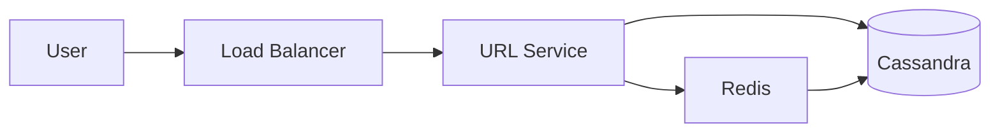

# System Design Interview Practice Site Implementation Plan

> **For Claude:** REQUIRED SUB-SKILL: Use superpowers:executing-plans to implement this plan task-by-task.

**Goal:** Build a local-first, OSS Next.js 15 web app where senior engineers practice Google L5/L6 system design interviews with seed questions and dynamic LLM-generated questions, presented in a two-step "draft then reveal" UX with Mermaid diagrams.

**Architecture:** Next.js 15 App Router with server-side LLM proxy (Approach A from design doc). Vercel AI SDK with structured Zod output for question generation. Mermaid validation pipeline (parse → maid autofix → LLM retry → source fallback). Static markdown seed questions, IndexedDB drafts, BYOK config in `.env.local`.

**Tech Stack:** Next.js 15, React 19, TypeScript, Tailwind CSS, shadcn/ui, Vercel AI SDK (`ai`, `@ai-sdk/openai`, `@ai-sdk/anthropic`), Zod, Mermaid, `@probelabs/maid`, Streamdown, Dexie, Vitest, MSW, Playwright.

**Reference design doc:** `docs/plans/2026-04-30-system-design-interview-site-design.md`

---

## Phase 0 — Project Bootstrap

### Task 0.1: Initialize Next.js 15 project

**Files:**
- Create: `package.json`, `tsconfig.json`, `next.config.ts`, `app/layout.tsx`, `app/page.tsx`, etc. (via `create-next-app`)

**Step 1: Run create-next-app non-interactively**

```bash
cd /Users/linhansheng/Desktop/system_design
npx -y create-next-app@latest . \
  --typescript --tailwind --eslint --app --src-dir \
  --turbopack --import-alias "@/*" --no-git --yes
```

Expected: Files scaffolded, no git init (we already have repo).

**Step 2: Verify dev server boots**

```bash
npm run dev
```
Then in another terminal:
```bash
curl -s http://localhost:3000 | head -5
```
Expected: HTML response containing `<!DOCTYPE html>`. Kill dev server after.

**Step 3: Commit**

```bash
git add -A
git commit -m "chore: bootstrap Next.js 15 with TypeScript + Tailwind"
```

---

### Task 0.2: Add core dependencies

**Files:**
- Modify: `package.json`

**Step 1: Install runtime deps**

```bash
npm install ai @ai-sdk/openai @ai-sdk/anthropic zod mermaid @probelabs/maid streamdown dexie
```

**Step 2: Install shadcn/ui CLI and init**

```bash
npx -y shadcn@latest init -y -d
```
Expected: `components.json` created, `src/lib/utils.ts` created, Tailwind extended.

**Step 3: Add baseline shadcn components used throughout**

```bash
npx -y shadcn@latest add button card input textarea label dialog toast tabs
```

**Step 4: Install dev deps**

```bash
npm install -D vitest @vitest/ui @vitejs/plugin-react jsdom fake-indexeddb msw \
  @playwright/test @testing-library/react @testing-library/jest-dom @testing-library/user-event \
  @types/node
npx -y playwright install --with-deps chromium
```

**Step 5: Verify install integrity**

```bash
npm ls --depth=0 2>&1 | grep -E "^├|^└" | head -30
```
Expected: All listed packages present, no `UNMET` warnings.

**Step 6: Commit**

```bash
git add package.json package-lock.json components.json src/
git commit -m "chore: add LLM, Mermaid, testing, and shadcn/ui dependencies"
```

---

### Task 0.3: Configure Vitest

**Files:**
- Create: `vitest.config.ts`, `src/test/setup.ts`

**Step 1: Write `vitest.config.ts`**

```typescript
import { defineConfig } from 'vitest/config';
import react from '@vitejs/plugin-react';
import path from 'node:path';

export default defineConfig({
  plugins: [react()],
  test: {
    environment: 'jsdom',
    setupFiles: ['./src/test/setup.ts'],
    globals: true,
    coverage: { provider: 'v8', reporter: ['text', 'html'] },
  },
  resolve: {
    alias: { '@': path.resolve(__dirname, './src') },
  },
});
```

**Step 2: Write `src/test/setup.ts`**

```typescript
import '@testing-library/jest-dom/vitest';
import 'fake-indexeddb/auto';
```

**Step 3: Add test scripts to `package.json`**

Modify the `"scripts"` block:
```json
{
  "scripts": {
    "dev": "next dev --turbopack",
    "build": "next build",
    "start": "next start",
    "lint": "next lint",
    "test": "vitest run",
    "test:watch": "vitest",
    "test:e2e": "playwright test",
    "typecheck": "tsc --noEmit"
  }
}
```

**Step 4: Sanity test — write trivial test and run it**

Create `src/test/sanity.test.ts`:
```typescript
import { describe, it, expect } from 'vitest';
describe('sanity', () => {
  it('runs', () => expect(1 + 1).toBe(2));
});
```

Run: `npm test`
Expected: 1 passed.

**Step 5: Commit**

```bash
git add vitest.config.ts src/test/ package.json
git commit -m "chore: configure Vitest with jsdom and fake-indexeddb"
```

---

### Task 0.4: Add `.env.example` and `.gitignore` entries

**Files:**
- Create: `.env.example`
- Modify: `.gitignore`

**Step 1: Write `.env.example`**

```
# Choose ONE provider and set its API key.
# OpenAI
LLM_PROVIDER=openai
OPENAI_API_KEY=sk-...
OPENAI_MODEL=gpt-4o-mini

# Anthropic
# LLM_PROVIDER=anthropic
# ANTHROPIC_API_KEY=sk-ant-...
# ANTHROPIC_MODEL=claude-3-5-sonnet-latest

# Ollama (local)
# LLM_PROVIDER=ollama
# OLLAMA_BASE_URL=http://localhost:11434
# OLLAMA_MODEL=llama3.3
```

**Step 2: Ensure `.env.local` is gitignored**

Verify `.gitignore` contains `.env*` (Next.js default). If not, append:
```
.env.local
.env.*.local
```

**Step 3: Commit**

```bash
git add .env.example .gitignore
git commit -m "chore: add .env.example documenting BYOK configuration"
```

---

## Phase 1 — Mermaid Validation Pipeline

> Most error-prone subsystem; build first with TDD so all later code can rely on it.

### Task 1.1: Mermaid validator unit (TDD)

**Files:**
- Test: `src/lib/server/mermaid/validator.test.ts`
- Create: `src/lib/server/mermaid/validator.ts`

**Step 1: Write failing test**

```typescript
import { describe, it, expect } from 'vitest';
import { validateMermaid } from './validator';

describe('validateMermaid', () => {
  it('returns ok for a valid flowchart', async () => {
    const src = 'flowchart LR\n  A --> B';
    const result = await validateMermaid(src);
    expect(result.ok).toBe(true);
  });

  it('returns error for malformed source', async () => {
    const src = 'flowchart LR\n  A -->';
    const result = await validateMermaid(src);
    expect(result.ok).toBe(false);
    if (!result.ok) expect(result.error).toBeTruthy();
  });
});
```

**Step 2: Run test to verify it fails**

```bash
npm test -- src/lib/server/mermaid/validator.test.ts
```
Expected: FAIL — module not found.

**Step 3: Implement minimal validator**

```typescript
// src/lib/server/mermaid/validator.ts
import mermaid from 'mermaid';

export type MermaidValidation =
  | { ok: true }
  | { ok: false; error: string };

mermaid.initialize({ startOnLoad: false, securityLevel: 'strict' });

export async function validateMermaid(source: string): Promise<MermaidValidation> {
  try {
    await mermaid.parse(source, { suppressErrors: false });
    return { ok: true };
  } catch (e) {
    return { ok: false, error: e instanceof Error ? e.message : String(e) };
  }
}
```

**Step 4: Run test to verify it passes**

```bash
npm test -- src/lib/server/mermaid/validator.test.ts
```
Expected: PASS (2 tests).

**Step 5: Commit**

```bash
git add src/lib/server/mermaid/
git commit -m "feat: mermaid source validator with parse-based check"
```

---

### Task 1.2: Mermaid auto-fix wrapper (TDD)

**Files:**
- Test: `src/lib/server/mermaid/autofix.test.ts`
- Create: `src/lib/server/mermaid/autofix.ts`

**Step 1: Write failing test**

```typescript
import { describe, it, expect } from 'vitest';
import { autoFixMermaid } from './autofix';

describe('autoFixMermaid', () => {
  it('returns original when already valid', async () => {
    const src = 'flowchart LR\n  A --> B';
    const result = await autoFixMermaid(src);
    expect(result.ok).toBe(true);
    if (result.ok) expect(result.fixed).toBe(false);
  });

  it('reports unfixable when input is irrecoverable', async () => {
    const src = 'this is not mermaid at all !!!';
    const result = await autoFixMermaid(src);
    expect(result.ok).toBe(false);
  });
});
```

**Step 2: Run test to verify it fails**

```bash
npm test -- src/lib/server/mermaid/autofix.test.ts
```
Expected: FAIL.

**Step 3: Implement wrapper using `@probelabs/maid`**

```typescript
// src/lib/server/mermaid/autofix.ts
import { validateMermaid } from './validator';

export type AutoFixResult =
  | { ok: true; source: string; fixed: boolean }
  | { ok: false; error: string };

export async function autoFixMermaid(source: string): Promise<AutoFixResult> {
  const initial = await validateMermaid(source);
  if (initial.ok) return { ok: true, source, fixed: false };

  let fixed: string;
  try {
    const maid = await import('@probelabs/maid');
    // maid exports a `fix` or `lint` API; adapt at impl time based on actual exports
    const fn = (maid as unknown as { fix?: (s: string) => string }).fix
      ?? ((s: string) => s);
    fixed = fn(source);
  } catch {
    return { ok: false, error: initial.error };
  }

  const recheck = await validateMermaid(fixed);
  if (recheck.ok) return { ok: true, source: fixed, fixed: true };
  return { ok: false, error: recheck.error };
}
```

> NOTE during execution: inspect `@probelabs/maid`'s actual exported API and adapt the import call. If API differs, update the test fixture's "fixable" expectation accordingly.

**Step 4: Run test to verify it passes**

```bash
npm test -- src/lib/server/mermaid/autofix.test.ts
```
Expected: PASS (2 tests).

**Step 5: Commit**

```bash
git add src/lib/server/mermaid/
git commit -m "feat: mermaid auto-fix wrapper using @probelabs/maid"
```

---

### Task 1.3: Mermaid pipeline integrator (TDD)

**Files:**
- Test: `src/lib/server/mermaid/pipeline.test.ts`
- Create: `src/lib/server/mermaid/pipeline.ts`

**Step 1: Write failing test**

```typescript
import { describe, it, expect, vi } from 'vitest';
import { runMermaidPipeline } from './pipeline';

describe('runMermaidPipeline', () => {
  it('passes valid source straight through', async () => {
    const result = await runMermaidPipeline('flowchart LR\n  A --> B', vi.fn());
    expect(result.status).toBe('ok');
  });

  it('falls back when LLM retry also fails', async () => {
    const llm = vi.fn().mockResolvedValue('still broken !!!');
    const result = await runMermaidPipeline('still broken !!!', llm);
    expect(result.status).toBe('fallback');
  });
});
```

**Step 2: Run test to verify it fails**

```bash
npm test -- src/lib/server/mermaid/pipeline.test.ts
```
Expected: FAIL.

**Step 3: Implement pipeline**

```typescript
// src/lib/server/mermaid/pipeline.ts
import { autoFixMermaid } from './autofix';
import { validateMermaid } from './validator';

export type PipelineResult =
  | { status: 'ok'; source: string; autoFixed: boolean; llmRetried: boolean }
  | { status: 'fallback'; source: string; error: string };

export type LLMRetryFn = (source: string, error: string) => Promise<string>;

export async function runMermaidPipeline(
  source: string,
  llmRetry: LLMRetryFn,
): Promise<PipelineResult> {
  const fix = await autoFixMermaid(source);
  if (fix.ok) {
    return { status: 'ok', source: fix.source, autoFixed: fix.fixed, llmRetried: false };
  }

  const retried = await llmRetry(source, fix.error);
  const after = await validateMermaid(retried);
  if (after.ok) {
    return { status: 'ok', source: retried, autoFixed: false, llmRetried: true };
  }

  return { status: 'fallback', source, error: fix.error };
}
```

**Step 4: Run test to verify it passes**

```bash
npm test -- src/lib/server/mermaid/pipeline.test.ts
```
Expected: PASS (2 tests).

**Step 5: Commit**

```bash
git add src/lib/server/mermaid/
git commit -m "feat: mermaid pipeline orchestrating validate → autofix → LLM retry → fallback"
```

---

## Phase 2 — Domain Schemas

### Task 2.1: Question Zod schema (TDD)

**Files:**
- Test: `src/lib/shared/schemas.test.ts`
- Create: `src/lib/shared/schemas.ts`

**Step 1: Write failing test**

```typescript
import { describe, it, expect } from 'vitest';
import { QuestionSchema, DraftSchema } from './schemas';

const sampleQuestion = {
  title: 'Design Kafka',
  problem_statement: 'Design a distributed message queue.',
  requirements: { functional: ['publish'], non_functional: ['low latency'] },
  expected_answer: {
    high_level_design: 'Use partitioned log...',
    architecture_diagram: 'flowchart LR\n  P --> B',
    key_components: [{ name: 'Broker', responsibility: 'storage' }],
    tradeoffs: ['durability vs latency'],
    scaling_considerations: ['shard by topic'],
  },
  difficulty: 'L5' as const,
};

describe('QuestionSchema', () => {
  it('parses a valid question', () => {
    const r = QuestionSchema.safeParse(sampleQuestion);
    expect(r.success).toBe(true);
  });
  it('rejects when difficulty is invalid', () => {
    const r = QuestionSchema.safeParse({ ...sampleQuestion, difficulty: 'L9' });
    expect(r.success).toBe(false);
  });
});

describe('DraftSchema', () => {
  it('parses a valid draft', () => {
    const r = DraftSchema.safeParse({
      questionId: 'kafka',
      content: 'my answer',
      updatedAt: Date.now(),
    });
    expect(r.success).toBe(true);
  });
});
```

**Step 2: Run test to verify it fails**

```bash
npm test -- src/lib/shared/schemas.test.ts
```
Expected: FAIL.

**Step 3: Implement schemas**

```typescript
// src/lib/shared/schemas.ts
import { z } from 'zod';

export const QuestionSchema = z.object({
  title: z.string().min(1),
  problem_statement: z.string().min(1),
  requirements: z.object({
    functional: z.array(z.string()).min(1),
    non_functional: z.array(z.string()).min(1),
  }),
  expected_answer: z.object({
    high_level_design: z.string().min(1),
    architecture_diagram: z.string().min(1),
    key_components: z.array(
      z.object({
        name: z.string(),
        responsibility: z.string(),
      }),
    ).min(1),
    tradeoffs: z.array(z.string()),
    scaling_considerations: z.array(z.string()),
  }),
  difficulty: z.enum(['L4', 'L5', 'L6']),
});
export type Question = z.infer<typeof QuestionSchema>;

export const DraftSchema = z.object({
  questionId: z.string(),
  content: z.string(),
  mermaidSource: z.string().optional(),
  updatedAt: z.number(),
});
export type Draft = z.infer<typeof DraftSchema>;
```

**Step 4: Run test to verify it passes**

```bash
npm test -- src/lib/shared/schemas.test.ts
```
Expected: PASS (3 tests).

**Step 5: Commit**

```bash
git add src/lib/shared/
git commit -m "feat: shared Zod schemas for Question and Draft"
```

---

## Phase 3 — Seed Question Loader

### Task 3.1: Seed question file format spec (no code, just commit format)

**Files:**
- Create: `content/seed-questions/_attribution.json`
- Create: `content/seed-questions/url-shortener.md`

**Step 1: Write attribution registry**

```json
{
  "url-shortener": {
    "source": "https://github.com/donnemartin/system-design-primer",
    "license": "CC-BY-SA-4.0",
    "license_url": "https://creativecommons.org/licenses/by-sa/4.0/",
    "modifications": "Rewritten in question-and-answer format with Mermaid diagrams"
  }
}
```

**Step 2: Write first seed question**

```markdown
---
title: Design a URL Shortener
difficulty: L5
slug: url-shortener
---

# Problem Statement

Design a URL shortening service like bit.ly. Given a long URL, generate a short alias and redirect users.

# Requirements

## Functional
- Generate a short URL from a long URL
- Redirect short URL to original
- Custom aliases (optional)
- Analytics on click counts

## Non-Functional
- 100M URLs/month throughput
- p99 redirect latency < 100ms
- 99.9% availability

# Expected Answer

## High-Level Design

Use a write-heavy KV store keyed by short hash. Bloom filter to avoid collisions. CDN for hot redirects.

## Architecture Diagram



## Key Components

- **URL Service**: stateless, generates short codes via base62 encoding of counter or hash
- **Cache**: Redis LRU for hot URLs
- **Database**: Cassandra (write-heavy, eventually consistent)

## Tradeoffs

- Hash-based vs counter-based: hash avoids coordination but risks collision; counter needs distributed sequence
- Eventually-consistent reads acceptable since URLs are immutable

## Scaling Considerations

- Shard DB by short_code prefix
- CDN-cache 301 redirects
- Async analytics via Kafka
```

**Step 3: Commit**

```bash
git add content/
git commit -m "feat: add first seed question (URL shortener) with attribution"
```

---

### Task 3.2: Seed loader (TDD)

**Files:**
- Test: `src/lib/server/seed/loader.test.ts`
- Create: `src/lib/server/seed/loader.ts`
- Add dep: `gray-matter` for front-matter parsing

**Step 1: Install front-matter parser**

```bash
npm install gray-matter
```

**Step 2: Write failing test**

```typescript
import { describe, it, expect } from 'vitest';
import { loadAllSeedQuestions, loadSeedQuestion } from './loader';

describe('seed loader', () => {
  it('lists all seed questions with metadata', async () => {
    const list = await loadAllSeedQuestions();
    expect(list.length).toBeGreaterThan(0);
    expect(list[0]).toHaveProperty('slug');
    expect(list[0]).toHaveProperty('title');
    expect(list[0]).toHaveProperty('difficulty');
  });

  it('loads a single question fully', async () => {
    const q = await loadSeedQuestion('url-shortener');
    expect(q).not.toBeNull();
    expect(q!.slug).toBe('url-shortener');
    expect(q!.markdown).toContain('Design a URL Shortener');
    expect(q!.attribution.license).toBe('CC-BY-SA-4.0');
  });

  it('returns null for unknown slug', async () => {
    const q = await loadSeedQuestion('does-not-exist');
    expect(q).toBeNull();
  });
});
```

**Step 3: Run test to verify it fails**

```bash
npm test -- src/lib/server/seed/loader.test.ts
```
Expected: FAIL.

**Step 4: Implement loader**

```typescript
// src/lib/server/seed/loader.ts
import { promises as fs } from 'node:fs';
import path from 'node:path';
import matter from 'gray-matter';

const SEED_DIR = path.join(process.cwd(), 'content', 'seed-questions');

export interface Attribution {
  source: string;
  license: string;
  license_url: string;
  modifications: string;
}

export interface SeedSummary {
  slug: string;
  title: string;
  difficulty: 'L4' | 'L5' | 'L6';
}

export interface SeedQuestion extends SeedSummary {
  markdown: string;
  attribution: Attribution;
}

async function readAttribution(): Promise<Record<string, Attribution>> {
  const raw = await fs.readFile(path.join(SEED_DIR, '_attribution.json'), 'utf8');
  return JSON.parse(raw);
}

export async function loadAllSeedQuestions(): Promise<SeedSummary[]> {
  const files = await fs.readdir(SEED_DIR);
  const out: SeedSummary[] = [];
  for (const f of files) {
    if (!f.endsWith('.md')) continue;
    const raw = await fs.readFile(path.join(SEED_DIR, f), 'utf8');
    const { data } = matter(raw);
    out.push({
      slug: data.slug ?? f.replace(/\.md$/, ''),
      title: data.title,
      difficulty: data.difficulty,
    });
  }
  return out.sort((a, b) => a.title.localeCompare(b.title));
}

export async function loadSeedQuestion(slug: string): Promise<SeedQuestion | null> {
  const filePath = path.join(SEED_DIR, `${slug}.md`);
  try {
    const raw = await fs.readFile(filePath, 'utf8');
    const { data, content } = matter(raw);
    const attr = await readAttribution();
    if (!attr[slug]) return null;
    return {
      slug,
      title: data.title,
      difficulty: data.difficulty,
      markdown: content,
      attribution: attr[slug],
    };
  } catch {
    return null;
  }
}
```

**Step 5: Run test to verify it passes**

```bash
npm test -- src/lib/server/seed/loader.test.ts
```
Expected: PASS (3 tests).

**Step 6: Commit**

```bash
git add package.json package-lock.json src/lib/server/seed/
git commit -m "feat: seed question loader with attribution metadata"
```

---

### Task 3.3: Add 4 more seed questions

**Files:**
- Create: `content/seed-questions/{kafka,youtube,twitter,whatsapp}.md`
- Modify: `content/seed-questions/_attribution.json`

**Step 1**: For each of `kafka`, `youtube`, `twitter`, `whatsapp` write a `.md` file following the exact same structure as `url-shortener.md` (front-matter + sections: Problem, Requirements, Expected Answer with Mermaid). Source and adapt from `donnemartin/system-design-primer` and `karanpratapsingh/system-design`. Each must produce a valid Mermaid diagram.

**Step 2: Update `_attribution.json`** with all 4 new entries pointing to their original repos and CC-BY-SA-4.0 license.

**Step 3: Verify diagrams parse**

Add a test to ensure ALL seed Mermaid diagrams validate:

`src/lib/server/seed/diagrams.test.ts`:
```typescript
import { describe, it, expect } from 'vitest';
import { loadAllSeedQuestions, loadSeedQuestion } from './loader';
import { validateMermaid } from '../mermaid/validator';

describe('seed question diagrams', () => {
  it('all seed diagrams are valid mermaid', async () => {
    const all = await loadAllSeedQuestions();
    for (const s of all) {
      const q = await loadSeedQuestion(s.slug);
      expect(q).not.toBeNull();
      const match = q!.markdown.match(/```mermaid\n([\s\S]*?)```/);
      expect(match, `no mermaid block in ${s.slug}`).toBeTruthy();
      const v = await validateMermaid(match![1]);
      expect(v.ok, `${s.slug}: ${v.ok ? '' : v.error}`).toBe(true);
    }
  });
});
```

Run: `npm test -- src/lib/server/seed/diagrams.test.ts`
Expected: PASS.

**Step 4: Commit**

```bash
git add content/ src/lib/server/seed/
git commit -m "feat: add Kafka, YouTube, Twitter, WhatsApp seed questions with validated diagrams"
```

---

## Phase 4 — LLM Service

### Task 4.1: Provider factory (TDD)

**Files:**
- Test: `src/lib/server/llm/provider.test.ts`
- Create: `src/lib/server/llm/provider.ts`

**Step 1: Write failing test**

```typescript
import { describe, it, expect, beforeEach, afterEach } from 'vitest';
import { getProvider } from './provider';

const ORIGINAL = { ...process.env };
afterEach(() => { process.env = { ...ORIGINAL }; });

describe('getProvider', () => {
  it('throws when LLM_PROVIDER is unset', () => {
    delete process.env.LLM_PROVIDER;
    expect(() => getProvider()).toThrow(/LLM_PROVIDER/);
  });

  it('returns openai config when configured', () => {
    process.env.LLM_PROVIDER = 'openai';
    process.env.OPENAI_API_KEY = 'sk-test';
    process.env.OPENAI_MODEL = 'gpt-4o-mini';
    const p = getProvider();
    expect(p.kind).toBe('openai');
    expect(p.model).toBe('gpt-4o-mini');
  });

  it('throws when key is missing', () => {
    process.env.LLM_PROVIDER = 'openai';
    delete process.env.OPENAI_API_KEY;
    expect(() => getProvider()).toThrow(/OPENAI_API_KEY/);
  });
});
```

**Step 2: Run test to verify it fails**

```bash
npm test -- src/lib/server/llm/provider.test.ts
```
Expected: FAIL.

**Step 3: Implement provider factory**

```typescript
// src/lib/server/llm/provider.ts
import { createOpenAI } from '@ai-sdk/openai';
import { createAnthropic } from '@ai-sdk/anthropic';
import type { LanguageModel } from 'ai';

export type ProviderKind = 'openai' | 'anthropic' | 'ollama';

export interface ProviderConfig {
  kind: ProviderKind;
  model: string;
  client: LanguageModel;
}

function need(name: string): string {
  const v = process.env[name];
  if (!v) throw new Error(`Missing env: ${name}`);
  return v;
}

export function getProvider(): ProviderConfig {
  const kind = process.env.LLM_PROVIDER as ProviderKind | undefined;
  if (!kind) throw new Error('Missing env: LLM_PROVIDER');

  switch (kind) {
    case 'openai': {
      const key = need('OPENAI_API_KEY');
      const model = process.env.OPENAI_MODEL ?? 'gpt-4o-mini';
      const client = createOpenAI({ apiKey: key })(model);
      return { kind, model, client };
    }
    case 'anthropic': {
      const key = need('ANTHROPIC_API_KEY');
      const model = process.env.ANTHROPIC_MODEL ?? 'claude-3-5-sonnet-latest';
      const client = createAnthropic({ apiKey: key })(model);
      return { kind, model, client };
    }
    case 'ollama': {
      const baseURL = process.env.OLLAMA_BASE_URL ?? 'http://localhost:11434/v1';
      const model = process.env.OLLAMA_MODEL ?? 'llama3.3';
      // Ollama is OpenAI-compatible
      const client = createOpenAI({ apiKey: 'ollama', baseURL })(model);
      return { kind, model, client };
    }
    default:
      throw new Error(`Unsupported LLM_PROVIDER: ${kind}`);
  }
}
```

**Step 4: Run test to verify it passes**

```bash
npm test -- src/lib/server/llm/provider.test.ts
```
Expected: PASS (3 tests).

**Step 5: Commit**

```bash
git add src/lib/server/llm/
git commit -m "feat: LLM provider factory supporting OpenAI, Anthropic, Ollama"
```

---

### Task 4.2: System prompt and question generator

**Files:**
- Create: `src/lib/server/llm/prompts.ts`
- Create: `src/lib/server/llm/generate.ts`
- Test: `src/lib/server/llm/generate.test.ts` (uses mocked provider)

**Step 1: Write the system prompt**

```typescript
// src/lib/server/llm/prompts.ts
export const GOOGLE_INTERVIEWER_PROMPT = `
You are a Google senior engineering interviewer (L6). You give system design interviews to senior software engineers (L5+ candidates).

Given a topic the candidate names, produce ONE interview question with:
- A specific, scoped problem statement (not "design X" but "design X handling Y users with Z constraints")
- Functional and non-functional requirements
- A high-quality expected answer covering: high-level design, architecture diagram (Mermaid), key components, tradeoffs, scaling considerations
- Calibrated to L5-L6 difficulty

The architecture_diagram MUST be a syntactically valid Mermaid flowchart or graph.
Prefer flowchart LR/TD with clear node labels. Avoid experimental Mermaid features.

If the user's topic is not a system design topic (e.g. "make me a sandwich"), reply with a question titled "Off-topic request" and a brief explanation directing them to choose a software system to design.
`.trim();

export function mermaidRetryPrompt(broken: string, error: string): string {
  return `The following Mermaid source failed to parse with error: "${error}".
Return ONLY corrected Mermaid source (no fences, no explanation):

${broken}`;
}
```

**Step 2: Write failing test for `generate.ts`**

```typescript
// src/lib/server/llm/generate.test.ts
import { describe, it, expect, vi } from 'vitest';
import { generateQuestion } from './generate';

vi.mock('ai', async () => {
  const actual = await vi.importActual<typeof import('ai')>('ai');
  return {
    ...actual,
    generateObject: vi.fn().mockResolvedValue({
      object: {
        title: 'Design Warp',
        problem_statement: 'Design a GPU-accelerated terminal.',
        requirements: { functional: ['render text'], non_functional: ['low latency'] },
        expected_answer: {
          high_level_design: 'GPU pipeline...',
          architecture_diagram: 'flowchart LR\n A --> B',
          key_components: [{ name: 'Renderer', responsibility: 'draw' }],
          tradeoffs: ['CPU vs GPU'],
          scaling_considerations: ['plugin sandbox'],
        },
        difficulty: 'L5',
      },
    }),
  };
});

vi.mock('./provider', () => ({
  getProvider: () => ({ kind: 'openai', model: 'gpt-4o-mini', client: {} }),
}));

describe('generateQuestion', () => {
  it('returns a Question matching the schema', async () => {
    const q = await generateQuestion('Warp');
    expect(q.title).toBe('Design Warp');
    expect(q.difficulty).toBe('L5');
  });
});
```

**Step 3: Run test to verify it fails**

```bash
npm test -- src/lib/server/llm/generate.test.ts
```
Expected: FAIL.

**Step 4: Implement generator**

```typescript
// src/lib/server/llm/generate.ts
import { generateObject } from 'ai';
import { QuestionSchema, type Question } from '@/lib/shared/schemas';
import { GOOGLE_INTERVIEWER_PROMPT } from './prompts';
import { getProvider } from './provider';

export async function generateQuestion(topic: string): Promise<Question> {
  const provider = getProvider();
  const { object } = await generateObject({
    model: provider.client,
    schema: QuestionSchema,
    system: GOOGLE_INTERVIEWER_PROMPT,
    prompt: `Generate a system design interview question for the topic: "${topic}"`,
    maxRetries: 2,
  });
  return object;
}
```

**Step 5: Run test to verify it passes**

```bash
npm test -- src/lib/server/llm/generate.test.ts
```
Expected: PASS.

**Step 6: Commit**

```bash
git add src/lib/server/llm/
git commit -m "feat: question generator using Vercel AI SDK structured output"
```

---

### Task 4.3: Mermaid LLM-retry function (wires LLM into pipeline)

**Files:**
- Create: `src/lib/server/llm/mermaid-retry.ts`
- Test: `src/lib/server/llm/mermaid-retry.test.ts`

**Step 1: Write failing test**

```typescript
import { describe, it, expect, vi } from 'vitest';
import { llmFixMermaid } from './mermaid-retry';

vi.mock('ai', async (importOriginal) => {
  const actual = await importOriginal<typeof import('ai')>();
  return {
    ...actual,
    generateText: vi.fn().mockResolvedValue({ text: 'flowchart LR\n A --> B' }),
  };
});

vi.mock('./provider', () => ({
  getProvider: () => ({ kind: 'openai', model: 'm', client: {} }),
}));

describe('llmFixMermaid', () => {
  it('returns LLM-corrected mermaid', async () => {
    const result = await llmFixMermaid('broken', 'parse error');
    expect(result).toContain('flowchart');
  });
});
```

**Step 2: Run test to verify it fails**

```bash
npm test -- src/lib/server/llm/mermaid-retry.test.ts
```
Expected: FAIL.

**Step 3: Implement**

```typescript
// src/lib/server/llm/mermaid-retry.ts
import { generateText } from 'ai';
import { getProvider } from './provider';
import { mermaidRetryPrompt } from './prompts';

export async function llmFixMermaid(broken: string, error: string): Promise<string> {
  const p = getProvider();
  const { text } = await generateText({
    model: p.client,
    prompt: mermaidRetryPrompt(broken, error),
    maxRetries: 1,
  });
  return text.replace(/^```mermaid\n?|```$/g, '').trim();
}
```

**Step 4: Run test to verify it passes**

```bash
npm test -- src/lib/server/llm/mermaid-retry.test.ts
```
Expected: PASS.

**Step 5: Commit**

```bash
git add src/lib/server/llm/
git commit -m "feat: LLM-driven Mermaid retry function"
```

---

## Phase 5 — API Routes

### Task 5.1: GET /api/seed-questions (TDD)

**Files:**
- Test: `src/app/api/seed-questions/route.test.ts`
- Create: `src/app/api/seed-questions/route.ts`

**Step 1: Write failing test**

```typescript
import { describe, it, expect } from 'vitest';
import { GET } from './route';

describe('GET /api/seed-questions', () => {
  it('returns array of seed summaries', async () => {
    const res = await GET();
    expect(res.status).toBe(200);
    const body = await res.json();
    expect(Array.isArray(body.questions)).toBe(true);
    expect(body.questions.length).toBeGreaterThan(0);
    expect(body.questions[0]).toHaveProperty('slug');
  });
});
```

**Step 2: Run to verify failure**

```bash
npm test -- src/app/api/seed-questions/route.test.ts
```
Expected: FAIL.

**Step 3: Implement**

```typescript
// src/app/api/seed-questions/route.ts
import { NextResponse } from 'next/server';
import { loadAllSeedQuestions } from '@/lib/server/seed/loader';

export async function GET() {
  const questions = await loadAllSeedQuestions();
  return NextResponse.json({ questions });
}
```

**Step 4: Run test to verify it passes**

```bash
npm test -- src/app/api/seed-questions/route.test.ts
```
Expected: PASS.

**Step 5: Commit**

```bash
git add src/app/api/seed-questions/route.ts src/app/api/seed-questions/route.test.ts
git commit -m "feat: GET /api/seed-questions endpoint"
```

---

### Task 5.2: GET /api/seed-questions/[slug] (TDD)

**Files:**
- Test: `src/app/api/seed-questions/[slug]/route.test.ts`
- Create: `src/app/api/seed-questions/[slug]/route.ts`

**Step 1: Write failing test**

```typescript
import { describe, it, expect } from 'vitest';
import { GET } from './route';

describe('GET /api/seed-questions/[slug]', () => {
  it('returns 200 for known slug', async () => {
    const res = await GET(new Request('http://localhost/api/seed-questions/url-shortener'),
      { params: Promise.resolve({ slug: 'url-shortener' }) });
    expect(res.status).toBe(200);
    const body = await res.json();
    expect(body.slug).toBe('url-shortener');
    expect(body.markdown).toContain('URL Shortener');
  });

  it('returns 404 for unknown slug', async () => {
    const res = await GET(new Request('http://localhost/api/seed-questions/nope'),
      { params: Promise.resolve({ slug: 'nope' }) });
    expect(res.status).toBe(404);
  });
});
```

**Step 2: Run to verify failure**

```bash
npm test -- src/app/api/seed-questions/\[slug\]/route.test.ts
```
Expected: FAIL.

**Step 3: Implement**

```typescript
// src/app/api/seed-questions/[slug]/route.ts
import { NextResponse } from 'next/server';
import { loadSeedQuestion } from '@/lib/server/seed/loader';

export async function GET(
  _req: Request,
  { params }: { params: Promise<{ slug: string }> },
) {
  const { slug } = await params;
  const q = await loadSeedQuestion(slug);
  if (!q) return NextResponse.json({ error: 'not_found' }, { status: 404 });
  return NextResponse.json(q);
}
```

**Step 4: Run test to verify it passes**

```bash
npm test -- src/app/api/seed-questions/\[slug\]/route.test.ts
```
Expected: PASS.

**Step 5: Commit**

```bash
git add src/app/api/seed-questions/\[slug\]/
git commit -m "feat: GET /api/seed-questions/[slug] endpoint"
```

---

### Task 5.3: POST /api/generate (TDD with mocked LLM)

**Files:**
- Test: `src/app/api/generate/route.test.ts`
- Create: `src/app/api/generate/route.ts`

**Step 1: Write failing test**

```typescript
import { describe, it, expect, vi } from 'vitest';

vi.mock('@/lib/server/llm/generate', () => ({
  generateQuestion: vi.fn().mockResolvedValue({
    title: 'Design Warp',
    problem_statement: 'p',
    requirements: { functional: ['a'], non_functional: ['b'] },
    expected_answer: {
      high_level_design: 'h',
      architecture_diagram: 'flowchart LR\n A --> B',
      key_components: [{ name: 'X', responsibility: 'Y' }],
      tradeoffs: ['t'], scaling_considerations: ['s'],
    },
    difficulty: 'L5',
  }),
}));

vi.mock('@/lib/server/llm/mermaid-retry', () => ({
  llmFixMermaid: vi.fn(),
}));

import { POST } from './route';

describe('POST /api/generate', () => {
  it('returns generated question with mermaid_status ok', async () => {
    const req = new Request('http://localhost/api/generate', {
      method: 'POST',
      body: JSON.stringify({ topic: 'Warp' }),
    });
    const res = await POST(req);
    expect(res.status).toBe(200);
    const body = await res.json();
    expect(body.question.title).toBe('Design Warp');
    expect(body.mermaid_status).toBe('ok');
  });

  it('rejects empty topic with 400', async () => {
    const req = new Request('http://localhost/api/generate', {
      method: 'POST',
      body: JSON.stringify({ topic: '' }),
    });
    const res = await POST(req);
    expect(res.status).toBe(400);
  });
});
```

**Step 2: Run to verify failure**

```bash
npm test -- src/app/api/generate/route.test.ts
```
Expected: FAIL.

**Step 3: Implement**

```typescript
// src/app/api/generate/route.ts
import { NextResponse } from 'next/server';
import { z } from 'zod';
import { generateQuestion } from '@/lib/server/llm/generate';
import { llmFixMermaid } from '@/lib/server/llm/mermaid-retry';
import { runMermaidPipeline } from '@/lib/server/mermaid/pipeline';

const BodySchema = z.object({ topic: z.string().min(1).max(200) });

export async function POST(req: Request) {
  let body: unknown;
  try { body = await req.json(); } catch { body = {}; }
  const parsed = BodySchema.safeParse(body);
  if (!parsed.success) {
    return NextResponse.json({ error: 'invalid_topic' }, { status: 400 });
  }

  let question;
  try {
    question = await generateQuestion(parsed.data.topic);
  } catch (e) {
    const msg = e instanceof Error ? e.message : 'unknown';
    return NextResponse.json({ error: 'llm_error', message: msg }, { status: 502 });
  }

  const pipeline = await runMermaidPipeline(
    question.expected_answer.architecture_diagram,
    (src, err) => llmFixMermaid(src, err),
  );

  if (pipeline.status === 'ok') {
    question.expected_answer.architecture_diagram = pipeline.source;
    return NextResponse.json({
      question,
      mermaid_status: 'ok',
      mermaid_auto_fixed: pipeline.autoFixed,
      mermaid_llm_retried: pipeline.llmRetried,
    });
  }

  return NextResponse.json({
    question,
    mermaid_status: 'fallback',
    mermaid_error: pipeline.error,
  });
}
```

**Step 4: Run test to verify it passes**

```bash
npm test -- src/app/api/generate/route.test.ts
```
Expected: PASS.

**Step 5: Commit**

```bash
git add src/app/api/generate/
git commit -m "feat: POST /api/generate endpoint with mermaid pipeline integration"
```

---

## Phase 6 — Client Storage (Drafts)

### Task 6.1: Dexie wrapper (TDD)

**Files:**
- Test: `src/lib/storage/drafts.test.ts`
- Create: `src/lib/storage/drafts.ts`

**Step 1: Write failing test**

```typescript
import { describe, it, expect, beforeEach } from 'vitest';
import { saveDraft, loadDraft, deleteDraft } from './drafts';

beforeEach(async () => {
  // fake-indexeddb gives a fresh DB per test via setup, but be explicit:
  await deleteDraft('kafka').catch(() => {});
});

describe('drafts storage', () => {
  it('round-trips a draft', async () => {
    await saveDraft({ questionId: 'kafka', content: 'hello', updatedAt: 1 });
    const d = await loadDraft('kafka');
    expect(d?.content).toBe('hello');
  });

  it('returns undefined for missing draft', async () => {
    const d = await loadDraft('nope');
    expect(d).toBeUndefined();
  });
});
```

**Step 2: Run to verify failure**

```bash
npm test -- src/lib/storage/drafts.test.ts
```
Expected: FAIL.

**Step 3: Implement**

```typescript
// src/lib/storage/drafts.ts
import Dexie, { type Table } from 'dexie';
import { DraftSchema, type Draft } from '@/lib/shared/schemas';

class AppDB extends Dexie {
  drafts!: Table<Draft, string>;
  constructor() {
    super('sd-interview');
    this.version(1).stores({ drafts: 'questionId, updatedAt' });
  }
}

let _db: AppDB | null = null;
function db(): AppDB {
  if (!_db) _db = new AppDB();
  return _db;
}

export async function saveDraft(draft: Draft): Promise<void> {
  DraftSchema.parse(draft);
  await db().drafts.put(draft);
}

export async function loadDraft(questionId: string): Promise<Draft | undefined> {
  return db().drafts.get(questionId);
}

export async function deleteDraft(questionId: string): Promise<void> {
  await db().drafts.delete(questionId);
}
```

**Step 4: Run test to verify it passes**

```bash
npm test -- src/lib/storage/drafts.test.ts
```
Expected: PASS.

**Step 5: Commit**

```bash
git add src/lib/storage/
git commit -m "feat: IndexedDB drafts storage via Dexie"
```

---

## Phase 7 — UI Components

### Task 7.1: MermaidRenderer client component (TDD)

**Files:**
- Test: `src/components/MermaidRenderer.test.tsx`
- Create: `src/components/MermaidRenderer.tsx`

**Step 1: Write failing test**

```typescript
import { describe, it, expect, vi } from 'vitest';
import { render, screen, waitFor } from '@testing-library/react';
import { MermaidRenderer } from './MermaidRenderer';

vi.mock('mermaid', () => ({
  default: {
    initialize: vi.fn(),
    render: vi.fn().mockResolvedValue({ svg: '<svg data-testid="diagram"/>' }),
  },
}));

describe('MermaidRenderer', () => {
  it('renders diagram svg', async () => {
    render(<MermaidRenderer source="flowchart LR\n A --> B" />);
    await waitFor(() => expect(screen.getByTestId('diagram')).toBeInTheDocument());
  });

  it('falls back to source on render error', async () => {
    const mermaid = (await import('mermaid')).default;
    (mermaid.render as ReturnType<typeof vi.fn>).mockRejectedValueOnce(new Error('parse'));
    render(<MermaidRenderer source="bad" />);
    await waitFor(() => expect(screen.getByText(/Diagram could not be rendered/)).toBeInTheDocument());
    expect(screen.getByText('bad')).toBeInTheDocument();
  });
});
```

**Step 2: Run to verify failure**

```bash
npm test -- src/components/MermaidRenderer.test.tsx
```
Expected: FAIL.

**Step 3: Implement**

```tsx
// src/components/MermaidRenderer.tsx
'use client';
import { useEffect, useRef, useState, useId } from 'react';
import mermaid from 'mermaid';

mermaid.initialize({ startOnLoad: false, securityLevel: 'strict', theme: 'default' });

export function MermaidRenderer({ source }: { source: string }) {
  const id = useId().replace(/[^a-zA-Z0-9]/g, '');
  const [svg, setSvg] = useState<string | null>(null);
  const [error, setError] = useState<string | null>(null);

  useEffect(() => {
    let cancelled = false;
    mermaid.render(`m${id}`, source).then(
      ({ svg }) => { if (!cancelled) setSvg(svg); },
      (e) => { if (!cancelled) setError(e instanceof Error ? e.message : String(e)); },
    );
    return () => { cancelled = true; };
  }, [id, source]);

  if (error) {
    return (
      <div className="rounded border border-amber-300 bg-amber-50 p-3">
        <p className="text-sm text-amber-800">Diagram could not be rendered. Source shown below.</p>
        <pre className="mt-2 overflow-x-auto text-xs">{source}</pre>
      </div>
    );
  }
  if (!svg) return <div className="text-sm text-gray-500">Rendering diagram…</div>;
  return <div className="overflow-x-auto" dangerouslySetInnerHTML={{ __html: svg }} />;
}
```

**Step 4: Run test to verify it passes**

```bash
npm test -- src/components/MermaidRenderer.test.tsx
```
Expected: PASS.

**Step 5: Commit**

```bash
git add src/components/MermaidRenderer.tsx src/components/MermaidRenderer.test.tsx
git commit -m "feat: MermaidRenderer with graceful source fallback"
```

---

### Task 7.2: PracticeView two-step orchestrator

**Files:**
- Create: `src/components/PracticeView.tsx`, `src/components/DraftEditor.tsx`, `src/components/ReferenceAnswer.tsx`
- Test: `src/components/PracticeView.test.tsx`

**Step 1: Write failing test**

```typescript
import { describe, it, expect } from 'vitest';
import { render, screen } from '@testing-library/react';
import userEvent from '@testing-library/user-event';
import { PracticeView } from './PracticeView';

const sampleQuestion = {
  slug: 'kafka',
  title: 'Design Kafka',
  markdown: '# Design Kafka\n\nProblem...\n\n```mermaid\nflowchart LR\n A --> B\n```',
  attribution: { source: '', license: 'CC-BY-SA-4.0', license_url: '', modifications: '' },
  difficulty: 'L5' as const,
};

describe('PracticeView', () => {
  it('starts in draft mode and reveals on click', async () => {
    const user = userEvent.setup();
    render(<PracticeView question={sampleQuestion} />);
    expect(screen.getByRole('textbox')).toBeInTheDocument();
    expect(screen.queryByText(/Reference Answer/i)).not.toBeInTheDocument();
    await user.click(screen.getByRole('button', { name: /Reveal/i }));
    expect(screen.getByText(/Reference Answer/i)).toBeInTheDocument();
  });
});
```

**Step 2: Run to verify failure**

```bash
npm test -- src/components/PracticeView.test.tsx
```
Expected: FAIL.

**Step 3: Implement**

```tsx
// src/components/DraftEditor.tsx
'use client';
import { useEffect, useState } from 'react';
import { Textarea } from '@/components/ui/textarea';
import { saveDraft, loadDraft } from '@/lib/storage/drafts';

export function DraftEditor({ questionId }: { questionId: string }) {
  const [content, setContent] = useState('');
  useEffect(() => { loadDraft(questionId).then((d) => d && setContent(d.content)); }, [questionId]);
  useEffect(() => {
    const t = setTimeout(() => {
      saveDraft({ questionId, content, updatedAt: Date.now() }).catch(console.error);
    }, 500);
    return () => clearTimeout(t);
  }, [questionId, content]);
  return (
    <Textarea
      className="min-h-[300px] font-mono"
      placeholder="Sketch your design here…"
      value={content}
      onChange={(e) => setContent(e.target.value)}
    />
  );
}
```

```tsx
// src/components/ReferenceAnswer.tsx
'use client';
import ReactMarkdown from 'react-markdown';
import { MermaidRenderer } from './MermaidRenderer';

function splitMarkdown(md: string): { text: string; mermaid: string | null } {
  const m = md.match(/```mermaid\n([\s\S]*?)```/);
  if (!m) return { text: md, mermaid: null };
  return { text: md.replace(m[0], '[diagram below]'), mermaid: m[1] };
}

export function ReferenceAnswer({ markdown }: { markdown: string }) {
  const { text, mermaid } = splitMarkdown(markdown);
  return (
    <div className="prose max-w-none">
      <h2>Reference Answer</h2>
      <ReactMarkdown>{text}</ReactMarkdown>
      {mermaid && <MermaidRenderer source={mermaid} />}
    </div>
  );
}
```

```tsx
// src/components/PracticeView.tsx
'use client';
import { useState } from 'react';
import { Button } from '@/components/ui/button';
import { DraftEditor } from './DraftEditor';
import { ReferenceAnswer } from './ReferenceAnswer';
import type { SeedQuestion } from '@/lib/server/seed/loader';

export function PracticeView({ question }: { question: SeedQuestion }) {
  const [revealed, setRevealed] = useState(false);
  return (
    <div className="space-y-6">
      <h1 className="text-2xl font-semibold">{question.title}</h1>
      {!revealed && (
        <>
          <DraftEditor questionId={question.slug} />
          <Button onClick={() => setRevealed(true)}>Reveal Reference Answer</Button>
        </>
      )}
      {revealed && (
        <>
          <DraftEditor questionId={question.slug} />
          <ReferenceAnswer markdown={question.markdown} />
        </>
      )}
    </div>
  );
}
```

**Step 4: Install `react-markdown`**

```bash
npm install react-markdown
```

**Step 5: Run test to verify it passes**

```bash
npm test -- src/components/PracticeView.test.tsx
```
Expected: PASS.

**Step 6: Commit**

```bash
git add src/components/ package.json package-lock.json
git commit -m "feat: PracticeView orchestrating DraftEditor and ReferenceAnswer"
```

---

### Task 7.3: QuestionLibrary on home page

**Files:**
- Modify: `src/app/page.tsx`
- Create: `src/components/QuestionLibrary.tsx`, `src/components/TopicInput.tsx`

**Step 1: Implement QuestionLibrary**

```tsx
// src/components/QuestionLibrary.tsx
import Link from 'next/link';
import { Card } from '@/components/ui/card';
import { loadAllSeedQuestions } from '@/lib/server/seed/loader';

export async function QuestionLibrary() {
  const questions = await loadAllSeedQuestions();
  return (
    <div className="grid gap-3 sm:grid-cols-2 md:grid-cols-3">
      {questions.map((q) => (
        <Link key={q.slug} href={`/q/${q.slug}`} className="block">
          <Card className="p-4 hover:bg-gray-50">
            <h3 className="font-medium">{q.title}</h3>
            <p className="text-sm text-gray-500">{q.difficulty}</p>
          </Card>
        </Link>
      ))}
    </div>
  );
}
```

**Step 2: Implement TopicInput**

```tsx
// src/components/TopicInput.tsx
'use client';
import { useState } from 'react';
import { useRouter } from 'next/navigation';
import { Input } from '@/components/ui/input';
import { Button } from '@/components/ui/button';

export function TopicInput() {
  const [topic, setTopic] = useState('');
  const [loading, setLoading] = useState(false);
  const [error, setError] = useState<string | null>(null);
  const router = useRouter();

  async function submit() {
    setLoading(true);
    setError(null);
    try {
      const res = await fetch('/api/generate', {
        method: 'POST',
        headers: { 'content-type': 'application/json' },
        body: JSON.stringify({ topic }),
      });
      if (!res.ok) {
        const b = await res.json().catch(() => ({}));
        throw new Error(b.error ?? 'request failed');
      }
      const body = await res.json();
      const slug = `gen-${encodeURIComponent(topic.toLowerCase().replace(/\s+/g, '-'))}`;
      sessionStorage.setItem(`gen:${slug}`, JSON.stringify(body));
      router.push(`/q/${slug}`);
    } catch (e) {
      setError(e instanceof Error ? e.message : 'unknown error');
    } finally {
      setLoading(false);
    }
  }

  return (
    <div className="flex gap-2">
      <Input
        placeholder="Or type any topic (e.g. Warp, Spotify, Dropbox)…"
        value={topic}
        maxLength={200}
        onChange={(e) => setTopic(e.target.value)}
        disabled={loading}
      />
      <Button onClick={submit} disabled={!topic.trim() || loading}>
        {loading ? 'Generating…' : 'Generate'}
      </Button>
      {error && <p className="text-sm text-red-600">{error}</p>}
    </div>
  );
}
```

**Step 3: Wire home page**

```tsx
// src/app/page.tsx
import { QuestionLibrary } from '@/components/QuestionLibrary';
import { TopicInput } from '@/components/TopicInput';

export default function Home() {
  return (
    <main className="mx-auto max-w-4xl space-y-8 p-8">
      <header>
        <h1 className="text-3xl font-bold">System Design Interview Practice</h1>
        <p className="text-gray-600">Practice Google L5/L6 interviews with seed questions or any topic.</p>
      </header>
      <TopicInput />
      <section>
        <h2 className="mb-4 text-xl font-semibold">Seed Question Library</h2>
        <QuestionLibrary />
      </section>
    </main>
  );
}
```

**Step 4: Smoke test in browser**

```bash
npm run dev &
sleep 3
curl -s http://localhost:3000 | grep -q "System Design Interview Practice" && echo OK || echo FAIL
kill %1
```
Expected: `OK`.

**Step 5: Commit**

```bash
git add src/app/page.tsx src/components/QuestionLibrary.tsx src/components/TopicInput.tsx
git commit -m "feat: home page with question library and topic input"
```

---

### Task 7.4: Practice page route

**Files:**
- Create: `src/app/q/[id]/page.tsx`

**Step 1: Implement**

```tsx
// src/app/q/[id]/page.tsx
import { notFound } from 'next/navigation';
import { loadSeedQuestion } from '@/lib/server/seed/loader';
import { PracticeView } from '@/components/PracticeView';
import { GeneratedPracticeView } from '@/components/GeneratedPracticeView';

export default async function Page({ params }: { params: Promise<{ id: string }> }) {
  const { id } = await params;
  if (id.startsWith('gen-')) {
    return <GeneratedPracticeView slug={id} />;
  }
  const question = await loadSeedQuestion(id);
  if (!question) notFound();
  return (
    <main className="mx-auto max-w-4xl p-8">
      <PracticeView question={question} />
    </main>
  );
}
```

**Step 2: Implement GeneratedPracticeView (client, reads sessionStorage)**

```tsx
// src/components/GeneratedPracticeView.tsx
'use client';
import { useEffect, useState } from 'react';
import { MermaidRenderer } from './MermaidRenderer';
import type { Question } from '@/lib/shared/schemas';

interface GenResponse { question: Question; mermaid_status: 'ok' | 'fallback' }

export function GeneratedPracticeView({ slug }: { slug: string }) {
  const [data, setData] = useState<GenResponse | null>(null);
  useEffect(() => {
    const raw = sessionStorage.getItem(`gen:${slug}`);
    if (raw) setData(JSON.parse(raw));
  }, [slug]);

  if (!data) return <main className="p-8">Loading… (or open this from the home page)</main>;
  const { question } = data;
  return (
    <main className="mx-auto max-w-4xl space-y-6 p-8 prose">
      <h1>{question.title}</h1>
      <h2>Problem</h2>
      <p>{question.problem_statement}</p>
      <h2>Requirements</h2>
      <ul>{question.requirements.functional.map((r) => <li key={r}>{r}</li>)}</ul>
      <h2>Reference Answer</h2>
      <p>{question.expected_answer.high_level_design}</p>
      <MermaidRenderer source={question.expected_answer.architecture_diagram} />
    </main>
  );
}
```

**Step 3: Commit**

```bash
git add src/app/q/ src/components/GeneratedPracticeView.tsx
git commit -m "feat: practice page route handling seed and generated questions"
```

---

## Phase 8 — Settings (BYOK)

### Task 8.1: /settings page (informational, manual edit)

**Files:**
- Create: `src/app/settings/page.tsx`

**Step 1: Implement**

```tsx
// src/app/settings/page.tsx
export default function Settings() {
  return (
    <main className="mx-auto max-w-3xl space-y-4 p-8 prose">
      <h1>LLM Settings</h1>
      <p>Edit <code>.env.local</code> in the project root and restart <code>npm run dev</code>.</p>
      <p>Copy <code>.env.example</code> as a starting point:</p>
      <pre><code>cp .env.example .env.local</code></pre>
      <p>Supported providers: OpenAI, Anthropic, Ollama. See <code>.env.example</code> for the full list of variables.</p>
      <p>API keys are read by the local Next.js server only. They never leave your machine.</p>
    </main>
  );
}
```

**Step 2: Commit**

```bash
git add src/app/settings/
git commit -m "feat: settings page with BYOK instructions"
```

> **NOTE**: Programmatic editing of `.env.local` from a web form is intentionally NOT in v1. The local OSS positioning makes manual editing acceptable, and avoids file-write security concerns. Promote to UI form in v2 if user research demands it.

---

## Phase 9 — End-to-End Tests

### Task 9.1: Playwright config

**Files:**
- Create: `playwright.config.ts`, `e2e/seed-happy-path.spec.ts`

**Step 1: Write Playwright config**

```typescript
// playwright.config.ts
import { defineConfig } from '@playwright/test';

export default defineConfig({
  testDir: './e2e',
  webServer: {
    command: 'npm run build && npm start',
    url: 'http://localhost:3000',
    timeout: 120_000,
    reuseExistingServer: !process.env.CI,
  },
  use: { baseURL: 'http://localhost:3000' },
});
```

**Step 2: Write seed happy path test**

```typescript
// e2e/seed-happy-path.spec.ts
import { test, expect } from '@playwright/test';

test('user can practice a seed question and reveal the answer', async ({ page }) => {
  await page.goto('/');
  await expect(page.getByRole('heading', { name: /System Design Interview Practice/ })).toBeVisible();
  await page.getByRole('link', { name: /Design a URL Shortener/ }).click();
  await expect(page.getByRole('heading', { name: /Design a URL Shortener/ })).toBeVisible();
  await page.getByRole('textbox').fill('My draft answer');
  await page.getByRole('button', { name: /Reveal/ }).click();
  await expect(page.getByText(/Reference Answer/)).toBeVisible();
});
```

**Step 3: Run E2E**

```bash
npx playwright test
```
Expected: 1 test passed.

**Step 4: Commit**

```bash
git add playwright.config.ts e2e/
git commit -m "test: e2e happy path for seed question practice"
```

---

## Phase 10 — Documentation & Polish

### Task 10.1: Top-level README

**Files:**
- Create: `README.md`

**Step 1: Write README**

```markdown
# System Design Interview Practice

Local-first OSS web app for senior engineers preparing for Google L5/L6 system design interviews.

## Features

- Curated seed question library (URL shortener, Kafka, YouTube, Twitter, WhatsApp, …)
- Generate questions for any topic via your own LLM (OpenAI / Anthropic / Ollama)
- Two-step practice flow: draft your answer → reveal reference + Mermaid diagram
- Drafts auto-save in your browser (IndexedDB)
- 100% local — no accounts, no cloud, no telemetry

## Quickstart

```bash
git clone <repo>
cd system_design
npm install
cp .env.example .env.local
# edit .env.local with your LLM provider + API key
npm run dev
# open http://localhost:3000
```

## License

- **Code**: MIT
- **Question content**: CC-BY-SA 4.0 (inherited from upstream sources; see `content/seed-questions/_attribution.json`)
```

**Step 2: Commit**

```bash
git add README.md
git commit -m "docs: top-level README with quickstart"
```

---

### Task 10.2: LICENSE file and CONTRIBUTING

**Files:**
- Create: `LICENSE` (MIT text)
- Create: `CONTRIBUTING.md`

**Step 1: Write LICENSE** — paste standard MIT text with copyright year and holder placeholder.

**Step 2: Write CONTRIBUTING.md** — short guide: install, test commands (`npm test`, `npm run test:e2e`, `npm run typecheck`), commit conventions, "all PRs require tests".

**Step 3: Commit**

```bash
git add LICENSE CONTRIBUTING.md
git commit -m "docs: add MIT LICENSE and CONTRIBUTING guide"
```

---

### Task 10.3: Final verification

**Step 1: Full test sweep**

```bash
npm run lint
npm run typecheck
npm test
npm run test:e2e
npm run build
```
Expected: all pass, build succeeds.

**Step 2: Manual smoke**

```bash
npm run dev
```
- Open `http://localhost:3000`, verify library loads, click URL Shortener, verify draft persists, reveal answer, verify Mermaid renders.
- (Optional, requires real key) Type "Spotify" in topic input, submit, verify generation works end-to-end.

**Step 3: Final commit if any cleanup needed**

```bash
git add -A
git commit -m "chore: post-build cleanup" --allow-empty
```

---

## Out of Scope (Tracked for v2)

- Follow-up question generation
- LLM-judged self-evaluation of user drafts
- L5/L6 rubric scoring UI
- Hosted public demo / cloud sync
- Cache layer for repeated topics (Hybrid Approach C)
- Programmatic `.env.local` editing via UI form
- Mobile-optimized layout
- Authentication / accounts
- ui-ux-pro-max design refinement pass (deferred until baseline UX works)

---

## Skill References

- During implementation, invoke `ui-ux-pro-max` skill for visual polish (Phase 7+).
- For TDD discipline: @superpowers/test-driven-development
- For verifying completion: @superpowers/verification-before-completion
- For executing tasks: @superpowers/subagent-driven-development OR @superpowers/executing-plans
